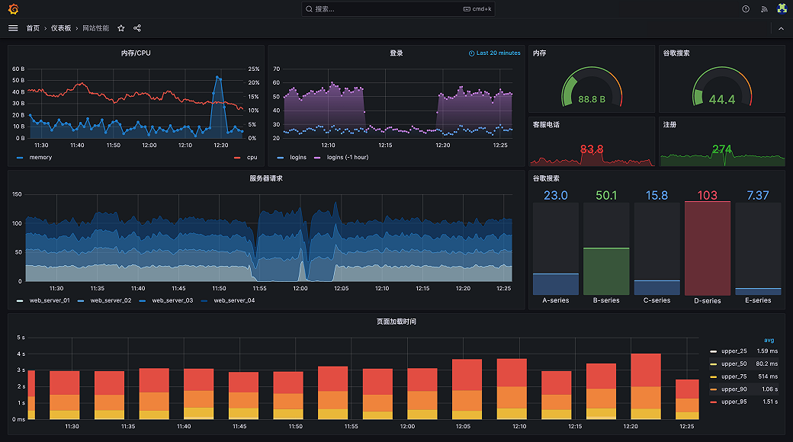

# 📊 Grafana 数据监控与查询指南

> Grafana 是一个强大的开源数据可视化和监控平台，支持多种数据源的实时监控和分析。

## 1. Grafana 简介

### 1.1 什么是 Grafana

Grafana 是一个开源的数据可视化和监控平台，可以帮助用户通过创建仪表盘和图表来实时监控和分析数据。它支持多种数据源，包括：

- Prometheus
- InfluxDB
- Elasticsearch
- MySQL/PostgreSQL
- Graphite
- OpenTSDB



### 1.2 核心优势

1. **统一数据，而非数据库**
   - 无需将数据导入后端数据仓库
   - 提供单一数据面板
   - 支持多种数据源的统一展示
   - 可从各类平台获取数据：
     - Kubernetes 集群
     - Raspberry Pi
     - 云服务
     - Google Sheets 等

2. **数据可视化民主化**
   - 面向组织所有成员开放
   - 打破数据孤岛
   - 增强团队协作能力

3. **灵活的数据面板**
   - 支持自定义图表创建
   - 便捷的面板共享机制
   - 支持团队协作探索

4. **强大的扩展性**
   - 丰富的插件生态
   - 自定义数据转换能力
   - 高级查询功能支持

## 2. 核心功能

### 2.1 数据源集成

- **时序数据库**
  - Prometheus
  - InfluxDB
  - Graphite

- **关系型数据库**
  - MySQL
  - PostgreSQL
  - Microsoft SQL Server

- **文档数据库**
  - Elasticsearch
  - MongoDB

- **云服务**
  - AWS CloudWatch
  - Azure Monitor
  - Google Cloud Monitoring

### 2.2 可视化选项

1. **图表类型**
   - 折线图
   - 柱状图
   - 饼图
   - 热力图
   - 地图
   - 仪表盘

2. **面板功能**
   - 数据过滤
   - 时间范围选择
   - 变量替换
   - 动态刷新

### 2.3 告警功能

- 支持多种告警规则
- 灵活的通知渠道
- 告警历史记录
- 告警状态管理

## 3. Lucene 查询语法

### 3.1 基础概念

#### Terms
查询将分解为若干 Term 以及操作符：
- 单一 Term：最小分词单元（如："Test"、"Hello"）
- 短语：双引号括起的词组（如："Hello dolly"）

#### Fields
支持指定字段查询：
- 显式指定：`title:hello`
- 默认字段：可省略字段名

### 3.2 查询语法示例

1. **基础查询**

```bash
# 标题包含短语且文本包含特定词
title:"The Right Way" AND go

# 等价写法
title:"The Right Way" AND text:go
```

2. **通配符查询**

```bash
# ? 匹配单个字符
text:te?t

# * 匹配多个字符
text:test*
text:te*t
```

3. **模糊查询**

```bash
# 拼写相近词匹配
text:roam~

# 距离查询（词间距离）
text:"jakarta apache"~10
```

4. **范围查询**

```bash
# 闭区间查询 []
mod_date:[20020101 TO 20030101]

# 开区间查询 {}
title:{Aida TO Carmen}
```

5. **权重查询**

```bash
# 提升特定词的权重
text:jakarta^4 apache

# 提升短语的权重
text:"jakarta apache"^4 "jakarta lucene"
```

6. **布尔操作符**

```bash
# AND 操作
text:"jakarta apache" AND jakarta

# OR 操作（默认）
text:"jakarta apache" OR jakarta

# NOT 操作
text:"jakarta apache" NOT "jakarta lucene"

# 必须包含（+）
text:+jakarta apache

# 必须不包含（-）
text:"jakarta apache" -"jakarta lucene"
```

7. **分组查询**

```bash
# 组合条件
text:(jakarta OR apache) AND website

# 组内优先级
title:(+return +"pink panther")
```

8. **特殊字符转义**

```bash
# 需要转义的特殊字符：+ - && || ! ( ) { } [ ] ^ " ~ * ? : \
num:1\+1\:2
```

## 4. 最佳实践

### 4.1 查询优化

1. **合理使用索引**
   - 避免使用通配符开头的查询
   - 优先使用精确匹配
   - 合理设置字段类型

2. **查询性能优化**
   - 控制查询复杂度
   - 使用缓存机制
   - 设置合理的超时时间

### 4.2 监控建议

1. **仪表盘设计**
   - 保持简洁清晰
   - 突出重要指标
   - 合理使用变量

2. **告警配置**
   - 设置合理的阈值
   - 避免告警风暴
   - 定期维护规则

## 5. 参考资料

- [Grafana 官方文档](https://grafana.com/docs/)
- [Lucene 查询语法指南](https://lucene.apache.org/core/2_9_4/queryparsersyntax.html)
- [Elasticsearch 查询 DSL](https://www.elastic.co/guide/en/elasticsearch/reference/current/query-dsl.html)