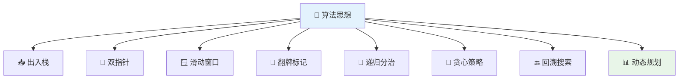

# 🧮 数据结构与算法完全指南

> 💡 **数据结构与算法** 是计算机科学的基础，也是前端工程师技术进阶的重要内容。掌握这些知识不仅能帮助你写出更高效的代码，还能在面试和实际工作中游刃有余。

## 📖 目录导航

- [🎯 概述](#🎯-概述)
- [🔢 数据结构](#🔢-数据结构)
- [📊 排序算法](#📊-排序算法)
- [🔍 搜索算法](#🔍-搜索算法)
- [🌲 树和图算法](#🌲-树和图算法)
- [💡 算法思想](#💡-算法思想)
- [🚀 动态规划](#🚀-动态规划)
- [📈 复杂度分析](#📈-复杂度分析)
- [🌟 实战应用](#🌟-实战应用)

---

## 🎯 概述

### 📚 知识体系

**🔗 数据结构**: 数组、链表、栈、队列、散列表、二叉树、堆、跳表、图、Trie 树

**⚡ 算法**: 递归、排序、二分查找、搜索、哈希算法、贪心算法、分治算法、回溯算法、动态规划、字符串匹配算法

### 💡 算法思想



| 思想 | 核心原理 | 适用场景 | 代表算法 |
|------|----------|----------|----------|
| **📥 出入栈** | 后进先出原则 | 表达式计算、括号匹配 | 栈算法 |
| **👥 双指针** | 两个指针协同移动 | 数组查找、链表操作 | 两数之和、回文判断 |
| **🪟 滑动窗口** | 固定大小窗口移动 | 子串查找、数组处理 | 最长子串、最小覆盖子串 |
| **🔄 翻牌标记** | 状态标记和恢复 | 图遍历、矩阵处理 | 岛屿数量、路径查找 |

---

## 🔢 数据结构

### 📋 数据结构对比

| 数据结构 | 访问 | 搜索 | 插入 | 删除 | 空间复杂度 | 特点 |
|----------|------|------|------|------|------------|------|
| **数组** | O(1) | O(n) | O(n) | O(n) | O(n) | 随机访问，内存连续 |
| **链表** | O(n) | O(n) | O(1) | O(1) | O(n) | 动态大小，指针连接 |
| **栈** | O(n) | O(n) | O(1) | O(1) | O(n) | LIFO，一端操作 |
| **队列** | O(n) | O(n) | O(1) | O(1) | O(n) | FIFO，两端操作 |
| **哈希表** | O(1) | O(1) | O(1) | O(1) | O(n) | 键值映射，快速查找 |

---

## 📊 排序算法

### 🔄 冒泡排序

#### 💡 算法思想

- 冒泡排序只会操作相邻的两个数据
- 每次冒泡操作都会对相邻的两个元素进行比较，看是否满足大小关系要求
- 一次冒泡会让至少一个元素移动到它应该在的位置，重复 n 次，就完成了 n 个数据的排序工作

#### ✅ 算法特点

| 特性 | 描述 | 值 |
|------|------|-----|
| **🕐 时间复杂度** | 平均/最坏情况 | O(n²) |
| **🚀 最佳时间** | 已排序数组 | O(n) |
| **💾 空间复杂度** | 原地排序 | O(1) |
| **🔒 稳定性** | 相同元素顺序不变 | 稳定 |

#### 🔧 基础实现

```javascript
/**
 * 冒泡排序 - 基础版本
 * @param {number[]} arr - 待排序数组
 * @returns {number[]} 排序后的数组
 */
function bubbleSort(arr) {
  console.time("冒泡排序耗时");
  
  if (!Array.isArray(arr) || arr.length <= 1) {
    console.timeEnd("冒泡排序耗时");
    return arr;
  }

  const { length } = arr;

  for (let i = 0; i < length - 1; i++) {
    // 最后一个值不需要对比了
    for (let j = 0; j < length - i - 1; j++) {
      if (arr[j] > arr[j + 1]) {
        // 比下一个值大，就交换位置
        [arr[j], arr[j + 1]] = [arr[j + 1], arr[j]];
      }
    }
  }
  
  console.timeEnd("冒泡排序耗时");
  return arr;
}

// 🧪 测试示例
const array = Array.from({ length: 10 }, () => Math.floor(Math.random() * 100));
console.log(`原始数组: ${array}`);
const sortedArray = bubbleSort([...array]);
console.log(`排序结果: ${sortedArray}`);
```

#### ⚡ 优化版本

```javascript
/**
 * 冒泡排序 - 优化版本（提前结束）
 * @param {number[]} arr - 待排序数组
 * @returns {number[]} 排序后的数组
 */
function bubbleSortOptimized(arr) {
  console.time("优化冒泡排序耗时");

  if (!Array.isArray(arr) || arr.length <= 1) {
    console.timeEnd("优化冒泡排序耗时");
    return arr;
  }

  const { length } = arr;

  for (let i = 0; i < length - 1; i++) {
    let hasSwapped = false; // 标记是否发生交换
    
    for (let j = 0; j < length - i - 1; j++) {
      if (arr[j] > arr[j + 1]) {
        [arr[j], arr[j + 1]] = [arr[j + 1], arr[j]];
        hasSwapped = true;
      }
    }
    
    // 如果没有发生交换，说明数组已经有序，可以提前结束
    if (!hasSwapped) {
      console.log(`优化：在第 ${i + 1} 轮后提前结束`);
      break;
    }
  }
  
  console.timeEnd("优化冒泡排序耗时");
  return arr;
}
```

### ⚡ 快速排序

#### 💡 算法思想

- 先找到一个基准点（一般指数组的中部），然后数组被该基准点分为两部分
- 依次与该基准点数据比较，如果比它小，放左边；反之，放右边
- 左右分别用一个空数组去存储比较后的数据
- 最后递归执行上述操作，直到数组长度 ≤ 1

#### ✅ 算法特点

| 特性 | 描述 | 值 |
|------|------|-----|
| **🕐 平均时间** | 分治策略 | O(n log n) |
| **⚠️ 最坏时间** | 数组已排序 | O(n²) |
| **💾 空间复杂度** | 递归调用栈 | O(log n) |
| **🔓 稳定性** | 元素顺序可能改变 | 不稳定 |

```javascript
/**
 * 快速排序实现
 * @param {number[]} arr - 待排序数组
 * @returns {number[]} 排序后的数组
 */
function quickSort(arr) {
  // 递归终止条件
  if (!Array.isArray(arr) || arr.length <= 1) {
    return arr;
  }

  // 选择基准点（中间位置）
  const pivotIndex = Math.floor(arr.length / 2);
  const pivot = arr.splice(pivotIndex, 1)[0];
  
  // 分割数组
  const left = [];
  const right = [];

  // 遍历数组，小于等于基准值的放左边，大于的放右边
  for (const item of arr) {
    if (item <= pivot) {
      left.push(item);
    } else {
      right.push(item);
    }
  }

  // 递归处理左右子数组，然后合并结果
  return [...quickSort(left), pivot, ...quickSort(right)];
}

// 🧪 测试示例
const testArray = [64, 34, 25, 12, 22, 11, 90];
console.log(`原始数组: ${testArray}`);
console.log(`快排结果: ${quickSort([...testArray])}`);
```

#### 🚀 原地快排（空间优化）

```javascript
/**
 * 原地快速排序 - 空间复杂度 O(1)
 * @param {number[]} arr - 待排序数组
 * @param {number} low - 起始索引
 * @param {number} high - 结束索引
 */
function quickSortInPlace(arr, low = 0, high = arr.length - 1) {
  if (low < high) {
    // 分区操作，返回基准元素的正确位置
    const pivotIndex = partition(arr, low, high);
    
    // 递归排序基准元素左右两部分
    quickSortInPlace(arr, low, pivotIndex - 1);
    quickSortInPlace(arr, pivotIndex + 1, high);
  }
  return arr;
}

/**
 * 分区函数 - Lomuto 分区方案
 * @param {number[]} arr - 数组
 * @param {number} low - 起始索引
 * @param {number} high - 结束索引
 * @returns {number} 基准元素的最终位置
 */
function partition(arr, low, high) {
  const pivot = arr[high]; // 选择最后一个元素作为基准
  let i = low - 1; // 小于基准元素的区域边界

  for (let j = low; j < high; j++) {
    if (arr[j] <= pivot) {
      i++;
      [arr[i], arr[j]] = [arr[j], arr[i]]; // 交换元素
    }
  }
  
  [arr[i + 1], arr[high]] = [arr[high], arr[i + 1]]; // 将基准元素放到正确位置
  return i + 1;
}
```

### 📥 插入排序

#### 💡 算法思想

每步将一个待排序的记录，按其关键码值的大小插入前面已经排序的文件中适当位置上，直到全部插入完为止。

#### ✅ 算法特点

| 特性 | 描述 | 值 |
|------|------|-----|
| **🕐 时间复杂度** | 平均/最坏情况 | O(n²) |
| **🚀 最佳时间** | 已排序数组 | O(n) |
| **💾 空间复杂度** | 原地排序 | O(1) |
| **🔒 稳定性** | 相同元素顺序不变 | 稳定 |

```javascript
/**
 * 插入排序实现
 * @param {number[]} arr - 待排序数组
 * @returns {number[]} 排序后的数组
 */
function insertionSort(arr) {
  console.time("插入排序耗时");
  
  if (!Array.isArray(arr) || arr.length <= 1) {
    console.timeEnd("插入排序耗时");
    return arr;
  }

  const { length } = arr;

  // 从第二个元素开始遍历（第一个元素认为已排序）
  for (let i = 1; i < length; i++) {
    const currentElement = arr[i]; // 当前要插入的元素
    let j = i - 1; // 已排序区域的最后一个元素索引

    // 在已排序区域中找到合适的插入位置
    while (j >= 0 && arr[j] > currentElement) {
      arr[j + 1] = arr[j]; // 向后移动元素
      j--;
    }
    
    arr[j + 1] = currentElement; // 插入当前元素
  }
  
  console.timeEnd("插入排序耗时");
  return arr;
}

// 🧪 测试示例
const insertTestArray = [64, 34, 25, 12, 22, 11, 90];
console.log(`原始数组: ${insertTestArray}`);
console.log(`插入排序结果: ${insertionSort([...insertTestArray])}`);
```

### 🔀 希尔排序

#### 💡 算法思想

希尔排序将序列分割成若干小序列（逻辑上分组），然后对每一个小序列进行插入排序，此时每一个小序列数据量小，插入排序的效率也提高了。

#### ✅ 算法特点

| 特性 | 描述 | 值 |
|------|------|-----|
| **🕐 时间复杂度** | 取决于增量序列 | O(n^1.3) ~ O(n²) |
| **💾 空间复杂度** | 原地排序 | O(1) |
| **🔓 稳定性** | 跨距离交换 | 不稳定 |

```javascript
/**
 * 希尔排序实现
 * @param {number[]} arr - 待排序数组
 * @returns {number[]} 排序后的数组
 */
function shellSort(arr) {
  console.time("希尔排序耗时");

  if (!Array.isArray(arr) || arr.length <= 1) {
    console.timeEnd("希尔排序耗时");
    return arr;
  }

  const { length } = arr;
  let gap = Math.floor(length / 2); // 初始增量
  let step = 1;

  // 逐步缩小增量直到为1
  while (gap > 0) {
    console.log(`第 ${step} 轮，间隔 gap = ${gap}`);
    
    // 对每个子序列进行插入排序
    for (let i = gap; i < length; i++) {
      const temp = arr[i]; // 当前要插入的元素
      let j = i - gap; // 同组前一个元素的位置

      // 在同组内进行插入排序
      while (j >= 0 && arr[j] > temp) {
        arr[j + gap] = arr[j]; // 向后移动
        j -= gap; // 移动到同组前一个元素
      }
      
      arr[j + gap] = temp; // 插入元素
    }
    
    // 打印当前排序状态
    console.log(`排序状态: [${arr.join(', ')}]`);
    
    gap = Math.floor(gap / 2); // 缩小增量
    step++;
  }
  
  console.timeEnd("希尔排序耗时");
  return arr;
}

// 🧪 测试示例
const shellTestArray = [64, 34, 25, 12, 22, 11, 90, 5, 77, 30];
console.log(`原始数组: [${shellTestArray.join(', ')}]`);
shellSort([...shellTestArray]);
```

### 📊 排序算法对比总结

| 算法 | 平均时间 | 最坏时间 | 最好时间 | 空间复杂度 | 稳定性 | 特点 |
|------|----------|----------|----------|------------|--------|------|
| **🔄 冒泡排序** | O(n²) | O(n²) | O(n) | O(1) | ✅ 稳定 | 简单易懂，效率较低 |
| **⚡ 快速排序** | O(n log n) | O(n²) | O(n log n) | O(log n) | ❌ 不稳定 | 平均性能最佳 |
| **📥 插入排序** | O(n²) | O(n²) | O(n) | O(1) | ✅ 稳定 | 小数组效率高 |
| **🔀 希尔排序** | O(n^1.3) | O(n²) | O(n) | O(1) | ❌ 不稳定 | 插入排序的改进 |
| **🔗 归并排序** | O(n log n) | O(n log n) | O(n log n) | O(n) | ✅ 稳定 | 性能稳定可靠 |
| **📈 堆排序** | O(n log n) | O(n log n) | O(n log n) | O(1) | ❌ 不稳定 | 原地排序 |

---

## 🔍 搜索算法

### 🎯 二分查找

#### 💡 算法思想

二分查找是一种在有序数组中查找特定元素的搜索算法。通过比较目标值和数组中间元素的大小，可以排除一半的搜索空间。

```javascript
/**
 * 二分查找 - 递归实现
 * @param {number[]} arr - 有序数组
 * @param {number} target - 目标值
 * @param {number} left - 左边界
 * @param {number} right - 右边界
 * @returns {number} 目标值的索引，不存在返回 -1
 */
function binarySearchRecursive(arr, target, left = 0, right = arr.length - 1) {
  // 递归终止条件
  if (left > right) {
    return -1;
  }

  const mid = Math.floor((left + right) / 2);

  if (arr[mid] === target) {
    return mid; // 找到目标值
  } else if (arr[mid] > target) {
    return binarySearchRecursive(arr, target, left, mid - 1); // 在左半部分搜索
  } else {
    return binarySearchRecursive(arr, target, mid + 1, right); // 在右半部分搜索
  }
}

/**
 * 二分查找 - 迭代实现
 * @param {number[]} arr - 有序数组
 * @param {number} target - 目标值
 * @returns {number} 目标值的索引，不存在返回 -1
 */
function binarySearchIterative(arr, target) {
  let left = 0;
  let right = arr.length - 1;

  while (left <= right) {
    const mid = Math.floor((left + right) / 2);

    if (arr[mid] === target) {
      return mid;
    } else if (arr[mid] > target) {
      right = mid - 1;
    } else {
      left = mid + 1;
    }
  }

  return -1;
}

// 🧪 测试示例
const sortedArray = [1, 3, 5, 7, 9, 11, 13, 15, 17, 19];
console.log('数组:', sortedArray);
console.log('查找 7:', binarySearchIterative(sortedArray, 7)); // 输出: 3
console.log('查找 16:', binarySearchIterative(sortedArray, 16)); // 输出: -1
```

---

## 💡 算法思想

### 👥 双指针技巧

双指针是一种简单而有效的技巧，在处理数组和字符串问题时特别有用。

#### 🎯 对撞指针

```javascript
/**
 * 验证回文字符串
 * @param {string} s - 输入字符串
 * @returns {boolean} 是否为回文
 */
function isPalindrome(s) {
  // 预处理：转换为小写并移除非字母数字字符
  const cleaned = s.toLowerCase().replace(/[^a-z0-9]/g, '');
  
  let left = 0;
  let right = cleaned.length - 1;

  while (left < right) {
    if (cleaned[left] !== cleaned[right]) {
      return false;
    }
    left++;
    right--;
  }

  return true;
}

// 🧪 测试
console.log(isPalindrome("A man, a plan, a canal: Panama")); // true
console.log(isPalindrome("race a car")); // false
```

#### 🏃 快慢指针

```javascript
/**
 * 检测链表是否有环（快慢指针）
 * @param {ListNode} head - 链表头节点
 * @returns {boolean} 是否有环
 */
function hasCycle(head) {
  if (!head || !head.next) return false;

  let slow = head;    // 慢指针，每次移动一步
  let fast = head;    // 快指针，每次移动两步

  while (fast && fast.next) {
    slow = slow.next;
    fast = fast.next.next;

    // 如果有环，快慢指针最终会相遇
    if (slow === fast) {
      return true;
    }
  }

  return false;
}
```

### 🪟 滑动窗口

滑动窗口是处理子串/子数组问题的重要技巧。

```javascript
/**
 * 无重复字符的最长子串
 * @param {string} s - 输入字符串
 * @returns {number} 最长子串长度
 */
function lengthOfLongestSubstring(s) {
  const charSet = new Set();
  let left = 0;
  let maxLength = 0;

  for (let right = 0; right < s.length; right++) {
    // 如果字符重复，收缩左边界
    while (charSet.has(s[right])) {
      charSet.delete(s[left]);
      left++;
    }

    charSet.add(s[right]);
    maxLength = Math.max(maxLength, right - left + 1);
  }

  return maxLength;
}

// 🧪 测试
console.log(lengthOfLongestSubstring("abcabcbb")); // 3 ("abc")
console.log(lengthOfLongestSubstring("bbbbb"));    // 1 ("b")
console.log(lengthOfLongestSubstring("pwwkew"));   // 3 ("wke")
```

---

## 🚀 动态规划

动态规划是解决优化问题的重要算法思想，通过将问题分解为子问题来避免重复计算。

### 🧗 经典问题：爬楼梯

```javascript
/**
 * 爬楼梯问题 - 动态规划解法
 * @param {number} n - 楼梯总数
 * @returns {number} 爬楼梯的方法数
 */
function climbStairs(n) {
  if (n <= 2) return n;

  // dp[i] 表示爬到第 i 阶楼梯的方法数
  const dp = new Array(n + 1);
  dp[1] = 1; // 1阶楼梯只有1种方法
  dp[2] = 2; // 2阶楼梯有2种方法

  for (let i = 3; i <= n; i++) {
    dp[i] = dp[i - 1] + dp[i - 2]; // 状态转移方程
  }

  return dp[n];
}

/**
 * 爬楼梯问题 - 空间优化版本
 * @param {number} n - 楼梯总数
 * @returns {number} 爬楼梯的方法数
 */
function climbStairsOptimized(n) {
  if (n <= 2) return n;

  let prev2 = 1; // 前两个状态
  let prev1 = 2; // 前一个状态

  for (let i = 3; i <= n; i++) {
    const current = prev1 + prev2;
    prev2 = prev1;
    prev1 = current;
  }

  return prev1;
}

// 🧪 测试
console.log('爬 5 阶楼梯的方法数:', climbStairs(5)); // 8
```

---

## 📈 复杂度分析

### ⏰ 时间复杂度

```mermaid
graph LR
    A[O(1)] --> B[O(log n)]
    B --> C[O(n)]
    C --> D[O(n log n)]
    D --> E[O(n²)]
    E --> F[O(n³)]
    F --> G[O(2ⁿ)]
    
    style A fill:#4caf50
    style B fill:#8bc34a
    style C fill:#ffeb3b
    style D fill:#ff9800
    style E fill:#f44336
    style F fill:#9c27b0
    style G fill:#000000,color:#ffffff
```

| 复杂度 | 描述 | 示例算法 | 性能 |
|--------|------|----------|------|
| **O(1)** | 常数时间 | 数组访问、哈希表查找 | 🟢 优秀 |
| **O(log n)** | 对数时间 | 二分查找、堆操作 | 🟢 很好 |
| **O(n)** | 线性时间 | 遍历数组、链表查找 | 🟡 良好 |
| **O(n log n)** | 线性对数 | 归并排序、快速排序 | 🟡 可接受 |
| **O(n²)** | 平方时间 | 冒泡排序、插入排序 | 🔴 较差 |
| **O(2ⁿ)** | 指数时间 | 递归斐波那契 | 🔴 很差 |

---

## 🌟 实战应用

### 📊 性能优化实例

```javascript
/**
 * 数组去重 - 多种实现方式性能对比
 */

// 方法1: Set (推荐)
function uniqueWithSet(arr) {
  return [...new Set(arr)];
}

// 方法2: filter + indexOf
function uniqueWithFilter(arr) {
  return arr.filter((item, index) => arr.indexOf(item) === index);
}

// 方法3: 双层循环
function uniqueWithLoop(arr) {
  const result = [];
  for (let i = 0; i < arr.length; i++) {
    if (!result.includes(arr[i])) {
      result.push(arr[i]);
    }
  }
  return result;
}

// 性能测试
function performanceTest() {
  const testArray = Array.from({length: 10000}, () => Math.floor(Math.random() * 1000));
  
  console.time('Set方法');
  uniqueWithSet(testArray);
  console.timeEnd('Set方法');
  
  console.time('Filter方法');
  uniqueWithFilter(testArray);
  console.timeEnd('Filter方法');
  
  console.time('双层循环');
  uniqueWithLoop(testArray);
  console.timeEnd('双层循环');
}

// performanceTest();
```

---

::: tip 🎯 总结

数据结构与算法是编程的基础，掌握这些知识对提升编程能力至关重要：

### 🚀 学习建议
1. **📚 理论先行**: 先理解算法原理，再看代码实现
2. **🔧 动手实践**: 自己编写代码，不要只看不练
3. **📊 复杂度分析**: 养成分析时间空间复杂度的习惯
4. **🎯 刷题巩固**: 通过 LeetCode 等平台加强练习
5. **🏗️ 实际应用**: 在项目中思考如何应用算法优化

### 💡 重点掌握
- **排序算法**: 快排、归并排序的原理和实现
- **搜索算法**: 二分查找及其变形
- **数据结构**: 数组、链表、栈、队列、哈希表
- **算法思想**: 双指针、滑动窗口、动态规划
- **复杂度分析**: 时间和空间复杂度的计算

坚持练习，算法思维会成为你编程路上的有力武器！🎉

:::

::: warning 📋 注意事项
- 算法实现要考虑边界条件和异常情况
- 选择算法时要权衡时间复杂度和空间复杂度
- 实际项目中优先考虑代码的可读性和维护性
- 不要过度优化，适合场景的算法就是好算法
:::

---

> 🌟 **算法之美，逻辑之力** - 用数据结构与算法构建高效优雅的程序世界！

