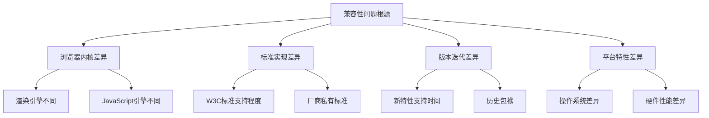
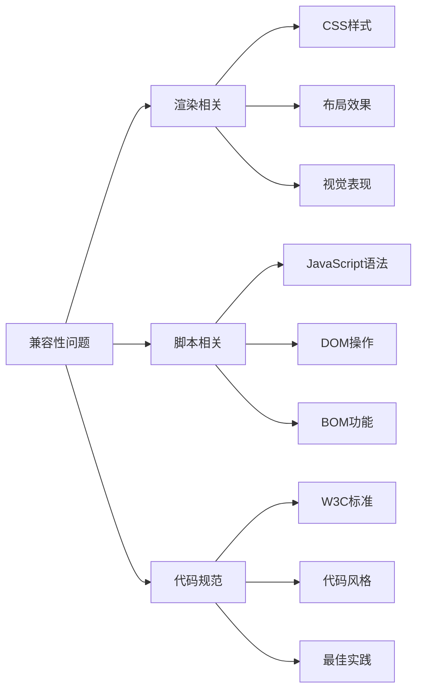
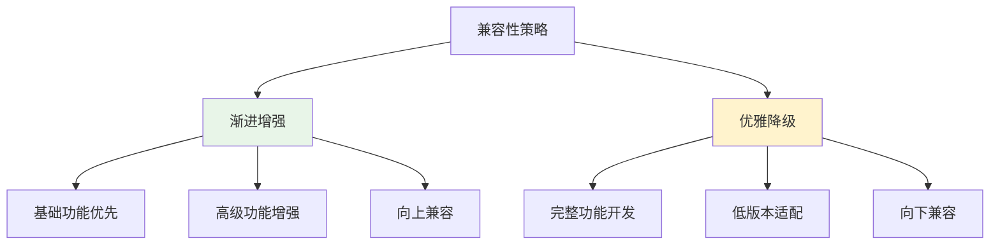
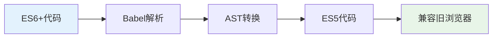
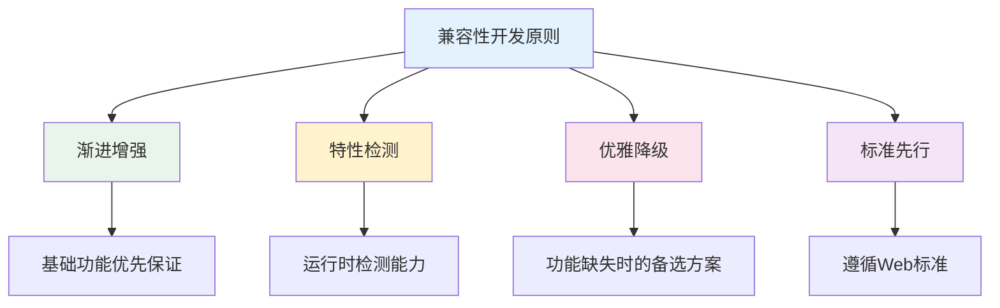

# 🔧 浏览器兼容性解决方案完全指南

> 浏览器兼容性是前端开发中必须面对的挑战。本指南提供全面的兼容性问题分析和解决方案，帮助开发者构建稳定可靠的Web应用。

## 📋 目录导航

<details>
<summary>点击展开完整目录</summary>

### 🎯 兼容性基础
- [兼容性问题概述](#兼容性问题概述)
- [浏览器内核差异](#浏览器内核差异)
- [解决思路与原则](#解决思路与原则)

### 💻 JavaScript兼容性
- [ES6+ 语法兼容](#javascript兼容性)
- [IE浏览器兼容](#ie兼容性问题)
- [事件处理兼容](#事件处理兼容)
- [DOM操作兼容](#dom操作兼容)

### 🎨 CSS兼容性
- [样式重置与标准化](#css兼容性问题)
- [CSS3属性前缀](#css3兼容前缀)
- [布局兼容性](#布局兼容性)
- [字体渲染问题](#字体渲染问题)

### 📱 移动端兼容性
- [iOS兼容性问题](#ios兼容性)
- [Android兼容性问题](#android兼容性)
- [响应式布局](#响应式布局)
- [触摸事件处理](#触摸事件处理)

### 🛠️ 兼容性工具
- [Polyfill解决方案](#polyfill解决方案)
- [自动化工具](#自动化工具)
- [测试与调试](#测试与调试)

</details>

## 🎯 兼容性问题概述

### 什么是兼容性问题

**兼容性问题**是指因为不同浏览器使用的内核不同，对同样的代码有不同的解析，造成页面显示效果不统一的现象。



### 浏览器内核差异

| 浏览器 | 内核 | 渲染引擎 | JavaScript引擎 | 市场份额 |
|--------|------|----------|----------------|----------|
| **Chrome** | Blink | Blink | V8 | 🟢 65% |
| **Safari** | WebKit | WebKit | JavaScriptCore | 🟡 19% |
| **Firefox** | Gecko | Gecko | SpiderMonkey | 🟡 8% |
| **Edge** | Blink | Blink | V8 | 🟡 5% |
| **IE** | Trident | Trident | Chakra | 🔴 2% |

::: tip 🎯 兼容性影响因素
- **内核技术**：不同内核对标准的实现方式存在差异
- **版本差异**：版本越老，存在bug越多，对新特性支持越少
- **标准差异**：核心技术和标准不同，实现方式有差异
:::

### 兼容性问题分类



**问题类型详解：**

| 类型 | 具体表现 | 影响程度 | 解决难度 |
|------|----------|----------|----------|
| **渲染相关** | 样式布局差异，视觉效果不一致 | 🔴 高 | 🟡 中等 |
| **脚本相关** | API不支持，功能异常 | 🔴 高 | 🔴 困难 |
| **代码规范** | 不规范代码导致的问题 | 🟡 中 | 🟢 简单 |

## 💡 解决思路与原则

### 兼容性策略



**🔄 渐进增强 vs 优雅降级**

| 策略 | 核心思路 | 优势 | 劣势 | 适用场景 |
|------|----------|------|------|----------|
| **渐进增强** | 先保证基础功能，再增强体验 | ✅ 兼容性好<br>✅ 稳定可靠 | ❌ 开发周期长<br>❌ 功能受限 | 企业级应用 |
| **优雅降级** | 先开发完整功能，再向下兼容 | ✅ 功能完整<br>✅ 开发效率高 | ❌ 兼容性差<br>❌ 维护复杂 | 现代化应用 |

### 解决方案工具箱

**🛠️ 通用解决方案：**

| 方案类型 | 具体工具 | 适用场景 | 推荐指数 |
|----------|----------|----------|----------|
| **框架库** | jQuery、Vue、React | 快速开发，内置兼容性处理 | ⭐⭐⭐⭐⭐ |
| **兼容工具** | html5shiv、Respond.js、CSS Reset | 特定问题解决 | ⭐⭐⭐⭐ |
| **构建工具** | Babel、PostCSS、Autoprefixer | 自动化处理 | ⭐⭐⭐⭐⭐ |
| **检测工具** | Modernizr.js、Can I Use | 特性检测和查询 | ⭐⭐⭐⭐ |

::: tip 🌐 兼容性查询工具
推荐使用 [Can I Use](https://caniuse.com/) 查询CSS、JS、HTML5、SVG在主流浏览器中的特性和兼容性，确保网页在浏览器中的兼容性。
:::

## 💻 JavaScript兼容性

### ES6+ 语法兼容

**🔄 Babel转换流程：**



老版本浏览器不支持ES6+语法，需要使用**Babel**进行转换：

```javascript
// 🔧 Babel配置示例
// .babelrc
{
  "presets": [
    [
      "@babel/preset-env",
      {
        "targets": {
          "browsers": ["last 2 versions", "ie >= 9"]
        },
        "useBuiltIns": "usage",
        "corejs": 3
      }
    ]
  ],
  "plugins": [
    "@babel/plugin-transform-runtime"
  ]
}
```

**⚠️ Babel限制：**

::: warning 注意事项
Babel默认只转换**语法（syntax）**，不转换**新的API**。以下功能需要polyfill：
- Promise、Set、Map、Symbol
- Object.assign、Array.from
- Iterator、Generator、Proxy、Reflect
:::

**🔌 Polyfill解决方案：**

```javascript
// 方案1：全量引入（不推荐）
import '@babel/polyfill';

// 方案2：按需引入（推荐）
import 'core-js/stable';
import 'regenerator-runtime/runtime';

// 方案3：动态polyfill（最优）
// 使用 polyfill.io 服务
```

### IE兼容性问题

IE浏览器由于历史原因，存在诸多兼容性问题，需要特殊处理：

#### 事件处理兼容

```javascript
/**
 * 跨浏览器事件绑定
 * @param {Element} elm - 目标元素
 * @param {string} evType - 事件类型
 * @param {Function} fn - 事件处理函数
 * @param {boolean} useCapture - 是否捕获
 */
function addEvent(elm, evType, fn, useCapture) {
  if (elm.addEventListener) {
    // ✅ W3C标准
    elm.addEventListener(evType, fn, useCapture);
    return true;
  } else if (elm.attachEvent) {
    // 🔧 IE8及以下
    const r = elm.attachEvent('on' + evType, fn);
    return r;
  } else {
    // 🔧 最古老的方式
    elm['on' + evType] = fn;
  }
}

// 🧪 使用示例
addEvent(document.getElementById('btn'), 'click', function() {
  console.log('Button clicked!');
}, false);
```

#### 事件对象兼容

```javascript
/**
 * 阻止事件冒泡 - 兼容版本
 */
function stopPropagation(event) {
  if (event.stopPropagation) {
    // ✅ 标准浏览器
    event.stopPropagation();
  } else {
    // 🔧 IE
    event.cancelBubble = true;
  }
}

/**
 * 阻止默认行为 - 兼容版本
 */
function preventDefault(event) {
  if (event.preventDefault) {
    // ✅ 标准浏览器
    event.preventDefault();
  } else {
    // 🔧 IE
    event.returnValue = false;
  }
  return false;
}

/**
 * 获取事件对象 - 兼容版本
 */
function getEvent(event) {
  return event || window.event;
}

/**
 * 获取事件目标 - 兼容版本
 */
function getTarget(event) {
  return event.target || event.srcElement;
}
```

#### 页面坐标兼容

```javascript
/**
 * 获取页面滚动距离 - 兼容版本
 */
function getScrollOffset() {
  return {
    top: document.documentElement.scrollTop || document.body.scrollTop,
    left: document.documentElement.scrollLeft || document.body.scrollLeft
  };
}

/**
 * 获取鼠标坐标 - 兼容版本
 */
function getMousePosition(event) {
  event = getEvent(event);
  return {
    x: event.pageX || event.clientX + getScrollOffset().left,
    y: event.pageY || event.clientY + getScrollOffset().top
  };
}
```

#### 其他IE兼容问题

```javascript
// 🔧 常量定义兼容
// IE只能使用var关键字定义常量
var CONST_VALUE = 'constant';

// 🔧 透明度兼容
function setOpacity(element, opacity) {
  if (element.style.opacity !== undefined) {
    // ✅ 标准浏览器
    element.style.opacity = opacity;
  } else {
    // 🔧 IE滤镜
    element.style.filter = 'alpha(opacity=' + (opacity * 100) + ')';
  }
}

// 🔧 元素选择器兼容
function getElementsByClassName(className, parent) {
  parent = parent || document;
  
  if (parent.getElementsByClassName) {
    // ✅ 现代浏览器
    return parent.getElementsByClassName(className);
  } else {
    // 🔧 IE8及以下
    const elements = parent.getElementsByTagName('*');
    const result = [];
    const pattern = new RegExp('(^|\\s)' + className + '(\\s|$)');
    
    for (let i = 0; i < elements.length; i++) {
      if (pattern.test(elements[i].className)) {
        result.push(elements[i]);
      }
    }
    return result;
  }
}
```

## 🎨 CSS兼容性问题

### 样式重置与标准化

不同浏览器的默认样式存在差异，需要进行重置或标准化：

```css
/* 🔄 CSS Reset - 完全重置（激进方案） */
* {
  margin: 0;
  padding: 0;
  box-sizing: border-box;
}

/* 📝 推荐使用 normalize.css - 保留有用默认值 */
/* normalize.css 主要功能：
 * 1. 保留有用的默认值
 * 2. 标准化各种元素的样式
 * 3. 纠正错误和常见的浏览器不一致
 * 4. 通过微妙的改进提高可用性
 */
```

### CSS3兼容前缀

使用**Autoprefixer**自动添加浏览器前缀：

```css
/* 🔧 CSS3属性兼容前缀 */
.gradient-box {
  /* Chrome, Safari, Opera */
  background: -webkit-linear-gradient(left, red, blue);
  /* Firefox */
  background: -moz-linear-gradient(left, red, blue);
  /* IE10+ */
  background: -ms-linear-gradient(left, red, blue);
  /* 标准语法 */
  background: linear-gradient(to right, red, blue);
}

.transform-box {
  -webkit-transform: rotate(45deg);
  -moz-transform: rotate(45deg);
  -ms-transform: rotate(45deg);
  transform: rotate(45deg);
}

.transition-box {
  -webkit-transition: all 0.3s ease;
  -moz-transition: all 0.3s ease;
  -ms-transition: all 0.3s ease;
  transition: all 0.3s ease;
}
```

**🔧 Autoprefixer配置：**

```javascript
// postcss.config.js
module.exports = {
  plugins: [
    require('autoprefixer')({
      browsers: [
        'last 2 versions',
        'ie >= 9',
        'ios >= 8',
        'android >= 4.4'
      ]
    })
  ]
};
```

### 常见CSS兼容问题

#### 透明度兼容

```css
.opacity-element {
  /* 🔧 IE8及以下 */
  filter: alpha(opacity=70);
  /* ✅ 标准浏览器 */
  opacity: 0.7;
}
```

#### 字体大小兼容

```css
.small-font {
  font-size: 12px;
  /* 🔧 Chrome字体最小值限制 */
  -webkit-text-size-adjust: none;
  /* 🔧 缩放解决方案 */
  transform: scale(0.8);
  transform-origin: left top;
}
```

#### 鼠标指针兼容

```css
.clickable {
  /* 🔧 统一使用pointer */
  cursor: pointer;
  /* ❌ 避免使用hand，IE专有 */
  /* cursor: hand; */
}
```

#### 链接状态顺序

```css
/* 🔧 必须按照 LVHA 顺序编写 */
a:link { color: blue; }      /* 未访问 */
a:visited { color: purple; } /* 已访问 */
a:hover { color: red; }      /* 悬停 */
a:active { color: orange; }  /* 激活 */
```

## 📱 移动端兼容性

### iOS兼容性

#### 禁用系统默认行为

```css
/* 🚫 禁止弹出各种操作窗口 */
* {
  -webkit-touch-callout: none;
}

/* 🚫 禁止用户选中文字 */
* {
  -webkit-user-select: none;
  -moz-user-select: none;
  -ms-user-select: none;
  user-select: none;
}

/* 🔧 禁止文字缩放 */
* {
  -webkit-text-size-adjust: 100%;
  -ms-text-size-adjust: 100%;
}

/* 🎨 字体渲染优化 */
* {
  /* 关闭抗锯齿 */
  -webkit-font-smoothing: none;
  /* 像素级平滑 */
  -webkit-font-smoothing: antialiased;
  /* 亚像素级平滑 */
  -webkit-font-smoothing: subpixel-antialiased;
}
```

#### 输入框优化

```html
<!-- 🔧 iOS输入框优化 -->
<input 
  type="text"
  autocapitalize="off"    <!-- 关闭首字母大写 -->
  autocomplete="off"      <!-- 关闭自动保存 -->
  autocorrect="off"       <!-- 关闭自动纠错 -->
  spellcheck="false"      <!-- 关闭拼写检查 -->
/>
```

#### 滚动优化

```css
/* 🔄 iOS滚动回弹效果 */
.scroll-container {
  overflow: auto;
  -webkit-overflow-scrolling: touch;
}

/* 🚫 禁止滚动回弹 */
.no-bounce {
  overscroll-behavior: none;
}
```

#### 日期格式兼容

```javascript
// ❌ iOS不支持 - 分割的日期格式
const wrongDate = new Date('2024-12-12');

// ✅ 使用 / 分割的日期格式
const correctDate = new Date('2024/12/12');

// 🔧 日期格式转换函数
function formatDateForIOS(dateString) {
  return dateString.replace(/-/g, '/');
}
```

#### 虚拟键盘处理

```javascript
// 🔧 虚拟键盘收起后页面位置修正
function fixIOSKeyboardIssue() {
  const inputs = document.querySelectorAll('input, textarea');
  
  inputs.forEach(input => {
    input.addEventListener('blur', function() {
      setTimeout(function() {
        // 获取当前滚动位置
        const currentPosition = document.documentElement.scrollTop || 
                               document.body.scrollTop;
        // 滚动修正
        window.scrollTo(0, currentPosition);
        
        // 或者使用双重滚动解决方案
        window.scrollBy(0, 5);
        window.scrollBy(0, -5);
      }, 200);
    });
  });
}

// 🔧 处理多个输入框的情况
function handleMultipleInputs() {
  let setTimerTop = 0;
  
  $(document)
    .on('blur', 'input, textarea', function() {
      event.preventDefault();
      setTimerTop = setTimeout(function() {
        window.scrollBy(0, 5);
        window.scrollBy(0, -5);
      }, 500);
    })
    .on('focus', 'input, textarea', function() {
      clearTimeout(setTimerTop);
    });
}
```

#### 边界滚动处理

```javascript
// 🔧 防止上拉下拉边界出现空白
document.body.addEventListener('touchmove', function(e) {
  // 如果不是滚动容器，阻止默认行为
  if (e._isScroller) return;
  e.preventDefault();
}, {
  passive: false
});

// 🔧 标记可滚动容器
document.querySelectorAll('.scroll-container').forEach(container => {
  container.addEventListener('touchmove', function(e) {
    e._isScroller = true;
  });
});
```

### Android兼容性

#### 输入框处理

```css
/* 🔧 Android输入框样式重置 */
input, textarea {
  -webkit-appearance: none;
  -moz-appearance: none;
  appearance: none;
  border-radius: 0;
  background-color: transparent;
}

/* 🔧 禁用输入框阴影 */
input:focus, textarea:focus {
  outline: none;
  -webkit-box-shadow: none;
  box-shadow: none;
}
```

#### 点击延迟处理

```css
/* 🔧 消除300ms点击延迟 */
* {
  touch-action: manipulation;
}

/* 🔧 或者使用fastclick库 */
```

```javascript
// 🔧 FastClick解决方案
import FastClick from 'fastclick';

if ('addEventListener' in document) {
  document.addEventListener('DOMContentLoaded', function() {
    FastClick.attach(document.body);
  }, false);
}
```

## 🛠️ 兼容性工具

### Polyfill解决方案

```javascript
// 🔌 常用Polyfill实现

// Array.from polyfill
if (!Array.from) {
  Array.from = function(arrayLike, mapFn, thisArg) {
    const C = this;
    const items = Object(arrayLike);
    const len = parseInt(items.length) || 0;
    const A = typeof C === 'function' ? Object(new C(len)) : new Array(len);
    
    for (let k = 0; k < len; k++) {
      const kValue = items[k];
      const mappedValue = mapFn ? mapFn.call(thisArg, kValue, k) : kValue;
      A[k] = mappedValue;
    }
    
    A.length = len;
    return A;
  };
}

// Object.assign polyfill
if (!Object.assign) {
  Object.assign = function(target, ...sources) {
    if (target == null) {
      throw new TypeError('Cannot convert undefined or null to object');
    }
    
    const to = Object(target);
    
    for (let index = 0; index < sources.length; index++) {
      const nextSource = sources[index];
      
      if (nextSource != null) {
        for (const nextKey in nextSource) {
          if (Object.prototype.hasOwnProperty.call(nextSource, nextKey)) {
            to[nextKey] = nextSource[nextKey];
          }
        }
      }
    }
    
    return to;
  };
}
```

### 自动化工具

**🔧 推荐工具链：**

| 工具 | 功能 | 配置复杂度 | 推荐指数 |
|------|------|------------|----------|
| **Babel** | JavaScript语法转换 | 🟡 中等 | ⭐⭐⭐⭐⭐ |
| **PostCSS + Autoprefixer** | CSS前缀自动添加 | 🟢 简单 | ⭐⭐⭐⭐⭐ |
| **core-js** | JavaScript API polyfill | 🟡 中等 | ⭐⭐⭐⭐ |
| **normalize.css** | CSS样式标准化 | 🟢 简单 | ⭐⭐⭐⭐ |
| **Modernizr** | 特性检测 | 🟡 中等 | ⭐⭐⭐⭐ |

### 测试与调试

```javascript
// 🔍 浏览器特性检测
const browserSupport = {
  // 检测localStorage支持
  localStorage: (function() {
    try {
      return 'localStorage' in window && window.localStorage !== null;
    } catch (e) {
      return false;
    }
  })(),
  
  // 检测CSS3支持
  css3: (function() {
    const div = document.createElement('div');
    return 'borderRadius' in div.style;
  })(),
  
  // 检测touch事件支持
  touch: 'ontouchstart' in window || navigator.maxTouchPoints > 0,
  
  // 检测Promise支持
  promise: typeof Promise !== 'undefined',
  
  // 检测fetch支持
  fetch: typeof fetch !== 'undefined'
};

console.log('浏览器支持情况:', browserSupport);
```

## 🎯 最佳实践总结

### 兼容性开发原则



### 🔧 实用代码片段

```javascript
// 🛠️ 通用兼容性工具函数

/**
 * 获取浏览器信息
 */
function getBrowserInfo() {
  const ua = navigator.userAgent;
  const browser = {
    isIE: /msie|trident/i.test(ua),
    isChrome: /chrome/i.test(ua),
    isFirefox: /firefox/i.test(ua),
    isSafari: /safari/i.test(ua) && !/chrome/i.test(ua),
    isEdge: /edge/i.test(ua),
    isMobile: /mobile|phone|pad|pod|iPhone|iPod|ios|iPad|Android|BlackBerry|IEMobile/i.test(ua)
  };
  
  return browser;
}

/**
 * 动态加载polyfill
 */
function loadPolyfills() {
  const polyfills = [];
  
  // 检测并添加需要的polyfill
  if (!window.Promise) {
    polyfills.push('https://cdn.jsdelivr.net/npm/es6-promise@4/dist/es6-promise.auto.min.js');
  }
  
  if (!window.fetch) {
    polyfills.push('https://cdn.jsdelivr.net/npm/whatwg-fetch@3/dist/fetch.umd.js');
  }
  
  // 动态加载
  return Promise.all(polyfills.map(url => {
    return new Promise((resolve, reject) => {
      const script = document.createElement('script');
      script.src = url;
      script.onload = resolve;
      script.onerror = reject;
      document.head.appendChild(script);
    });
  }));
}

/**
 * 通用事件处理器
 */
class EventHandler {
  static on(element, event, handler, useCapture = false) {
    if (element.addEventListener) {
      element.addEventListener(event, handler, useCapture);
    } else if (element.attachEvent) {
      element.attachEvent('on' + event, handler);
    } else {
      element['on' + event] = handler;
    }
  }
  
  static off(element, event, handler, useCapture = false) {
    if (element.removeEventListener) {
      element.removeEventListener(event, handler, useCapture);
    } else if (element.detachEvent) {
      element.detachEvent('on' + event, handler);
    } else {
      element['on' + event] = null;
    }
  }
}
```

### 📋 兼容性检查清单

**🔍 开发阶段检查：**

- [ ] 目标浏览器和版本确定
- [ ] 使用Can I Use查询特性支持
- [ ] 配置适当的构建工具
- [ ] 添加必要的polyfill
- [ ] 编写特性检测代码

**🧪 测试阶段检查：**

- [ ] 多浏览器功能测试
- [ ] 不同屏幕尺寸测试
- [ ] 网络环境测试
- [ ] 性能影响评估
- [ ] 用户体验验证

**🚀 部署阶段检查：**

- [ ] 生产环境兼容性验证
- [ ] 错误监控和日志
- [ ] 用户反馈收集
- [ ] 持续优化计划

::: tip 💡 总结建议
- **优先使用标准化解决方案**：选择成熟的框架和工具链
- **建立兼容性测试流程**：确保每次发布都经过充分测试
- **持续关注兼容性动态**：定期更新polyfill和工具版本
- **权衡成本与收益**：合理确定兼容性支持范围
:::

---

> 📚 **延伸阅读**：
> - [MDN Web兼容性指南](https://developer.mozilla.org/zh-CN/docs/Web/Guide/CSS/Getting_started/What_is_CSS)
> - [Can I Use 兼容性查询](https://caniuse.com/)
> - [Autoprefixer 在线工具](https://autoprefixer.github.io/)
> - [Babel 官方文档](https://babeljs.io/docs/)
