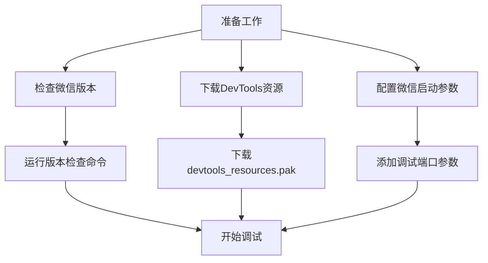
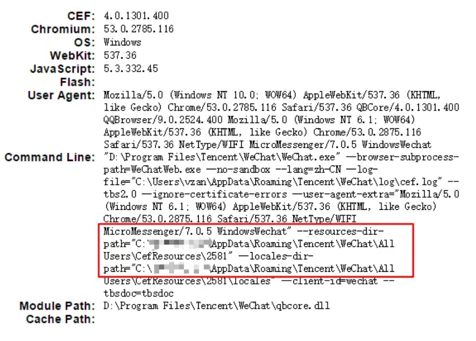
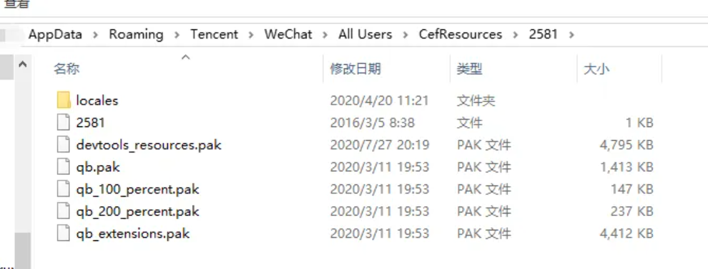
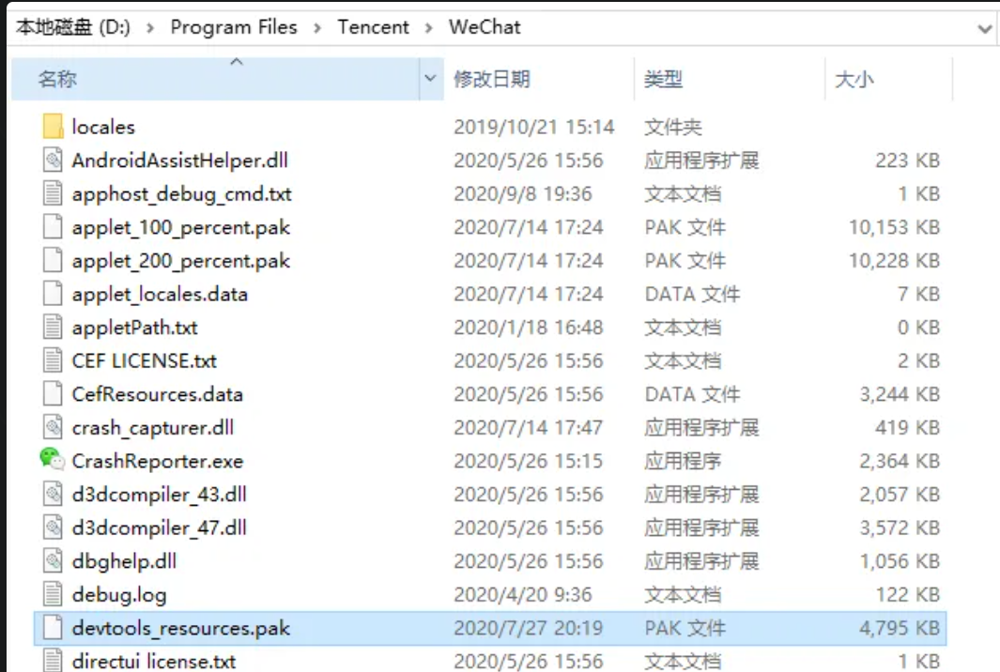
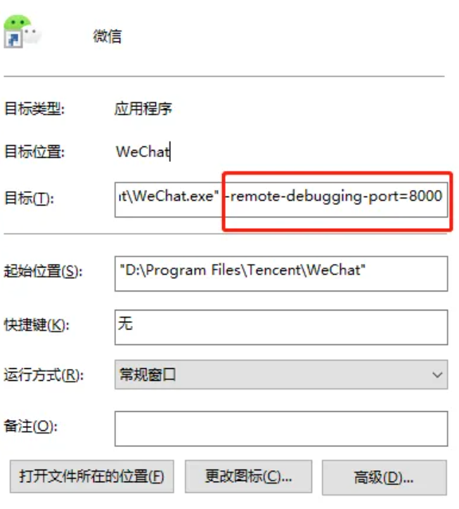
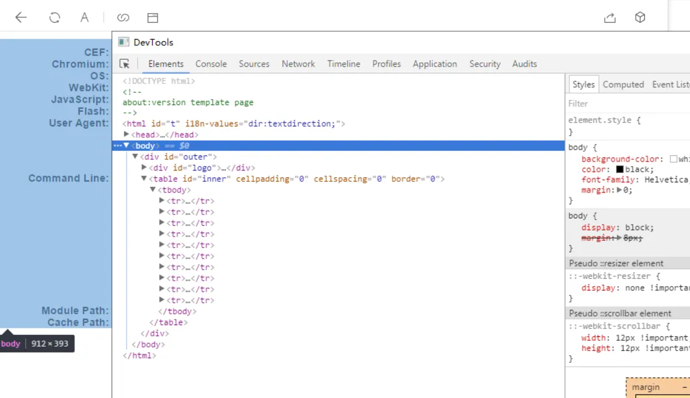
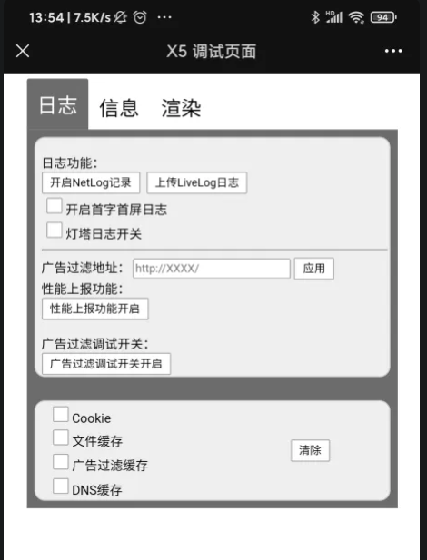
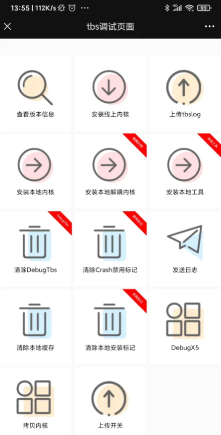
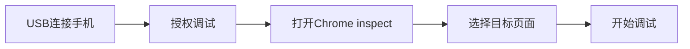

# 🔍 移动端调试完全指南

> 移动端Web开发中，调试是一个重要且具有挑战性的环节。本指南提供全面的移动端调试方法和技巧，帮助开发者高效解决移动端问题。

## 📋 目录导航

<details>
<summary>点击展开完整目录</summary>

### 📱 微信调试
- [微信内置浏览器调试](#微信内置浏览器调试)
- [微信开发者工具](#微信开发者工具)
- [微信缓存清理](#微信缓存清理)

### 🔧 移动端调试工具
- [Chrome远程调试](#chrome远程调试)
- [Safari Web检查器](#safari-web检查器)
- [vConsole调试工具](#vconsole调试工具)
- [Eruda调试面板](#eruda调试面板)

### 📊 性能调试
- [性能分析工具](#性能分析工具)
- [内存泄漏检测](#内存泄漏检测)
- [网络请求分析](#网络请求分析)

### 🛠️ 常见问题调试
- [兼容性问题](#兼容性问题调试)
- [样式问题](#样式问题调试)
- [JavaScript错误](#javascript错误调试)

### 🎯 调试技巧
- [真机调试技巧](#真机调试技巧)
- [模拟器调试](#模拟器调试)
- [调试最佳实践](#调试最佳实践)

</details>

## 📱 微信内置浏览器调试

微信内置浏览器基于X5内核（Android）和WKWebView（iOS），调试方法与普通浏览器有所不同。

### 方法一：Chrome DevTools调试

#### 🔧 环境准备



#### 📝 详细步骤

**1. 检查微信内核版本**

在微信内置浏览器中运行：

```javascript
// 在微信中打开调试页面，执行以下命令
window.open("chrome://version");
```



**2. 下载DevTools资源文件**

根据版本信息下载对应的 `devtools_resources.pak` 文件，放入微信安装目录：




**3. 配置微信启动参数**

右键微信快捷方式，选择"属性"，在目标路径后添加调试参数：

```bash
# 在目标路径后添加
-remote-debugging-port=8000
```



**4. 启动调试**

重启微信后，在页面中右键选择"Show DevTools"即可打开调试工具：



### 方法二：X5调试页面

#### Android微信调试

**X5调试页面访问：**

```bash
# 方法1：直接访问调试页面
debugx5.qq.com

# 方法2：TBS调试页面
debugtas.qq.com
```





**🔧 X5调试功能：**

| 功能 | 说明 | 使用场景 |
|------|------|----------|
| **内核信息** | 查看X5内核版本和状态 | 兼容性问题排查 |
| **页面检查** | 类似Chrome DevTools | 样式和脚本调试 |
| **网络监控** | 监控网络请求 | 接口调试 |
| **性能分析** | 查看页面性能指标 | 性能优化 |
| **缓存管理** | 清理缓存和存储 | 缓存问题解决 |

## 微信缓存清理

### Android（X5内核）缓存清理

#### 方法一：X5调试页面清理

```bash
# 访问X5调试页面
debugx5.qq.com

# 功能选项：
- 清除TBS内核缓存
- 清除页面缓存
- 清除存储数据
- 重置TBS设置
```

#### 方法二：TBS调试页面

```bash
# 访问TBS调试页面
debugtas.qq.com

# 提供功能：
- 内核管理
- 缓存清理
- 调试模式切换
- 日志查看
```

### iOS微信缓存清理

```bash
# iOS微信设置路径
微信 -> 我 -> 设置 -> 通用 -> 存储空间 -> 清理微信缓存
```

## 🔧 移动端调试工具

### Chrome远程调试

#### Android设备调试

**1. 环境配置**

```bash
# 1. 启用开发者选项
设置 -> 关于手机 -> 版本号（连击7次）

# 2. 开启USB调试
设置 -> 开发者选项 -> USB调试

# 3. 电脑端Chrome访问
chrome://inspect/#devices
```

**2. 调试步骤**



### Safari Web检查器

#### iOS设备调试

**1. iOS设备设置**

```bash
设置 -> Safari -> 高级 -> Web检查器（开启）
```

**2. Mac端Safari设置**

```bash
Safari -> 偏好设置 -> 高级 -> 在菜单栏中显示"开发"菜单
```

**3. 开始调试**

```bash
# Mac端Safari菜单
开发 -> [设备名称] -> [页面标题]
```

### vConsole调试工具

#### 集成vConsole

```html
<!-- 方法1：CDN引入 -->
<script src="https://unpkg.com/vconsole@latest/dist/vconsole.min.js"></script>
<script>
  const vConsole = new VConsole();
</script>
```

```javascript
// 方法2：NPM安装
npm install vconsole

// 在项目中使用
import VConsole from 'vconsole';
const vConsole = new VConsole();

// 生产环境条件加载
if (process.env.NODE_ENV === 'development') {
  const VConsole = require('vconsole');
  new VConsole();
}
```

#### vConsole功能特性

| 面板 | 功能 | 适用场景 |
|------|------|----------|
| **Console** | 日志输出、错误信息 | 调试JavaScript代码 |
| **Network** | 网络请求监控 | API调试、性能分析 |
| **Element** | DOM结构查看 | 页面结构调试 |
| **Storage** | 本地存储管理 | 缓存和存储调试 |
| **System** | 系统信息显示 | 设备兼容性检查 |

### Eruda调试面板

#### 快速集成Eruda

```html
<!-- 书签方式（推荐） -->
<script>
javascript:(function () { 
  var script = document.createElement('script'); 
  script.src="https://cdn.jsdelivr.net/npm/eruda"; 
  document.body.appendChild(script); 
  script.onload = function () { 
    eruda.init() 
  } 
})();
</script>
```

```javascript
// NPM安装方式
npm install eruda

// 项目集成
import eruda from 'eruda';
eruda.init();

// 条件加载
if (window.location.href.includes('debug=true')) {
  import('eruda').then(eruda => eruda.default.init());
}
```

#### Eruda vs vConsole对比

| 特性 | Eruda | vConsole | 推荐场景 |
|------|-------|----------|----------|
| **体积大小** | 📦 较大 | 📦 较小 | vConsole适合生产环境 |
| **功能丰富度** | 🎯 丰富 | 🎯 基础 | Eruda适合开发调试 |
| **DOM编辑** | ✅ 支持 | ❌ 不支持 | 需要DOM调试选择Eruda |
| **源码查看** | ✅ 支持 | ❌ 不支持 | 代码调试选择Eruda |

## 📊 性能调试

### 性能分析工具

#### Lighthouse移动端分析

```javascript
// 使用Lighthouse API
npm install -g lighthouse

// 分析移动端性能
lighthouse https://example.com --preset=perf --view --chrome-flags="--headless"

// 生成报告
lighthouse https://example.com --output=json --output-path=./report.json
```

#### Performance面板使用

```javascript
// 性能监控代码
const observer = new PerformanceObserver((list) => {
  for (const entry of list.getEntries()) {
    console.log(`${entry.name}: ${entry.duration}ms`);
  }
});

observer.observe({entryTypes: ['measure', 'navigation']});

// 标记性能关键点
performance.mark('start-render');
// ... 渲染代码
performance.mark('end-render');
performance.measure('render-time', 'start-render', 'end-render');
```

### 内存泄漏检测

```javascript
// 内存使用监控
function checkMemoryUsage() {
  if ('memory' in performance) {
    const memory = performance.memory;
    console.log(`Used: ${memory.usedJSHeapSize / 1048576} MB`);
    console.log(`Total: ${memory.totalJSHeapSize / 1048576} MB`);
    console.log(`Limit: ${memory.jsHeapSizeLimit / 1048576} MB`);
  }
}

// 定期检测
setInterval(checkMemoryUsage, 5000);

// 检测DOM节点泄漏
function checkDOMNodes() {
  console.log(`DOM nodes: ${document.querySelectorAll('*').length}`);
}
```

### 网络请求分析

```javascript
// 网络请求拦截
const originalFetch = window.fetch;
window.fetch = function(...args) {
  console.time(`Fetch: ${args[0]}`);
  return originalFetch.apply(this, args)
    .then(response => {
      console.timeEnd(`Fetch: ${args[0]}`);
      console.log(`Status: ${response.status}`);
      return response;
    })
    .catch(error => {
      console.timeEnd(`Fetch: ${args[0]}`);
      console.error(`Fetch error: ${error}`);
      throw error;
    });
};

// XMLHttpRequest拦截
const originalXHR = window.XMLHttpRequest;
window.XMLHttpRequest = function() {
  const xhr = new originalXHR();
  const originalOpen = xhr.open;
  const originalSend = xhr.send;
  
  xhr.open = function(method, url) {
    this._startTime = performance.now();
    this._method = method;
    this._url = url;
    return originalOpen.apply(this, arguments);
  };
  
  xhr.addEventListener('loadend', function() {
    const duration = performance.now() - this._startTime;
    console.log(`${this._method} ${this._url}: ${duration.toFixed(2)}ms`);
  });
  
  return xhr;
};
```

## 🛠️ 常见问题调试

### 兼容性问题调试

#### User Agent检测

```javascript
// 检测浏览器环境
function detectBrowser() {
  const ua = navigator.userAgent;
  const info = {
    isWeChat: /MicroMessenger/i.test(ua),
    isAlipay: /AlipayClient/i.test(ua),
    isAndroid: /Android/i.test(ua),
    isIOS: /iPhone|iPad|iPod/i.test(ua),
    isChrome: /Chrome/i.test(ua),
    isSafari: /Safari/i.test(ua) && !/Chrome/i.test(ua),
    version: ua.match(/(?:Chrome|Safari|MicroMessenger)\/(\d+)/)?.[1]
  };
  
  console.table(info);
  return info;
}

// 功能特性检测
function detectFeatures() {
  const features = {
    localStorage: typeof(Storage) !== "undefined",
    sessionStorage: typeof(Storage) !== "undefined",
    indexedDB: typeof(indexedDB) !== "undefined",
    webGL: !!window.WebGLRenderingContext,
    canvas: !!document.createElement('canvas').getContext,
    touch: 'ontouchstart' in window,
    geolocation: !!navigator.geolocation,
    camera: !!navigator.mediaDevices?.getUserMedia
  };
  
  console.table(features);
  return features;
}
```

### 样式问题调试

#### CSS调试技巧

```css
/* 边框调试法 */
* {
  border: 1px solid red !important;
}

/* 特定元素调试 */
.debug {
  border: 2px solid blue !important;
  background-color: rgba(255, 0, 0, 0.1) !important;
}

/* 查看元素层级 */
.z-index-debug {
  position: relative;
  z-index: 9999;
  border: 2px solid green;
}
```

```javascript
// 动态添加调试样式
function addDebugStyles() {
  const style = document.createElement('style');
  style.textContent = `
    .debug-element {
      outline: 2px solid red !important;
      outline-offset: -2px;
    }
    
    .debug-element::before {
      content: attr(class);
      position: absolute;
      background: red;
      color: white;
      font-size: 12px;
      padding: 2px 4px;
      top: -20px;
      left: 0;
      z-index: 9999;
    }
  `;
  document.head.appendChild(style);
}

// 高亮所有元素
function highlightElements(selector = '*') {
  document.querySelectorAll(selector).forEach(el => {
    el.classList.add('debug-element');
  });
}
```

### JavaScript错误调试

#### 错误捕获和上报

```javascript
// 全局错误捕获
window.addEventListener('error', function(event) {
  console.error('JavaScript Error:', {
    message: event.message,
    filename: event.filename,
    lineno: event.lineno,
    colno: event.colno,
    error: event.error
  });
  
  // 错误上报
  reportError({
    type: 'javascript',
    message: event.message,
    stack: event.error?.stack,
    userAgent: navigator.userAgent,
    url: window.location.href
  });
});

// Promise错误捕获
window.addEventListener('unhandledrejection', function(event) {
  console.error('Unhandled Promise Rejection:', event.reason);
  
  reportError({
    type: 'promise',
    message: event.reason?.message || event.reason,
    stack: event.reason?.stack,
    userAgent: navigator.userAgent,
    url: window.location.href
  });
});

// 错误上报函数
function reportError(errorInfo) {
  if (typeof fetch !== 'undefined') {
    fetch('/api/error-report', {
      method: 'POST',
      headers: {
        'Content-Type': 'application/json'
      },
      body: JSON.stringify(errorInfo)
    }).catch(console.error);
  }
}
```

## 🎯 调试技巧

### 真机调试技巧

#### 网络代理调试

```bash
# 使用Charles代理
1. 设置Charles监听端口
2. 手机连接同一WiFi
3. 手机设置代理指向电脑IP
4. 安装Charles证书
5. 开始抓包调试
```

#### 内网穿透调试

```bash
# 使用ngrok
npm install -g ngrok
ngrok http 3000

# 使用localtunnel
npm install -g localtunnel
lt --port 3000

# 访问生成的公网地址进行调试
```

### 模拟器调试

#### Chrome DevTools设备模拟

```javascript
// 模拟不同设备
const devices = [
  { name: 'iPhone 12', width: 390, height: 844, pixelRatio: 3 },
  { name: 'Galaxy S21', width: 360, height: 800, pixelRatio: 3 },
  { name: 'iPad Pro', width: 1024, height: 1366, pixelRatio: 2 }
];

// 动态切换视口
function switchDevice(device) {
  if (window.chrome && chrome.debugger) {
    chrome.debugger.sendCommand({
      method: 'Emulation.setDeviceMetricsOverride',
      params: {
        width: device.width,
        height: device.height,
        deviceScaleFactor: device.pixelRatio,
        mobile: true
      }
    });
  }
}
```

### 调试最佳实践

#### 调试代码管理

```javascript
// 调试工具类
class MobileDebugger {
  constructor() {
    this.isEnabled = this.shouldEnableDebug();
    this.init();
  }
  
  shouldEnableDebug() {
    return (
      window.location.search.includes('debug=true') ||
      localStorage.getItem('debug') === 'true' ||
      process.env.NODE_ENV === 'development'
    );
  }
  
  init() {
    if (!this.isEnabled) return;
    
    this.loadDebugTools();
    this.setupErrorTracking();
    this.addDebugPanel();
  }
  
  loadDebugTools() {
    // 动态加载调试工具
    import('vconsole').then(VConsole => {
      new VConsole.default();
    });
  }
  
  setupErrorTracking() {
    // 设置错误追踪
    window.addEventListener('error', this.handleError.bind(this));
    window.addEventListener('unhandledrejection', this.handlePromiseError.bind(this));
  }
  
  addDebugPanel() {
    // 添加调试面板
    const panel = document.createElement('div');
    panel.innerHTML = `
      <div style="position: fixed; top: 0; right: 0; z-index: 9999; background: black; color: white; padding: 10px;">
        <div>Debug Mode</div>
        <button onclick="this.parentNode.style.display='none'">Close</button>
      </div>
    `;
    document.body.appendChild(panel);
  }
  
  handleError(event) {
    console.group('🚨 JavaScript Error');
    console.error('Message:', event.message);
    console.error('File:', event.filename);
    console.error('Line:', event.lineno, 'Column:', event.colno);
    console.error('Stack:', event.error?.stack);
    console.groupEnd();
  }
  
  handlePromiseError(event) {
    console.group('🚨 Promise Rejection');
    console.error('Reason:', event.reason);
    console.groupEnd();
  }
}

// 初始化调试器
const debugger = new MobileDebugger();
```

## 📋 调试清单

### 开发阶段

- [ ] **基础工具配置**
  - [ ] 配置Chrome远程调试
  - [ ] 安装vConsole或Eruda
  - [ ] 设置错误监控
  - [ ] 准备真机测试环境

- [ ] **兼容性测试**
  - [ ] 测试主流移动浏览器
  - [ ] 验证微信/支付宝内置浏览器
  - [ ] 检查iOS Safari兼容性
  - [ ] 测试不同Android版本

### 问题排查

- [ ] **性能问题**
  - [ ] 检查资源加载时间
  - [ ] 分析JavaScript执行性能
  - [ ] 监控内存使用情况
  - [ ] 优化网络请求

- [ ] **功能问题**
  - [ ] 验证API接口调用
  - [ ] 检查事件绑定
  - [ ] 测试用户交互
  - [ ] 确认数据存储

### 上线前检查

- [ ] **调试代码清理**
  - [ ] 移除或条件化调试工具
  - [ ] 清理console.log语句
  - [ ] 压缩优化代码
  - [ ] 配置生产环境错误监控

::: tip 💡 调试建议
- **多设备测试**：在不同设备和浏览器上进行测试
- **网络环境**：测试不同网络条件下的表现
- **用户行为**：模拟真实用户的操作流程
- **性能监控**：持续监控线上性能表现
:::

---

> 📚 **相关资源**：
> - [Chrome DevTools移动端调试](https://developers.google.com/web/tools/chrome-devtools/remote-debugging)
> - [微信开发者工具](https://developers.weixin.qq.com/miniprogram/dev/devtools/devtools.html)
> - [vConsole GitHub](https://github.com/Tencent/vConsole)
> - [Eruda GitHub](https://github.com/liriliri/eruda)
