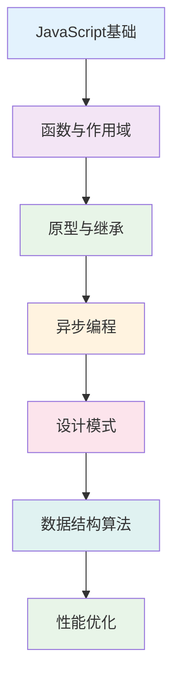

# ✍️ 前端手写题完全指南

> 💡 **手写题** 是前端面试的重要环节，考查对JavaScript核心概念的深度理解。本文汇总了常见手写题目，每道题都提供详细解答和多种实现方式。

::: info 📚 官方资源
- **难度分级**: 🟢 基础 | 🟡 中等 | 🔴 困难
- **覆盖领域**: 函数实现、数组方法、异步编程、设计模式、数据结构
- **学习建议**: 理解原理 → 自主实现 → 对比解答 → 边界优化
- **面试频率**: 95%以上的前端面试都会涉及手写题
:::

<details>
<summary>📋 目录导航</summary>

[[toc]]

</details>

## 📊 手写题分类概览

### 💼 面试频率统计

| 类别 | 高频题目 | 出现率 | 重要程度 | 学习优先级 |
|------|----------|--------|----------|-----------|
| **🔧 函数实现** | call/apply/bind, new | 95% | ⭐⭐⭐⭐⭐ | 1️⃣ |
| **📚 数组方法** | map/filter/reduce | 90% | ⭐⭐⭐⭐⭐ | 2️⃣ |
| **🚀 异步编程** | Promise, 防抖节流 | 85% | ⭐⭐⭐⭐⭐ | 3️⃣ |
| **🎨 设计模式** | 观察者, 发布订阅 | 70% | ⭐⭐⭐⭐ | 4️⃣ |
| **🌐 工具函数** | 深拷贝, 类型判断 | 80% | ⭐⭐⭐⭐ | 5️⃣ |
| **🧮 数据结构** | 栈队列, LRU缓存 | 60% | ⭐⭐⭐ | 6️⃣ |

### 🎯 学习路径



## 🔧 函数实现类

### 1. 手写 new 操作符 🟢

`new` 操作符用于创建对象实例，理解其内部机制对掌握JavaScript面向对象编程至关重要。

#### 💡 实现原理

1. 创建一个空对象，设置其原型为构造函数的 prototype
2. 将构造函数的 this 指向新创建的对象
3. 执行构造函数，为新对象添加属性
4. 如果构造函数返回对象，则返回该对象；否则返回新创建的对象

```javascript
/**
 * 手写 new 操作符
 * @param {Function} constructor - 构造函数
 * @param {...any} args - 构造函数参数
 * @returns {Object} 新创建的对象实例
 */
function myNew(constructor, ...args) {
  // 1. 参数校验
  if (typeof constructor !== "function") {
    throw new TypeError("构造函数必须是一个函数");
  }

  // 2. 创建一个空对象，设置原型链
  const obj = Object.create(constructor.prototype);
  
  // 3. 执行构造函数，并将this指向新创建的对象
  const result = constructor.apply(obj, args);
  
  // 4. 如果构造函数返回对象，则返回该对象；否则返回新创建的对象
  return result instanceof Object ? result : obj;
}

// 🧪 使用示例
function Person(name, age) {
  this.name = name;
  this.age = age;
}

Person.prototype.sayHello = function() {
  console.log(`Hello, I'm ${this.name}`);
};

const person = myNew(Person, "张三", 25);
person.sayHello(); // Hello, I'm 张三
console.log(person instanceof Person); // true
```

### 2. 手写 call 方法 🟢

`call` 方法允许为不同的对象分配和调用属于一个对象的函数/方法。

```javascript
/**
 * 手写 call 方法
 * @param {Object} context - 执行上下文
 * @param {...any} args - 函数参数
 * @returns {any} 函数执行结果
 */
Function.prototype.myCall = function(context, ...args) {
  // 1. 类型校验
  if (typeof this !== "function") {
    throw new TypeError("myCall 必须由函数调用");
  }

  // 2. 处理 context：null 或 undefined 时指向全局对象
  context = context || globalThis;
  
  // 3. 创建唯一的属性名，避免覆盖原有属性
  const fnSymbol = Symbol('fn');
  context[fnSymbol] = this;
  
  // 4. 通过对象调用函数，改变 this 指向
  const result = context[fnSymbol](...args);
  
  // 5. 清理临时属性
  delete context[fnSymbol];
  
  return result;
};

// 🧪 使用示例
const person = {
  name: '张三',
  greet: function(prefix, suffix) {
    return `${prefix} ${this.name} ${suffix}`;
  }
};

const anotherPerson = { name: '李四' };
const result = person.greet.myCall(anotherPerson, 'Hello', '!');
console.log(result); // Hello 李四 !
```

### 3. 手写 apply 方法 🟢

```javascript
/**
 * 手写 apply 方法
 * @param {Object} context - 执行上下文
 * @param {Array} argsArray - 参数数组
 * @returns {any} 函数执行结果
 */
Function.prototype.myApply = function(context, argsArray) {
  // 1. 类型校验
  if (typeof this !== "function") {
    throw new TypeError("myApply 必须由函数调用");
  }

  // 2. 处理 context
  context = context || globalThis;
  
  // 3. 处理参数数组
  const args = Array.isArray(argsArray) ? argsArray : [];
  
  // 4. 创建唯一的属性名
  const fnSymbol = Symbol('fn');
  context[fnSymbol] = this;
  
  // 5. 执行函数
  const result = context[fnSymbol](...args);
  
  // 6. 清理临时属性
  delete context[fnSymbol];
  
  return result;
};

// 🧪 使用示例
function sum(a, b, c) {
  return a + b + c;
}

const result = sum.myApply(null, [1, 2, 3]);
console.log(result); // 6
```

### 4. 手写 bind 方法 🟡

```javascript
/**
 * 手写 bind 方法
 * @param {Object} context - 绑定的上下文
 * @param {...any} args1 - 预设参数
 * @returns {Function} 绑定后的新函数
 */
Function.prototype.myBind = function(context, ...args1) {
  if (typeof this !== "function") {
    throw new TypeError("myBind 必须由函数调用");
  }
  
  const fn = this;
  context = context || globalThis;
  
  // 返回的绑定函数
  function BoundFunction(...args2) {
    // 判断是否作为构造函数调用
    if (this instanceof BoundFunction) {
      // 作为构造函数调用时，this 指向新创建的实例
      return fn.apply(this, [...args1, ...args2]);
    } else {
      // 作为普通函数调用时，this 指向绑定的 context
      return fn.apply(context, [...args1, ...args2]);
    }
  }
  
  // 维护原型链
  if (fn.prototype) {
    BoundFunction.prototype = Object.create(fn.prototype);
  }
  
  return BoundFunction;
};
```

### 5. 手写 instanceof 操作符 🟢

```javascript
/**
 * 手写 instanceof 操作符
 * @param {any} left - 左操作数（实例对象）
 * @param {Function} right - 右操作数（构造函数）
 * @returns {boolean} 是否为该构造函数的实例
 */
function myInstanceof(left, right) {
  // 基本数据类型直接返回 false
  if (typeof left !== 'object' || left === null) {
    return false;
  }
  
  // 获取构造函数的原型对象
  const prototype = right.prototype;
  
  // 获取对象的原型
  let proto = Object.getPrototypeOf(left);
  
  // 沿着原型链查找
  while (proto !== null) {
    if (proto === prototype) {
      return true;
    }
    proto = Object.getPrototypeOf(proto);
  }
  
  return false;
}

// 🧪 测试示例
console.log(myInstanceof([], Array)); // true
console.log(myInstanceof({}, Object)); // true
console.log(myInstanceof('hello', String)); // false
```

### 6. 手写 Object.create 🟡

```javascript
/**
 * 手写 Object.create
 * @param {Object|null} proto - 新创建对象的原型对象
 * @param {Object} propertiesObject - 可选，添加到新对象的可枚举属性
 * @returns {Object} 新创建的对象
 */
function myObjectCreate(proto, propertiesObject) {
  // 参数校验
  if (typeof proto !== 'object' && typeof proto !== 'function' && proto !== null) {
    throw new TypeError('Object prototype may only be an Object or null');
  }
  
  // 创建一个空的构造函数
  function TempConstructor() {}
  
  // 设置构造函数的原型
  TempConstructor.prototype = proto;
  
  // 创建新对象
  const obj = new TempConstructor();
  
  // 清理构造函数原型，避免意外的引用
  TempConstructor.prototype = null;
  
  // 如果提供了属性描述符对象，则添加属性
  if (propertiesObject !== undefined) {
    Object.defineProperties(obj, propertiesObject);
  }
  
  return obj;
}
```

## 📚 数组方法实现

### 1. 手写 forEach 🟢

```javascript
/**
 * 手写 forEach 方法
 * @param {Function} callback - 回调函数
 * @param {any} thisArg - this 指向
 */
Array.prototype.myForEach = function(callback, thisArg) {
  // 类型校验
  if (typeof callback !== 'function') {
    throw new TypeError('callback must be a function');
  }
  
  const array = Object(this);
  const length = parseInt(array.length) || 0;
  
  for (let i = 0; i < length; i++) {
    if (i in array) {
      callback.call(thisArg, array[i], i, array);
    }
  }
};

// 🧪 测试
const arr = [1, 2, 3, 4];
arr.myForEach((item, index) => {
  console.log(`${index}: ${item}`);
});
```

### 2. 手写 map 🟢

```javascript
/**
 * 手写 map 方法
 * @param {Function} callback - 回调函数
 * @param {any} thisArg - this 指向
 * @returns {Array} 新数组
 */
Array.prototype.myMap = function(callback, thisArg) {
  if (typeof callback !== 'function') {
    throw new TypeError('callback must be a function');
  }
  
  const array = Object(this);
  const length = parseInt(array.length) || 0;
  const result = new Array(length);
  
  for (let i = 0; i < length; i++) {
    if (i in array) {
      result[i] = callback.call(thisArg, array[i], i, array);
    }
  }
  
  return result;
};

// 🧪 测试
const numbers = [1, 2, 3, 4];
const doubled = numbers.myMap(x => x * 2);
console.log(doubled); // [2, 4, 6, 8]
```

### 3. 手写 filter 🟢

```javascript
/**
 * 手写 filter 方法
 * @param {Function} callback - 回调函数
 * @param {any} thisArg - this 指向
 * @returns {Array} 过滤后的新数组
 */
Array.prototype.myFilter = function(callback, thisArg) {
  if (typeof callback !== 'function') {
    throw new TypeError('callback must be a function');
  }
  
  const array = Object(this);
  const length = parseInt(array.length) || 0;
  const result = [];
  
  for (let i = 0; i < length; i++) {
    if (i in array) {
      const value = array[i];
      if (callback.call(thisArg, value, i, array)) {
        result.push(value);
      }
    }
  }
  
  return result;
};

// 🧪 测试
const numbers = [1, 2, 3, 4, 5, 6];
const evenNumbers = numbers.myFilter(x => x % 2 === 0);
console.log(evenNumbers); // [2, 4, 6]
```

### 4. 手写 reduce 🟡

```javascript
/**
 * 手写 reduce 方法
 * @param {Function} callback - 回调函数
 * @param {any} initialValue - 初始值
 * @returns {any} 累计结果
 */
Array.prototype.myReduce = function(callback, initialValue) {
  if (typeof callback !== 'function') {
    throw new TypeError('callback must be a function');
  }
  
  const array = Object(this);
  const length = parseInt(array.length) || 0;
  
  if (length === 0 && arguments.length < 2) {
    throw new TypeError('Reduce of empty array with no initial value');
  }
  
  let accumulator;
  let startIndex = 0;
  
  // 判断是否提供了初始值
  if (arguments.length >= 2) {
    accumulator = initialValue;
  } else {
    // 找到第一个有效的数组元素作为初始值
    while (startIndex < length && !(startIndex in array)) {
      startIndex++;
    }
    
    if (startIndex >= length) {
      throw new TypeError('Reduce of empty array with no initial value');
    }
    
    accumulator = array[startIndex];
    startIndex++;
  }
  
  // 遍历数组执行回调
  for (let i = startIndex; i < length; i++) {
    if (i in array) {
      accumulator = callback(accumulator, array[i], i, array);
    }
  }
  
  return accumulator;
};

// 🧪 测试
const numbers = [1, 2, 3, 4, 5];
const sum = numbers.myReduce((acc, cur) => acc + cur, 0);
console.log(sum); // 15

const product = numbers.myReduce((acc, cur) => acc * cur);
console.log(product); // 120
```

### 5. 手写 find 🟢

```javascript
/**
 * 手写 find 方法
 * @param {Function} callback - 回调函数
 * @param {any} thisArg - this 指向
 * @returns {any} 找到的元素或 undefined
 */
Array.prototype.myFind = function(callback, thisArg) {
  if (typeof callback !== 'function') {
    throw new TypeError('callback must be a function');
  }
  
  const array = Object(this);
  const length = parseInt(array.length) || 0;
  
  for (let i = 0; i < length; i++) {
    if (i in array) {
      const value = array[i];
      if (callback.call(thisArg, value, i, array)) {
        return value;
      }
    }
  }
  
  return undefined;
};

// 🧪 测试
const users = [
  { id: 1, name: '张三', age: 25 },
  { id: 2, name: '李四', age: 30 },
  { id: 3, name: '王五', age: 35 }
];

const user = users.myFind(u => u.age > 28);
console.log(user); // { id: 2, name: '李四', age: 30 }
```

### 6. 数组扁平化（flat）🟡

```javascript
/**
 * 数组扁平化 - 递归实现
 * @param {Array} arr - 多维数组
 * @param {number} depth - 扁平化深度，默认为 1
 * @returns {Array} 扁平化后的数组
 */
function flattenRecursive(arr, depth = 1) {
  const result = [];
  
  for (const item of arr) {
    if (Array.isArray(item) && depth > 0) {
      result.push(...flattenRecursive(item, depth - 1));
    } else {
      result.push(item);
    }
  }
  
  return result;
}

/**
 * 数组扁平化 - 完全扁平化
 * @param {Array} arr - 多维数组
 * @returns {Array} 完全扁平化的数组
 */
function flattenDeep(arr) {
  return arr.reduce((result, item) => {
    return Array.isArray(item) 
      ? result.concat(flattenDeep(item))
      : result.concat(item);
  }, []);
}

// 🧪 测试
const nestedArray = [1, [2, 3], [4, [5, 6]], 7];
console.log(flattenRecursive(nestedArray, 1)); // [1, 2, 3, 4, [5, 6], 7]
console.log(flattenDeep(nestedArray)); // [1, 2, 3, 4, 5, 6, 7]
```

### 7. 数组去重 🟢

```javascript
/**
 * 数组去重 - Set 方法（推荐）
 * @param {Array} arr - 待去重数组
 * @returns {Array} 去重后的数组
 */
function uniqueWithSet(arr) {
  return [...new Set(arr)];
}

/**
 * 对象数组去重 - 根据指定属性
 * @param {Array} arr - 对象数组
 * @param {string} key - 去重依据的属性名
 * @returns {Array} 去重后的数组
 */
function uniqueByProperty(arr, key) {
  const seen = new Map();
  return arr.filter(item => {
    const value = item[key];
    if (seen.has(value)) {
      return false;
    }
    seen.set(value, true);
    return true;
  });
}

// 🧪 测试
const duplicateArray = [1, 2, 2, 3, 4, 4, 5];
console.log(uniqueWithSet(duplicateArray)); // [1, 2, 3, 4, 5]

const users = [
  { id: 1, name: '张三' },
  { id: 2, name: '李四' },
  { id: 1, name: '张三' },
  { id: 3, name: '王五' }
];
console.log(uniqueByProperty(users, 'id'));
```

## 🚀 异步编程实现

### 1. 手写 Promise 🔴

```javascript
/**
 * 手写 Promise 实现
 */
class MyPromise {
  constructor(executor) {
    // Promise 状态
    this.state = 'pending';
    this.value = undefined;
    this.reason = undefined;
    
    // 回调函数队列
    this.onFulfilledCallbacks = [];
    this.onRejectedCallbacks = [];
    
    // resolve 函数
    const resolve = (value) => {
      if (this.state === 'pending') {
        this.state = 'fulfilled';
        this.value = value;
        this.onFulfilledCallbacks.forEach(fn => fn());
      }
    };
    
    // reject 函数
    const reject = (reason) => {
      if (this.state === 'pending') {
        this.state = 'rejected';
        this.reason = reason;
        this.onRejectedCallbacks.forEach(fn => fn());
      }
    };
    
    // 执行 executor
    try {
      executor(resolve, reject);
    } catch (error) {
      reject(error);
    }
  }
  
  then(onFulfilled, onRejected) {
    // 参数处理
    onFulfilled = typeof onFulfilled === 'function' ? onFulfilled : value => value;
    onRejected = typeof onRejected === 'function' ? onRejected : reason => { throw reason; };
    
    // 返回新的 Promise
    return new MyPromise((resolve, reject) => {
      const handleFulfilled = () => {
        try {
          const result = onFulfilled(this.value);
          if (result instanceof MyPromise) {
            result.then(resolve, reject);
          } else {
            resolve(result);
          }
        } catch (error) {
          reject(error);
        }
      };
      
      const handleRejected = () => {
        try {
          const result = onRejected(this.reason);
          if (result instanceof MyPromise) {
            result.then(resolve, reject);
          } else {
            resolve(result);
          }
        } catch (error) {
          reject(error);
        }
      };
      
      if (this.state === 'fulfilled') {
        setTimeout(handleFulfilled, 0);
      } else if (this.state === 'rejected') {
        setTimeout(handleRejected, 0);
      } else if (this.state === 'pending') {
        this.onFulfilledCallbacks.push(() => setTimeout(handleFulfilled, 0));
        this.onRejectedCallbacks.push(() => setTimeout(handleRejected, 0));
      }
    });
  }
  
  catch(onRejected) {
    return this.then(null, onRejected);
  }
  
  finally(onFinally) {
    return this.then(
      value => MyPromise.resolve(onFinally()).then(() => value),
      reason => MyPromise.resolve(onFinally()).then(() => { throw reason; })
    );
  }
  
  // 静态方法
  static resolve(value) {
    if (value instanceof MyPromise) {
      return value;
    }
    return new MyPromise((resolve) => resolve(value));
  }
  
  static reject(reason) {
    return new MyPromise((resolve, reject) => reject(reason));
  }
  
  static all(promises) {
    return new MyPromise((resolve, reject) => {
      const results = [];
      let completedCount = 0;
      
      if (promises.length === 0) {
        resolve(results);
        return;
      }
      
      promises.forEach((promise, index) => {
        MyPromise.resolve(promise).then(
          value => {
            results[index] = value;
            completedCount++;
            if (completedCount === promises.length) {
              resolve(results);
            }
          },
          reject
        );
      });
    });
  }
  
  static race(promises) {
    return new MyPromise((resolve, reject) => {
      promises.forEach(promise => {
        MyPromise.resolve(promise).then(resolve, reject);
      });
    });
  }
  
  static allSettled(promises) {
    return new MyPromise((resolve) => {
      const results = [];
      let completedCount = 0;
      
      if (promises.length === 0) {
        resolve(results);
        return;
      }
      
      promises.forEach((promise, index) => {
        MyPromise.resolve(promise).then(
          value => {
            results[index] = { status: 'fulfilled', value };
            completedCount++;
            if (completedCount === promises.length) {
              resolve(results);
            }
          },
          reason => {
            results[index] = { status: 'rejected', reason };
            completedCount++;
            if (completedCount === promises.length) {
              resolve(results);
            }
          }
        );
      });
    });
  }
}

// 🧪 使用示例
const myPromise = new MyPromise((resolve, reject) => {
  setTimeout(() => resolve('Hello World'), 1000);
});

myPromise
  .then(value => {
    console.log(value); // Hello World
    return 'Next step';
  })
  .then(value => {
    console.log(value); // Next step
  })
  .catch(error => {
    console.error(error);
  });
```

### 2. 防抖和节流 🟡

#### 防抖（Debounce）

```javascript
/**
 * 防抖函数
 * @param {Function} func - 要防抖的函数
 * @param {number} delay - 延迟时间（毫秒）
 * @param {boolean} immediate - 是否立即执行
 * @returns {Function} 防抖后的函数
 */
function debounce(func, delay, immediate = false) {
  let timeoutId;
  let hasExecuted = false;
  
  return function debounced(...args) {
    const context = this;
    
    // 清除之前的定时器
    clearTimeout(timeoutId);
    
    if (immediate && !hasExecuted) {
      // 立即执行模式
      func.apply(context, args);
      hasExecuted = true;
    } else {
      // 延迟执行模式
      timeoutId = setTimeout(() => {
        func.apply(context, args);
        hasExecuted = false;
      }, delay);
    }
  };
}

// 🧪 使用示例
const searchInput = document.getElementById('search');
const debouncedSearch = debounce((e) => {
  console.log('搜索:', e.target.value);
}, 500);

searchInput?.addEventListener('input', debouncedSearch);
```

#### 节流（Throttle）

```javascript
/**
 * 节流函数
 * @param {Function} func - 要节流的函数
 * @param {number} delay - 时间间隔（毫秒）
 * @param {Object} options - 配置选项
 * @returns {Function} 节流后的函数
 */
function throttle(func, delay, options = {}) {
  const { leading = true, trailing = true } = options;
  let timeoutId;
  let lastExecTime = 0;
  
  return function throttled(...args) {
    const context = this;
    const now = Date.now();
    
    // 如果是第一次执行且不需要leading执行
    if (!lastExecTime && !leading) {
      lastExecTime = now;
    }
    
    const remainingTime = delay - (now - lastExecTime);
    
    if (remainingTime <= 0 || remainingTime > delay) {
      // 可以执行
      if (timeoutId) {
        clearTimeout(timeoutId);
        timeoutId = null;
      }
      
      func.apply(context, args);
      lastExecTime = now;
    } else if (!timeoutId && trailing) {
      // 设置延迟执行
      timeoutId = setTimeout(() => {
        lastExecTime = leading ? Date.now() : 0;
        timeoutId = null;
        func.apply(context, args);
      }, remainingTime);
    }
  };
}

// 🧪 使用示例
const scrollHandler = throttle(() => {
  console.log('页面滚动:', window.scrollY);
}, 100);

window.addEventListener('scroll', scrollHandler);
```

### 3. 并发控制 🔴

```javascript
/**
 * 并发控制函数
 * @param {Array} tasks - 任务数组
 * @param {number} limit - 并发限制数量
 * @returns {Promise} 所有任务完成的 Promise
 */
async function concurrencyControl(tasks, limit) {
  const results = [];
  const executing = [];
  
  for (const task of tasks) {
    const promise = Promise.resolve().then(() => task());
    results.push(promise);
    
    if (tasks.length >= limit) {
      const e = promise.then(() => executing.splice(executing.indexOf(e), 1));
      executing.push(e);
      
      if (executing.length >= limit) {
        await Promise.race(executing);
      }
    }
  }
  
  return Promise.all(results);
}

// 🧪 使用示例
const createTask = (id, delay) => () => {
  return new Promise(resolve => {
    console.log(`任务 ${id} 开始`);
    setTimeout(() => {
      console.log(`任务 ${id} 完成`);
      resolve(id);
    }, delay);
  });
};

const tasks = [
  createTask(1, 1000),
  createTask(2, 2000),
  createTask(3, 1500),
  createTask(4, 800),
  createTask(5, 1200)
];

concurrencyControl(tasks, 2);
```

## 🎨 设计模式实现

### 1. 观察者模式 🟡

```javascript
/**
 * 观察者模式实现
 */
class Observer {
  constructor(name) {
    this.name = name;
  }
  
  update(message) {
    console.log(`${this.name} 收到消息: ${message}`);
  }
}

class Subject {
  constructor() {
    this.observers = [];
  }
  
  // 添加观察者
  addObserver(observer) {
    this.observers.push(observer);
  }
  
  // 移除观察者
  removeObserver(observer) {
    const index = this.observers.indexOf(observer);
    if (index > -1) {
      this.observers.splice(index, 1);
    }
  }
  
  // 通知所有观察者
  notify(message) {
    this.observers.forEach(observer => observer.update(message));
  }
}

// 🧪 使用示例
const subject = new Subject();
const observer1 = new Observer('观察者1');
const observer2 = new Observer('观察者2');

subject.addObserver(observer1);
subject.addObserver(observer2);
subject.notify('Hello World');
```

### 2. 发布订阅模式 🟡

```javascript
/**
 * 发布订阅模式实现
 */
class EventEmitter {
  constructor() {
    this.events = {};
  }
  
  // 订阅事件
  on(eventName, callback) {
    if (!this.events[eventName]) {
      this.events[eventName] = [];
    }
    this.events[eventName].push(callback);
  }
  
  // 一次性订阅
  once(eventName, callback) {
    const onceWrapper = (...args) => {
      callback.apply(this, args);
      this.off(eventName, onceWrapper);
    };
    this.on(eventName, onceWrapper);
  }
  
  // 取消订阅
  off(eventName, callback) {
    if (!this.events[eventName]) return;
    
    if (!callback) {
      // 移除所有监听器
      delete this.events[eventName];
    } else {
      // 移除指定监听器
      const index = this.events[eventName].indexOf(callback);
      if (index > -1) {
        this.events[eventName].splice(index, 1);
      }
    }
  }
  
  // 发布事件
  emit(eventName, ...args) {
    if (!this.events[eventName]) return;
    
    this.events[eventName].forEach(callback => {
      callback.apply(this, args);
    });
  }
  
  // 获取监听器数量
  listenerCount(eventName) {
    return this.events[eventName] ? this.events[eventName].length : 0;
  }
}

// 🧪 使用示例
const emitter = new EventEmitter();

const handler1 = (data) => console.log('处理器1:', data);
const handler2 = (data) => console.log('处理器2:', data);

emitter.on('test', handler1);
emitter.on('test', handler2);
emitter.emit('test', 'Hello World'); // 两个处理器都会执行

emitter.off('test', handler1);
emitter.emit('test', '只有处理器2执行'); // 只有处理器2执行
```

### 3. 单例模式 🟢

```javascript
/**
 * 单例模式实现
 */
class Singleton {
  constructor(name) {
    if (Singleton.instance) {
      return Singleton.instance;
    }
    
    this.name = name;
    Singleton.instance = this;
    return this;
  }
  
  getName() {
    return this.name;
  }
}

// 使用闭包的单例模式
const SingletonClosure = (function() {
  let instance;
  
  function createInstance(name) {
    return {
      name,
      getName() {
        return this.name;
      }
    };
  }
  
  return {
    getInstance(name) {
      if (!instance) {
        instance = createInstance(name);
      }
      return instance;
    }
  };
})();

// 🧪 测试
const instance1 = new Singleton('实例1');
const instance2 = new Singleton('实例2');
console.log(instance1 === instance2); // true

const closureInstance1 = SingletonClosure.getInstance('闭包实例1');
const closureInstance2 = SingletonClosure.getInstance('闭包实例2');
console.log(closureInstance1 === closureInstance2); // true
```

### 4. 工厂模式 🟡

```javascript
/**
 * 工厂模式实现
 */
class Product {
  constructor(name) {
    this.name = name;
  }
  
  use() {
    console.log(`使用 ${this.name}`);
  }
}

class ProductA extends Product {
  constructor() {
    super('产品A');
  }
  
  specificMethodA() {
    console.log('产品A特有方法');
  }
}

class ProductB extends Product {
  constructor() {
    super('产品B');
  }
  
  specificMethodB() {
    console.log('产品B特有方法');
  }
}

class ProductFactory {
  static createProduct(type) {
    switch (type) {
      case 'A':
        return new ProductA();
      case 'B':
        return new ProductB();
      default:
        throw new Error('未知产品类型');
    }
  }
}

// 🧪 使用示例
const productA = ProductFactory.createProduct('A');
const productB = ProductFactory.createProduct('B');

productA.use(); // 使用 产品A
productB.use(); // 使用 产品B
```

## 🌐 工具函数实现

### 1. 深拷贝 🟡

```javascript
/**
 * 深拷贝实现
 * @param {any} obj - 要拷贝的对象
 * @param {WeakMap} hash - 用于处理循环引用
 * @returns {any} 深拷贝后的对象
 */
function deepClone(obj, hash = new WeakMap()) {
  // 处理 null 和 undefined
  if (obj === null || obj === undefined) return obj;
  
  // 处理基本数据类型
  if (typeof obj !== 'object') return obj;
  
  // 处理日期
  if (obj instanceof Date) return new Date(obj);
  
  // 处理正则表达式
  if (obj instanceof RegExp) return new RegExp(obj);
  
  // 处理函数
  if (typeof obj === 'function') {
    return obj; // 函数不进行深拷贝
  }
  
  // 处理循环引用
  if (hash.has(obj)) return hash.get(obj);
  
  // 创建新对象
  const cloneObj = Array.isArray(obj) ? [] : {};
  hash.set(obj, cloneObj);
  
  // 拷贝属性
  for (const key in obj) {
    if (obj.hasOwnProperty(key)) {
      cloneObj[key] = deepClone(obj[key], hash);
    }
  }
  
  return cloneObj;
}

// 🧪 测试
const original = {
  name: '张三',
  age: 25,
  hobbies: ['读书', '游泳'],
  address: {
    city: '北京',
    district: '朝阳区'
  },
  date: new Date(),
  regex: /test/g
};

// 创建循环引用
original.self = original;

const cloned = deepClone(original);
console.log(cloned);
console.log(cloned === original); // false
console.log(cloned.self === cloned); // true
```

### 2. 类型判断 🟢

```javascript
/**
 * 精确类型判断
 * @param {any} value - 要判断类型的值
 * @returns {string} 类型字符串
 */
function getType(value) {
  return Object.prototype.toString.call(value).slice(8, -1).toLowerCase();
}

/**
 * 类型检查工具集
 */
const typeUtils = {
  isString: (value) => typeof value === 'string',
  isNumber: (value) => typeof value === 'number' && !isNaN(value),
  isBoolean: (value) => typeof value === 'boolean',
  isFunction: (value) => typeof value === 'function',
  isObject: (value) => value !== null && typeof value === 'object',
  isArray: (value) => Array.isArray(value),
  isDate: (value) => value instanceof Date,
  isRegExp: (value) => value instanceof RegExp,
  isNull: (value) => value === null,
  isUndefined: (value) => value === undefined,
  isNullOrUndefined: (value) => value == null,
  isEmpty: (value) => {
    if (value == null) return true;
    if (typeof value === 'string' || Array.isArray(value)) {
      return value.length === 0;
    }
    if (typeof value === 'object') {
      return Object.keys(value).length === 0;
    }
    return false;
  },
  isPlainObject: (value) => {
    if (!typeUtils.isObject(value)) return false;
    if (Object.getPrototypeOf(value) === null) return true;
    let proto = value;
    while (Object.getPrototypeOf(proto) !== null) {
      proto = Object.getPrototypeOf(proto);
    }
    return Object.getPrototypeOf(value) === proto;
  }
};

// 🧪 测试
console.log(getType(123)); // number
console.log(getType('hello')); // string
console.log(getType([])); // array
console.log(getType({})); // object
console.log(getType(null)); // null
console.log(getType(new Date())); // date

console.log(typeUtils.isArray([1, 2, 3])); // true
console.log(typeUtils.isEmpty('')); // true
console.log(typeUtils.isPlainObject({})); // true
```

### 3. 函数柯里化 🟡

```javascript
/**
 * 函数柯里化实现
 * @param {Function} fn - 要柯里化的函数
 * @param {...any} args - 预设参数
 * @returns {Function} 柯里化后的函数
 */
function curry(fn, ...args) {
  return function curried(...newArgs) {
    const allArgs = [...args, ...newArgs];
    
    if (allArgs.length >= fn.length) {
      // 参数足够，直接调用
      return fn.apply(this, allArgs);
    } else {
      // 参数不够，返回新函数继续收集参数
      return curry(fn, ...allArgs);
    }
  };
}

// 高级柯里化，支持占位符
function advancedCurry(fn, ...args) {
  const placeholder = advancedCurry.placeholder || Symbol('placeholder');
  
  return function curried(...newArgs) {
    const allArgs = [...args];
    let argIndex = 0;
    
    // 填充占位符
    for (let i = 0; i < allArgs.length && argIndex < newArgs.length; i++) {
      if (allArgs[i] === placeholder) {
        allArgs[i] = newArgs[argIndex++];
      }
    }
    
    // 添加剩余参数
    while (argIndex < newArgs.length) {
      allArgs.push(newArgs[argIndex++]);
    }
    
    // 检查是否还有占位符
    const hasPlaceholder = allArgs.some(arg => arg === placeholder);
    
    if (allArgs.length >= fn.length && !hasPlaceholder) {
      return fn.apply(this, allArgs);
    } else {
      return advancedCurry(fn, ...allArgs);
    }
  };
}

advancedCurry.placeholder = Symbol('placeholder');
const _ = advancedCurry.placeholder;

// 🧪 使用示例
function add(a, b, c, d) {
  return a + b + c + d;
}

const curriedAdd = curry(add);
console.log(curriedAdd(1)(2)(3)(4)); // 10
console.log(curriedAdd(1, 2)(3, 4)); // 10

const advancedAdd = advancedCurry(add);
console.log(advancedAdd(1, _, 3)(2, 4)); // 10
console.log(advancedAdd(_, 2, _, 4)(1, 3)); // 10
```

### 4. 字符串模板解析 🟡

```javascript
/**
 * 简单的字符串模板解析器
 * @param {string} template - 模板字符串
 * @param {Object} data - 数据对象
 * @returns {string} 解析后的字符串
 */
function parseTemplate(template, data) {
  return template.replace(/\{\{(\w+)\}\}/g, (match, key) => {
    return data.hasOwnProperty(key) ? data[key] : match;
  });
}

/**
 * 高级模板解析器，支持表达式
 * @param {string} template - 模板字符串
 * @param {Object} data - 数据对象
 * @returns {string} 解析后的字符串
 */
function advancedParseTemplate(template, data) {
  return template.replace(/\{\{(.+?)\}\}/g, (match, expression) => {
    try {
      // 创建安全的执行环境
      const func = new Function('data', `with(data) { return ${expression}; }`);
      return func(data);
    } catch (error) {
      console.warn(`模板表达式解析错误: ${expression}`, error);
      return match;
    }
  });
}

// 🧪 使用示例
const template = 'Hello {{name}}, you are {{age}} years old.';
const data = { name: '张三', age: 25 };
console.log(parseTemplate(template, data)); 
// Hello 张三, you are 25 years old.

const advancedTemplate = 'Hello {{name}}, you will be {{age + 1}} next year.';
console.log(advancedParseTemplate(advancedTemplate, data));
// Hello 张三, you will be 26 next year.
```

### 5. URL 参数解析 🟢

```javascript
/**
 * URL 参数解析工具
 */
const urlUtils = {
  /**
   * 解析 URL 参数
   * @param {string} url - URL 字符串
   * @returns {Object} 参数对象
   */
  parseParams(url = window.location.href) {
    const params = {};
    const urlObj = new URL(url);
    
    for (const [key, value] of urlObj.searchParams) {
      // 处理重复参数
      if (params[key]) {
        if (Array.isArray(params[key])) {
          params[key].push(value);
        } else {
          params[key] = [params[key], value];
        }
      } else {
        params[key] = value;
      }
    }
    
    return params;
  },
  
  /**
   * 构建 URL 参数字符串
   * @param {Object} params - 参数对象
   * @returns {string} 参数字符串
   */
  stringifyParams(params) {
    const searchParams = new URLSearchParams();
    
    for (const [key, value] of Object.entries(params)) {
      if (Array.isArray(value)) {
        value.forEach(v => searchParams.append(key, v));
      } else {
        searchParams.set(key, value);
      }
    }
    
    return searchParams.toString();
  },
  
  /**
   * 更新 URL 参数
   * @param {Object} params - 要更新的参数
   * @param {string} url - 目标 URL
   * @returns {string} 更新后的 URL
   */
  updateParams(params, url = window.location.href) {
    const urlObj = new URL(url);
    
    for (const [key, value] of Object.entries(params)) {
      if (value === null || value === undefined) {
        urlObj.searchParams.delete(key);
      } else {
        urlObj.searchParams.set(key, value);
      }
    }
    
    return urlObj.toString();
  }
};

// 🧪 使用示例
const url = 'https://example.com?name=张三&age=25&hobby=读书&hobby=游泳';
const params = urlUtils.parseParams(url);
console.log(params); // { name: '张三', age: '25', hobby: ['读书', '游泳'] }

const newUrl = urlUtils.updateParams({ age: 26, city: '北京' }, url);
console.log(newUrl);
```

## 🧮 数据结构实现

### 1. 栈（Stack）🟢

```javascript
/**
 * 栈数据结构实现
 */
class Stack {
  constructor() {
    this.items = [];
  }
  
  // 入栈
  push(element) {
    this.items.push(element);
  }
  
  // 出栈
  pop() {
    if (this.isEmpty()) {
      throw new Error('Stack is empty');
    }
    return this.items.pop();
  }
  
  // 查看栈顶元素
  peek() {
    if (this.isEmpty()) {
      return undefined;
    }
    return this.items[this.items.length - 1];
  }
  
  // 检查是否为空
  isEmpty() {
    return this.items.length === 0;
  }
  
  // 获取大小
  size() {
    return this.items.length;
  }
  
  // 清空栈
  clear() {
    this.items = [];
  }
  
  // 转换为数组
  toArray() {
    return [...this.items];
  }
}

// 🧪 使用示例
const stack = new Stack();
stack.push(1);
stack.push(2);
stack.push(3);
console.log(stack.peek()); // 3
console.log(stack.pop()); // 3
console.log(stack.size()); // 2
```

### 2. 队列（Queue）🟢

```javascript
/**
 * 队列数据结构实现
 */
class Queue {
  constructor() {
    this.items = [];
  }
  
  // 入队
  enqueue(element) {
    this.items.push(element);
  }
  
  // 出队
  dequeue() {
    if (this.isEmpty()) {
      throw new Error('Queue is empty');
    }
    return this.items.shift();
  }
  
  // 查看队首元素
  front() {
    if (this.isEmpty()) {
      return undefined;
    }
    return this.items[0];
  }
  
  // 检查是否为空
  isEmpty() {
    return this.items.length === 0;
  }
  
  // 获取大小
  size() {
    return this.items.length;
  }
  
  // 清空队列
  clear() {
    this.items = [];
  }
  
  // 转换为数组
  toArray() {
    return [...this.items];
  }
}

// 🧪 使用示例
const queue = new Queue();
queue.enqueue(1);
queue.enqueue(2);
queue.enqueue(3);
console.log(queue.front()); // 1
console.log(queue.dequeue()); // 1
console.log(queue.size()); // 2
```

### 3. 链表（LinkedList）🟡

```javascript
/**
 * 链表节点
 */
class ListNode {
  constructor(val, next = null) {
    this.val = val;
    this.next = next;
  }
}

/**
 * 单向链表实现
 */
class LinkedList {
  constructor() {
    this.head = null;
    this.size = 0;
  }
  
  // 在指定位置插入元素
  insert(index, val) {
    if (index < 0 || index > this.size) {
      throw new Error('Index out of bounds');
    }
    
    if (index === 0) {
      this.head = new ListNode(val, this.head);
    } else {
      let current = this.head;
      for (let i = 0; i < index - 1; i++) {
        current = current.next;
      }
      current.next = new ListNode(val, current.next);
    }
    
    this.size++;
  }
  
  // 在末尾添加元素
  append(val) {
    this.insert(this.size, val);
  }
  
  // 在开头添加元素
  prepend(val) {
    this.insert(0, val);
  }
  
  // 删除指定位置的元素
  removeAt(index) {
    if (index < 0 || index >= this.size) {
      throw new Error('Index out of bounds');
    }
    
    if (index === 0) {
      const removedVal = this.head.val;
      this.head = this.head.next;
      this.size--;
      return removedVal;
    }
    
    let current = this.head;
    for (let i = 0; i < index - 1; i++) {
      current = current.next;
    }
    
    const removedVal = current.next.val;
    current.next = current.next.next;
    this.size--;
    return removedVal;
  }
  
  // 查找元素
  indexOf(val) {
    let current = this.head;
    let index = 0;
    
    while (current) {
      if (current.val === val) {
        return index;
      }
      current = current.next;
      index++;
    }
    
    return -1;
  }
  
  // 获取指定位置的元素
  get(index) {
    if (index < 0 || index >= this.size) {
      throw new Error('Index out of bounds');
    }
    
    let current = this.head;
    for (let i = 0; i < index; i++) {
      current = current.next;
    }
    
    return current.val;
  }
  
  // 转换为数组
  toArray() {
    const result = [];
    let current = this.head;
    
    while (current) {
      result.push(current.val);
      current = current.next;
    }
    
    return result;
  }
  
  // 获取大小
  getSize() {
    return this.size;
  }
  
  // 检查是否为空
  isEmpty() {
    return this.size === 0;
  }
}

// 🧪 使用示例
const list = new LinkedList();
list.append(1);
list.append(2);
list.append(3);
list.insert(1, 1.5);
console.log(list.toArray()); // [1, 1.5, 2, 3]
console.log(list.indexOf(2)); // 2
console.log(list.removeAt(1)); // 1.5
console.log(list.toArray()); // [1, 2, 3]
```

### 4. LRU 缓存 🔴

```javascript
/**
 * LRU (Least Recently Used) 缓存实现
 */
class LRUCache {
  constructor(capacity) {
    this.capacity = capacity;
    this.cache = new Map();
  }
  
  get(key) {
    if (this.cache.has(key)) {
      // 移动到最新位置
      const value = this.cache.get(key);
      this.cache.delete(key);
      this.cache.set(key, value);
      return value;
    }
    return -1;
  }
  
  put(key, value) {
    if (this.cache.has(key)) {
      // 更新现有键值
      this.cache.delete(key);
    } else if (this.cache.size >= this.capacity) {
      // 删除最久未使用的项（Map 的第一个项）
      const firstKey = this.cache.keys().next().value;
      this.cache.delete(firstKey);
    }
    
    this.cache.set(key, value);
  }
  
  // 获取所有键值对
  getAll() {
    return Array.from(this.cache.entries());
  }
  
  // 获取缓存大小
  size() {
    return this.cache.size;
  }
  
  // 清空缓存
  clear() {
    this.cache.clear();
  }
}

// 🧪 使用示例
const lru = new LRUCache(3);
lru.put(1, 'one');
lru.put(2, 'two');
lru.put(3, 'three');
console.log(lru.get(2)); // 'two'
lru.put(4, 'four'); // 会移除键 1
console.log(lru.get(1)); // -1 (未找到)
console.log(lru.getAll()); // [[3, 'three'], [2, 'two'], [4, 'four']]
```

## 🔍 字符串处理

### 1. 字符串反转 🟢

```javascript
/**
 * 字符串反转的多种实现
 */
const stringReverse = {
  // 方法1: 使用内置方法
  method1: (str) => str.split('').reverse().join(''),
  
  // 方法2: 循环实现
  method2: (str) => {
    let result = '';
    for (let i = str.length - 1; i >= 0; i--) {
      result += str[i];
    }
    return result;
  },
  
  // 方法3: 递归实现
  method3: (str) => {
    if (str.length <= 1) return str;
    return str[str.length - 1] + stringReverse.method3(str.slice(0, -1));
  },
  
  // 方法4: 双指针
  method4: (str) => {
    const arr = str.split('');
    let left = 0;
    let right = arr.length - 1;
    
    while (left < right) {
      [arr[left], arr[right]] = [arr[right], arr[left]];
      left++;
      right--;
    }
    
    return arr.join('');
  }
};

// 🧪 测试
const testStr = 'hello world';
console.log(stringReverse.method1(testStr)); // dlrow olleh
```

### 2. 回文字符串检测 🟢

```javascript
/**
 * 回文字符串检测
 * @param {string} s - 输入字符串
 * @returns {boolean} 是否为回文
 */
function isPalindrome(s) {
  // 预处理：转换为小写并移除非字母数字字符
  const cleaned = s.toLowerCase().replace(/[^a-z0-9]/g, '');
  
  let left = 0;
  let right = cleaned.length - 1;

  while (left < right) {
    if (cleaned[left] !== cleaned[right]) {
      return false;
    }
    left++;
    right--;
  }

  return true;
}

/**
 * 最长回文子串
 * @param {string} s - 输入字符串
 * @returns {string} 最长回文子串
 */
function longestPalindrome(s) {
  if (!s || s.length < 2) return s;
  
  let start = 0;
  let maxLength = 1;
  
  // 辅助函数：从中心向外扩展
  function expandAroundCenter(left, right) {
    while (left >= 0 && right < s.length && s[left] === s[right]) {
      const currentLength = right - left + 1;
      if (currentLength > maxLength) {
        start = left;
        maxLength = currentLength;
      }
      left--;
      right++;
    }
  }
  
  for (let i = 0; i < s.length; i++) {
    // 奇数长度回文
    expandAroundCenter(i, i);
    // 偶数长度回文
    expandAroundCenter(i, i + 1);
  }
  
  return s.substring(start, start + maxLength);
}

// 🧪 测试
console.log(isPalindrome("A man, a plan, a canal: Panama")); // true
console.log(longestPalindrome("babad")); // "bab" 或 "aba"
```

### 3. 字符串压缩 🟡

```javascript
/**
 * 字符串压缩
 * @param {string} str - 输入字符串
 * @returns {string} 压缩后的字符串
 */
function compressString(str) {
  if (!str) return str;
  
  let compressed = '';
  let count = 1;
  
  for (let i = 0; i < str.length; i++) {
    if (i + 1 < str.length && str[i] === str[i + 1]) {
      count++;
    } else {
      compressed += str[i] + count;
      count = 1;
    }
  }
  
  return compressed.length < str.length ? compressed : str;
}

/**
 * 字符串解压缩
 * @param {string} str - 压缩的字符串
 * @returns {string} 解压缩后的字符串
 */
function decompressString(str) {
  let result = '';
  
  for (let i = 0; i < str.length; i += 2) {
    const char = str[i];
    const count = parseInt(str[i + 1]);
    result += char.repeat(count);
  }
  
  return result;
}

// 🧪 测试
console.log(compressString("aabcccccaaa")); // "a2b1c5a3"
console.log(decompressString("a2b1c5a3")); // "aabcccccaaa"
```

## 🎯 面试要点

### ✅ 评分标准

| 层次 | 要求 | 分数 | 关键点 |
|------|------|------|--------|
| **🔴 不合格** | 无法实现基本功能 | 0-40分 | 语法错误、逻辑混乱 |
| **🟡 基础** | 能实现基本功能，但有bug | 40-60分 | 功能基本正确，边界处理欠缺 |
| **🟢 良好** | 功能正确，考虑边界情况 | 60-80分 | 代码健壮，思路清晰 |
| **🟦 优秀** | 性能优化，代码优雅 | 80-95分 | 多种实现方式，复杂度分析 |
| **🟣 卓越** | 扩展性强，设计模式应用 | 95-100分 | 工程化思维，架构设计 |

### 💡 加分要点

1. **🛡️ 边界处理**: 考虑 null、undefined、空数组等边界情况
2. **⚡ 性能优化**: 时间复杂度和空间复杂度优化
3. **🧪 错误处理**: 合理的错误检查和异常处理
4. **📝 代码规范**: 清晰的变量命名和注释
5. **🔧 扩展性**: 代码的可维护性和扩展性
6. **🎨 多种方案**: 提供多种实现思路并分析优劣

### 🎤 面试技巧

#### 良好的回答流程

```javascript
// ✅ 推荐的面试回答步骤

// 1. 明确需求
function solveproblem() {
  // 先询问和确认需求
  // "这个函数需要处理哪些数据类型？"
  // "有什么特殊的边界情况需要考虑吗？"
  
  // 2. 分析思路
  // "我想用XX方法来实现，时间复杂度是O(n)..."
  
  // 3. 编写代码
  // 边写边解释思路
  
  // 4. 测试验证
  // 主动提供测试用例
  
  // 5. 优化改进
  // 讨论可能的优化方案
}
```

#### 面试沟通模板

```javascript
/**
 * 面试标准流程示例
 */
function interview() {
  // 📋 Step 1: 理解题目
  console.log("让我确认一下需求...");
  
  // 📊 Step 2: 分析方案
  console.log("我考虑用这种方法，因为...");
  
  // 💻 Step 3: 编码实现
  console.log("我先写一个基础版本...");
  
  // 🧪 Step 4: 测试验证
  console.log("让我测试几个用例...");
  
  // ⚡ Step 5: 优化讨论
  console.log("这里还可以优化...");
}
```

### 📚 知识点分布

#### 必掌握（95%+ 出现率）

- **函数相关**: call、apply、bind、new
- **数组方法**: map、filter、reduce、forEach
- **异步编程**: Promise 实现、防抖节流
- **工具函数**: 深拷贝、类型判断

#### 重要掌握（70%+ 出现率）

- **设计模式**: 观察者、发布订阅、单例
- **数据结构**: 栈、队列、链表
- **字符串处理**: 模板解析、URL 处理
- **算法思想**: 递归、双指针、动态规划

#### 进阶掌握（50%+ 出现率）

- **高级异步**: 并发控制、调度器
- **复杂数据结构**: LRU 缓存、树结构
- **性能优化**: 函数缓存、懒加载
- **工程化**: 模块化、插件系统

## 💡 学习建议

### 🎯 学习路径

1. **理解原理**: 先理解 API 的工作原理和使用场景
2. **基础实现**: 从简单版本开始，逐步完善功能
3. **边界处理**: 重视边界情况和错误处理
4. **性能优化**: 分析时间空间复杂度，寻求优化
5. **实际应用**: 在项目中运用这些实现思路

### 📖 练习建议

```javascript
// 🎯 每日练习计划
const studyPlan = {
  week1: ['call/apply/bind', 'new操作符', 'instanceof'],
  week2: ['数组方法实现', '数组扁平化', '数组去重'],
  week3: ['Promise实现', '防抖节流', 'async/await'],
  week4: ['深拷贝', '类型判断', '柯里化'],
  week5: ['设计模式', '数据结构', '字符串处理'],
  week6: ['综合练习', '性能优化', '面试模拟']
};

// 💪 练习方法
const practiceMethod = {
  step1: '看题目要求，不看答案先自己实现',
  step2: '对比标准答案，找出差距和不足',
  step3: '优化自己的实现，考虑边界情况',
  step4: '尝试多种实现方式，分析优劣',
  step5: '总结知识点，整理成笔记'
};
```

### 🔧 调试技巧

```javascript
/**
 * 面试调试技巧
 */
const debugTips = {
  // 1. 使用断言验证逻辑
  assert: (condition, message) => {
    if (!condition) {
      throw new Error(`断言失败: ${message}`);
    }
  },
  
  // 2. 添加日志输出
  log: (step, value) => {
    console.log(`步骤 ${step}:`, value);
  },
  
  // 3. 边界测试
  testBoundary: (fn) => {
    console.log('测试空值:', fn(null));
    console.log('测试undefined:', fn(undefined));
    console.log('测试空数组:', fn([]));
    console.log('测试空对象:', fn({}));
  }
};
```

::: tip 🎯 总结

手写题是检验JavaScript基础功底的重要方式：

### 🎯 重点掌握
- **🔧 核心API**: call、apply、bind、new、Promise等原理
- **📚 数组方法**: map、filter、reduce、flat等实现
- **🚀 异步编程**: Promise、防抖节流、并发控制
- **🎨 设计模式**: 观察者、发布订阅、单例等
- **🌐 工具函数**: 深拷贝、柯里化、类型判断

### 💡 学习建议
1. **理解原理**: 先理解API的工作原理和使用场景
2. **循序渐进**: 从简单实现开始，逐步完善功能
3. **关注细节**: 重视边界情况和错误处理
4. **性能意识**: 分析时间空间复杂度，寻求优化
5. **实际应用**: 在项目中运用这些实现思路

坚持练习，手写能力会成为你面试和工作中的有力武器！🎉

:::

::: warning 📋 注意事项
- 面试时先思考再编码，不要急于下手
- 注意代码的可读性和规范性
- 主动说明自己的思路和考虑的边界情况
- 如果时间允许，可以讨论性能优化和扩展方案
- 准备多种实现方式，展现技术深度
:::

---

> 🌟 **细节决定成败，原理照亮前路** - 用深度理解驾驭JavaScript的精妙世界！
