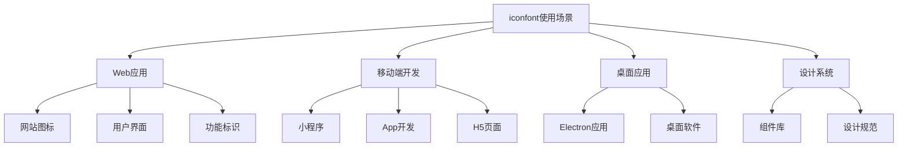
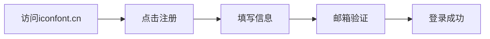
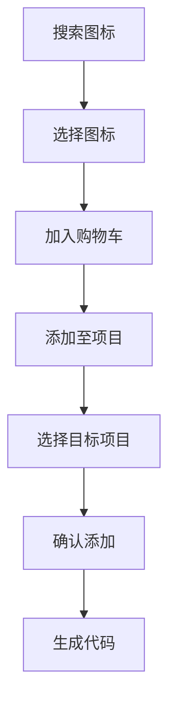
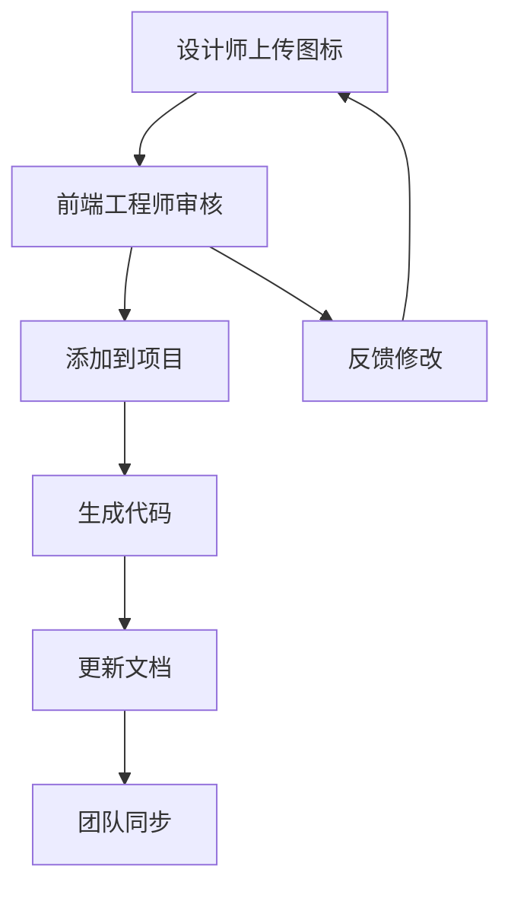

# 🎨 iconfont 完全使用指南

> iconfont是阿里巴巴推出的矢量图标库，提供丰富的图标资源和多种使用方式。本指南将详细介绍iconfont的各种使用方法和最佳实践。

## 📋 目录导航

<details>
<summary>点击展开完整目录</summary>

### 🚀 快速开始
- [iconfont介绍](#iconfont介绍)
- [注册与项目创建](#注册与项目创建)
- [图标搜索与添加](#图标搜索与添加)

### 📦 使用方式
- [Unicode引入](#unicode引入方式)
- [Font class引入](#font-class引入方式)
- [Symbol引入](#symbol引入方式)
- [SVG Sprite引入](#svg-sprite引入方式)

### 🎯 高级用法
- [自定义图标上传](#自定义图标上传)
- [图标管理技巧](#图标管理技巧)
- [批量操作](#批量操作)

### 🎨 样式定制
- [图标样式修改](#图标样式修改)
- [颜色主题设置](#颜色主题设置)
- [尺寸适配](#尺寸适配)

### ⚡ 性能优化
- [按需加载](#按需加载)
- [缓存策略](#缓存策略)
- [CDN优化](#cdn优化)

### 🛠️ 集成方案
- [Vue项目集成](#vue项目集成)
- [React项目集成](#react项目集成)
- [微信小程序集成](#微信小程序集成)

### 📚 最佳实践
- [项目规范](#项目规范)
- [团队协作](#团队协作)
- [版本管理](#版本管理)

</details>

## 🚀 iconfont介绍

iconfont是阿里巴巴推出的矢量图标库，具有以下特点：

### ✨ 核心优势

| 特性 | 说明 | 优势 |
|------|------|------|
| **矢量化** | 基于SVG的矢量图标 | 任意缩放不失真 |
| **体积小** | 比位图更小的文件大小 | 加载速度快 |
| **可定制** | 支持颜色、大小定制 | 灵活的样式控制 |
| **丰富库** | 海量免费图标资源 | 覆盖各种使用场景 |
| **多格式** | 支持多种引入方式 | 适应不同项目需求 |

### 🎯 使用场景



## 📝 注册与项目创建

### 1. 账号注册

访问 [iconfont.cn](https://www.iconfont.cn/) 进行注册：



### 2. 创建项目

```bash
# 项目创建流程
1. 登录后点击"资源管理" -> "我的项目"
2. 点击"+"创建新项目
3. 填写项目信息：
   - 项目名称
   - 项目描述
   - FontClass前缀
   - Font Family
```

### 3. 项目配置建议

```javascript
// 项目配置最佳实践
const projectConfig = {
  projectName: "my-project-icons",          // 项目名称
  prefix: "icon",                           // 前缀统一
  fontFamily: "iconfont",                   // 字体族名
  description: "项目图标库 - 版本1.0",      // 详细描述
  category: "前端开发"                      // 分类标识
};
```

## 🔍 图标搜索与添加

### 搜索技巧

```bash
# 高效搜索方法
1. 关键词搜索：使用英文关键词效果更好
2. 分类浏览：按功能分类查找
3. 标签筛选：使用标签精确定位
4. 颜色筛选：单色/多色图标筛选
5. 格式筛选：SVG/AI等格式筛选
```

### 添加到项目



## 📦 使用方式详解

### Unicode引入方式

#### 1. 引入字体文件

```html
<!-- 在HTML头部引入字体文件 -->
<link rel="stylesheet" href="//at.alicdn.com/t/font_xxx.css">
```

```css
/* 或者在CSS中引入 */
@import url('//at.alicdn.com/t/font_xxx.css');

/* 本地字体文件 */
@font-face {
  font-family: 'iconfont';
  src: url('./iconfont.eot');
  src: url('./iconfont.eot?#iefix') format('embedded-opentype'),
       url('./iconfont.woff2') format('woff2'),
       url('./iconfont.woff') format('woff'),
       url('./iconfont.ttf') format('truetype'),
       url('./iconfont.svg#iconfont') format('svg');
}

.iconfont {
  font-family: "iconfont" !important;
  font-size: 16px;
  font-style: normal;
  -webkit-font-smoothing: antialiased;
  -moz-osx-font-smoothing: grayscale;
}
```

#### 2. 使用图标

```html
<!-- Unicode方式使用 -->
<i class="iconfont">&#xe600;</i>
<i class="iconfont">&#xe601;</i>
<i class="iconfont">&#xe602;</i>

<!-- 支持自定义样式 -->
<i class="iconfont custom-icon">&#xe600;</i>
```

```css
/* 自定义图标样式 */
.custom-icon {
  font-size: 24px;
  color: #1890ff;
}
```

#### ✅ Unicode优势
- 兼容性好，支持所有现代浏览器
- 字体文件相对较小
- 支持CSS控制颜色、大小

#### ❌ Unicode劣势
- 语义化较差
- Unicode码难以记忆
- 不支持多色图标

### Font class引入方式

#### 1. 引入样式文件

```html
<!-- 引入iconfont样式 -->
<link rel="stylesheet" href="//at.alicdn.com/t/font_xxx.css">
```

#### 2. 使用类名

```html
<!-- Font class方式 -->
<i class="iconfont icon-home"></i>
<i class="iconfont icon-user"></i>
<i class="iconfont icon-setting"></i>

<!-- 结合其他class -->
<i class="iconfont icon-home large-icon"></i>
<span class="iconfont icon-star text-warning"></span>
```

#### 3. 批量使用示例

```html
<!-- 导航菜单示例 -->
<nav class="nav-menu">
  <a href="/home">
    <i class="iconfont icon-home"></i>
    <span>首页</span>
  </a>
  <a href="/user">
    <i class="iconfont icon-user"></i>
    <span>用户</span>
  </a>
  <a href="/settings">
    <i class="iconfont icon-setting"></i>
    <span>设置</span>
  </a>
</nav>
```

```css
/* 导航样式 */
.nav-menu a {
  display: flex;
  align-items: center;
  padding: 12px 16px;
  text-decoration: none;
  color: #333;
}

.nav-menu .iconfont {
  margin-right: 8px;
  font-size: 18px;
}

.nav-menu a:hover .iconfont {
  color: #1890ff;
}
```

#### ✅ Font class优势
- 语义化好，类名清晰
- 易于维护和使用
- 支持CSS样式控制

#### ❌ Font class劣势
- 需要额外的CSS文件
- 不支持多色图标
- 类名可能冲突

### Symbol引入方式

#### 1. 引入JS文件

```html
<!-- 引入symbol JS文件 -->
<script src="//at.alicdn.com/t/font_xxx.js"></script>
```

#### 2. 添加CSS样式

```css
.icon {
  width: 1em;
  height: 1em;
  vertical-align: -0.15em;
  fill: currentColor;
  overflow: hidden;
}
```

#### 3. 使用SVG图标

```html
<!-- Symbol方式使用 -->
<svg class="icon" aria-hidden="true">
  <use xlink:href="#icon-home"></use>
</svg>

<svg class="icon" aria-hidden="true">
  <use xlink:href="#icon-user"></use>
</svg>

<!-- 多色图标支持 -->
<svg class="icon multicolor-icon" aria-hidden="true">
  <use xlink:href="#icon-logo"></use>
</svg>
```

#### 4. Vue组件封装

```vue
<!-- IconFont.vue -->
<template>
  <svg class="icon" :class="className" aria-hidden="true">
    <use :xlink:href="`#icon-${name}`"></use>
  </svg>
</template>

<script>
export default {
  name: 'IconFont',
  props: {
    name: {
      type: String,
      required: true
    },
    className: {
      type: String,
      default: ''
    }
  }
}
</script>

<style scoped>
.icon {
  width: 1em;
  height: 1em;
  vertical-align: -0.15em;
  fill: currentColor;
  overflow: hidden;
}
</style>
```

```vue
<!-- 使用组件 -->
<template>
  <div>
    <IconFont name="home" />
    <IconFont name="user" className="large-icon" />
    <IconFont name="setting" />
  </div>
</template>

<script>
import IconFont from './components/IconFont.vue'

export default {
  components: {
    IconFont
  }
}
</script>
```

#### ✅ Symbol优势
- 支持多色图标
- 矢量化，任意缩放
- 浏览器缓存友好
- 支持CSS样式控制

#### ❌ Symbol劣势
- 兼容性相对较差
- 需要额外的JS文件
- SVG语法相对复杂

### SVG Sprite引入方式

#### 1. 下载SVG Sprite文件

```html
<!-- 直接引入SVG Sprite -->
<svg style="display: none;">
  <defs>
    <symbol id="icon-home" viewBox="0 0 1024 1024">
      <path d="M512 0L0 512h128v512h256V640h256v384h256V512h128z"/>
    </symbol>
    <!-- 更多图标定义 -->
  </defs>
</svg>
```

#### 2. 使用SVG引用

```html
<!-- 使用SVG引用 -->
<svg class="icon">
  <use href="#icon-home"></use>
</svg>
```

#### 3. 自动化构建集成

```javascript
// webpack配置
const path = require('path');

module.exports = {
  module: {
    rules: [
      {
        test: /\.svg$/,
        include: path.resolve('src/icons'),
        use: [
          {
            loader: 'svg-sprite-loader',
            options: {
              symbolId: 'icon-[name]'
            }
          }
        ]
      }
    ]
  }
};
```

## 🎨 样式定制

### 图标样式修改

```css
/* 基础样式控制 */
.iconfont {
  /* 大小控制 */
  font-size: 16px;
  
  /* 颜色控制 */
  color: #333;
  
  /* 行高控制 */
  line-height: 1;
  
  /* 字体平滑 */
  -webkit-font-smoothing: antialiased;
  -moz-osx-font-smoothing: grayscale;
}

/* 尺寸类 */
.icon-small { font-size: 12px; }
.icon-normal { font-size: 16px; }
.icon-large { font-size: 20px; }
.icon-huge { font-size: 24px; }

/* 颜色类 */
.icon-primary { color: #1890ff; }
.icon-success { color: #52c41a; }
.icon-warning { color: #faad14; }
.icon-danger { color: #ff4d4f; }

/* 状态类 */
.icon-disabled {
  color: #d9d9d9;
  cursor: not-allowed;
}

.icon-loading {
  animation: icon-spin 1s linear infinite;
}

@keyframes icon-spin {
  from { transform: rotate(0deg); }
  to { transform: rotate(360deg); }
}
```

### 主题设置

```css
/* CSS变量主题 */
:root {
  --icon-color-primary: #1890ff;
  --icon-color-secondary: #666;
  --icon-size-small: 12px;
  --icon-size-normal: 16px;
  --icon-size-large: 20px;
}

/* 暗色主题 */
[data-theme="dark"] {
  --icon-color-primary: #177ddc;
  --icon-color-secondary: #a6a6a6;
}

/* 应用主题变量 */
.themed-icon {
  color: var(--icon-color-primary);
  font-size: var(--icon-size-normal);
}
```

### 响应式设计

```css
/* 响应式图标大小 */
.responsive-icon {
  font-size: 16px;
}

@media (max-width: 768px) {
  .responsive-icon {
    font-size: 14px;
  }
}

@media (max-width: 480px) {
  .responsive-icon {
    font-size: 12px;
  }
}

/* 高DPI屏幕优化 */
@media (-webkit-min-device-pixel-ratio: 2), (min-resolution: 192dpi) {
  .iconfont {
    -webkit-font-smoothing: antialiased;
    -moz-osx-font-smoothing: grayscale;
  }
}
```

## ⚡ 性能优化

### 按需加载

```javascript
// 动态加载iconfont
function loadIconFont(fontUrl) {
  return new Promise((resolve, reject) => {
    const link = document.createElement('link');
    link.rel = 'stylesheet';
    link.href = fontUrl;
    link.onload = resolve;
    link.onerror = reject;
    document.head.appendChild(link);
  });
}

// 使用示例
async function initIcons() {
  try {
    await loadIconFont('//at.alicdn.com/t/font_xxx.css');
    console.log('图标字体加载完成');
  } catch (error) {
    console.error('图标字体加载失败:', error);
  }
}

// 懒加载特定图标
const iconLoader = {
  loaded: new Set(),
  
  async loadIcon(iconName) {
    if (this.loaded.has(iconName)) {
      return;
    }
    
    // 动态加载特定图标的CSS
    const css = await import(`./icons/${iconName}.css`);
    this.loaded.add(iconName);
  }
};
```

### 缓存策略

```javascript
// Service Worker缓存图标字体
self.addEventListener('fetch', event => {
  if (event.request.url.includes('iconfont')) {
    event.respondWith(
      caches.match(event.request).then(response => {
        if (response) {
          return response;
        }
        
        return fetch(event.request).then(response => {
          const responseClone = response.clone();
          caches.open('iconfont-cache').then(cache => {
            cache.put(event.request, responseClone);
          });
          return response;
        });
      })
    );
  }
});

// 本地存储缓存
const IconCache = {
  set(key, data) {
    localStorage.setItem(`icon_${key}`, JSON.stringify({
      data,
      timestamp: Date.now()
    }));
  },
  
  get(key, maxAge = 86400000) { // 默认24小时
    const item = localStorage.getItem(`icon_${key}`);
    if (!item) return null;
    
    const { data, timestamp } = JSON.parse(item);
    if (Date.now() - timestamp > maxAge) {
      this.remove(key);
      return null;
    }
    
    return data;
  },
  
  remove(key) {
    localStorage.removeItem(`icon_${key}`);
  }
};
```

### CDN优化

```javascript
// CDN配置
const CDN_CONFIG = {
  primary: '//at.alicdn.com',
  fallback: '//cdn.jsdelivr.net',
  local: '/assets/fonts'
};

// 智能CDN选择
async function loadIconFontWithFallback() {
  const urls = [
    `${CDN_CONFIG.primary}/t/font_xxx.css`,
    `${CDN_CONFIG.fallback}/npm/@your-org/icons/dist/iconfont.css`,
    `${CDN_CONFIG.local}/iconfont.css`
  ];
  
  for (const url of urls) {
    try {
      await loadIconFont(url);
      console.log(`图标字体从 ${url} 加载成功`);
      break;
    } catch (error) {
      console.warn(`从 ${url} 加载失败，尝试下一个...`);
    }
  }
}
```

## 🛠️ 框架集成

### Vue项目集成

#### 1. 全局注册组件

```javascript
// main.js
import { createApp } from 'vue'
import App from './App.vue'

// 引入iconfont样式
import '//at.alicdn.com/t/font_xxx.css'

const app = createApp(App)

// 全局图标组件
app.component('Icon', {
  props: {
    name: String,
    size: {
      type: [String, Number],
      default: 16
    },
    color: String
  },
  template: `
    <i 
      class="iconfont"
      :class="'icon-' + name"
      :style="{
        fontSize: size + 'px',
        color: color
      }"
    ></i>
  `
})

app.mount('#app')
```

#### 2. 组件使用

```vue
<template>
  <div class="demo">
    <!-- 基础使用 -->
    <Icon name="home" />
    
    <!-- 自定义大小和颜色 -->
    <Icon name="user" :size="24" color="#1890ff" />
    
    <!-- 结合其他元素 -->
    <button class="btn">
      <Icon name="plus" :size="14" />
      <span>添加</span>
    </button>
  </div>
</template>
```

#### 3. 高级Vue组件

```vue
<!-- IconFont.vue -->
<template>
  <component
    :is="tag"
    class="icon-font"
    :class="[
      `icon-${name}`,
      size && `icon-${size}`,
      className
    ]"
    :style="iconStyle"
    v-bind="$attrs"
  />
</template>

<script>
export default {
  name: 'IconFont',
  inheritAttrs: false,
  props: {
    name: {
      type: String,
      required: true
    },
    size: {
      type: [String, Number],
      validator: value => {
        return ['small', 'normal', 'large', 'huge'].includes(value) || 
               (typeof value === 'number' && value > 0)
      }
    },
    color: String,
    tag: {
      type: String,
      default: 'i'
    },
    className: String
  },
  computed: {
    iconStyle() {
      const style = {}
      
      if (typeof this.size === 'number') {
        style.fontSize = this.size + 'px'
      }
      
      if (this.color) {
        style.color = this.color
      }
      
      return style
    }
  }
}
</script>

<style scoped>
.icon-font {
  display: inline-block;
  font-family: "iconfont" !important;
  font-style: normal;
  -webkit-font-smoothing: antialiased;
  -moz-osx-font-smoothing: grayscale;
}

.icon-small { font-size: 12px; }
.icon-normal { font-size: 16px; }
.icon-large { font-size: 20px; }
.icon-huge { font-size: 24px; }
</style>
```

### React项目集成

#### 1. 创建Icon组件

```jsx
// Icon.jsx
import React from 'react';
import PropTypes from 'prop-types';
import './iconfont.css'; // 引入iconfont样式

const Icon = ({ 
  name, 
  size = 16, 
  color, 
  className = '', 
  style = {},
  ...props 
}) => {
  const iconStyle = {
    fontSize: typeof size === 'number' ? `${size}px` : size,
    color,
    ...style
  };

  return (
    <i
      className={`iconfont icon-${name} ${className}`}
      style={iconStyle}
      {...props}
    />
  );
};

Icon.propTypes = {
  name: PropTypes.string.isRequired,
  size: PropTypes.oneOfType([PropTypes.number, PropTypes.string]),
  color: PropTypes.string,
  className: PropTypes.string,
  style: PropTypes.object
};

export default Icon;
```

#### 2. 使用示例

```jsx
// App.jsx
import React from 'react';
import Icon from './components/Icon';

function App() {
  return (
    <div className="app">
      <h1>
        <Icon name="home" size={24} color="#1890ff" />
        首页
      </h1>
      
      <button className="btn">
        <Icon name="plus" size={14} />
        添加
      </button>
      
      <nav>
        <Icon name="user" />
        <Icon name="setting" />
        <Icon name="logout" />
      </nav>
    </div>
  );
}

export default App;
```

#### 3. TypeScript支持

```typescript
// Icon.tsx
import React, { CSSProperties } from 'react';

interface IconProps {
  name: string;
  size?: number | string;
  color?: string;
  className?: string;
  style?: CSSProperties;
  onClick?: (event: React.MouseEvent<HTMLElement>) => void;
}

const Icon: React.FC<IconProps> = ({
  name,
  size = 16,
  color,
  className = '',
  style = {},
  ...props
}) => {
  const iconStyle: CSSProperties = {
    fontSize: typeof size === 'number' ? `${size}px` : size,
    color,
    ...style
  };

  return (
    <i
      className={`iconfont icon-${name} ${className}`}
      style={iconStyle}
      {...props}
    />
  );
};

export default Icon;
```

### 微信小程序集成

#### 1. 下载字体文件

```bash
# 1. 在iconfont项目中下载字体文件
# 2. 将ttf文件转换为base64格式
# 3. 在小程序中使用
```

#### 2. 创建wxss样式

```css
/* iconfont.wxss */
@font-face {
  font-family: 'iconfont';
  src: url('data:font/truetype;charset=utf-8;base64,AAEAAAANAIAAAwBQR...')
       format('truetype');
}

.iconfont {
  font-family: "iconfont" !important;
  font-size: 16px;
  font-style: normal;
  -webkit-font-smoothing: antialiased;
  -webkit-text-stroke-width: 0.2px;
  -moz-osx-font-smoothing: grayscale;
}

.icon-home::before { content: "\e600"; }
.icon-user::before { content: "\e601"; }
.icon-setting::before { content: "\e602"; }
```

#### 3. 组件使用

```html
<!-- icon.wxml -->
<text class="iconfont icon-{{name}}" style="font-size: {{size}}rpx; color: {{color}};"></text>
```

```javascript
// icon.js
Component({
  properties: {
    name: {
      type: String,
      value: ''
    },
    size: {
      type: Number,
      value: 32
    },
    color: {
      type: String,
      value: '#333'
    }
  }
})
```

```json
{
  "component": true,
  "usingComponents": {}
}
```

#### 4. 页面使用

```html
<!-- index.wxml -->
<view class="container">
  <icon name="home" size="48" color="#1890ff"></icon>
  <icon name="user" size="32"></icon>
  <icon name="setting" size="24" color="#666"></icon>
</view>
```

## 📚 最佳实践

### 项目规范

#### 1. 命名规范

```javascript
// 图标命名规范
const ICON_NAMING_RULES = {
  // 功能性图标
  actions: [
    'icon-add',       // 添加
    'icon-edit',      // 编辑
    'icon-delete',    // 删除
    'icon-search',    // 搜索
    'icon-filter',    // 筛选
    'icon-sort',      // 排序
  ],
  
  // 导航图标
  navigation: [
    'icon-home',      // 首页
    'icon-back',      // 返回
    'icon-forward',   // 前进
    'icon-menu',      // 菜单
  ],
  
  // 状态图标
  status: [
    'icon-success',   // 成功
    'icon-error',     // 错误
    'icon-warning',   // 警告
    'icon-info',      // 信息
  ],
  
  // 业务图标
  business: [
    'icon-user',      // 用户
    'icon-order',     // 订单
    'icon-product',   // 产品
    'icon-message',   // 消息
  ]
};
```

#### 2. 分类管理

```bash
# 项目结构建议
icons/
├── actions/          # 操作类图标
├── navigation/       # 导航类图标
├── status/          # 状态类图标
├── business/        # 业务类图标
├── social/          # 社交类图标
└── common/          # 通用图标
```

### 团队协作

#### 1. 协作流程



#### 2. 权限管理

```javascript
// 团队权限配置
const TEAM_ROLES = {
  owner: {
    permissions: ['manage', 'edit', 'view', 'download'],
    description: '项目拥有者，拥有所有权限'
  },
  admin: {
    permissions: ['edit', 'view', 'download'],
    description: '管理员，可以编辑和下载'
  },
  member: {
    permissions: ['view', 'download'],
    description: '成员，可以查看和下载'
  },
  viewer: {
    permissions: ['view'],
    description: '访客，只能查看'
  }
};
```

### 版本管理

#### 1. 版本策略

```javascript
// 版本号规范
const VERSION_STRATEGY = {
  major: '重大更新，可能包含breaking changes',
  minor: '功能更新，添加新图标',
  patch: '修复更新，图标优化'
};

// 示例：v1.2.3
// 1 - 主版本号
// 2 - 次版本号  
// 3 - 修订版本号
```

#### 2. 更新日志

```markdown
# 更新日志

## v1.2.3 (2024-01-15)

### 新增
- 新增支付相关图标 10 个
- 新增社交媒体图标 8 个

### 优化
- 优化用户图标细节
- 统一图标描边宽度

### 修复
- 修复首页图标在某些浏览器下显示异常
- 修复图标字体在高DPI屏幕下的模糊问题

## v1.2.2 (2024-01-01)

### 新增
- 新增商城图标集 15 个

### 修复
- 修复图标垂直对齐问题
```

## 🔧 常见问题解决

### 1. 图标显示为方块

```css
/* 解决方案 */
@font-face {
  font-family: 'iconfont';
  src: url('./iconfont.eot');
  src: url('./iconfont.eot?#iefix') format('embedded-opentype'),
       url('./iconfont.woff2') format('woff2'),
       url('./iconfont.woff') format('woff'),
       url('./iconfont.ttf') format('truetype');
  font-display: swap; /* 添加字体显示策略 */
}

/* 检查字体是否正确引入 */
.iconfont {
  font-family: "iconfont" !important;
  /* 添加后备字体 */
  font-family: "iconfont", Arial, sans-serif !important;
}
```

### 2. 图标垂直对齐问题

```css
/* 解决垂直对齐 */
.iconfont {
  vertical-align: middle;
  /* 或者 */
  vertical-align: -0.15em;
  /* 或者 */
  display: inline-flex;
  align-items: center;
}
```

### 3. 图标模糊问题

```css
/* 解决图标模糊 */
.iconfont {
  -webkit-font-smoothing: antialiased;
  -moz-osx-font-smoothing: grayscale;
  /* 整数像素对齐 */
  transform: translateZ(0);
}
```

### 4. 缓存问题

```javascript
// 强制更新图标字体
function forceUpdateIconFont() {
  const links = document.querySelectorAll('link[href*="iconfont"]');
  links.forEach(link => {
    const newHref = link.href.split('?')[0] + '?t=' + Date.now();
    link.href = newHref;
  });
}

// 检测字体加载状态
document.fonts.ready.then(() => {
  console.log('所有字体加载完成');
});
```

## 📊 性能监控

```javascript
// 图标性能监控
const IconPerformance = {
  start: performance.now(),
  
  // 监控字体加载时间
  monitorFontLoad() {
    const startTime = performance.now();
    
    document.fonts.load('16px iconfont').then(() => {
      const loadTime = performance.now() - startTime;
      console.log(`iconfont 加载时间: ${loadTime.toFixed(2)}ms`);
      
      // 上报性能数据
      this.reportPerformance('iconfont_load_time', loadTime);
    });
  },
  
  // 监控图标渲染性能
  monitorRenderTime() {
    const observer = new PerformanceObserver((list) => {
      for (const entry of list.getEntries()) {
        if (entry.name.includes('iconfont')) {
          console.log(`图标渲染时间: ${entry.duration.toFixed(2)}ms`);
        }
      }
    });
    
    observer.observe({ entryTypes: ['measure'] });
  },
  
  // 性能数据上报
  reportPerformance(metric, value) {
    // 发送到监控系统
    fetch('/api/performance', {
      method: 'POST',
      headers: {
        'Content-Type': 'application/json'
      },
      body: JSON.stringify({
        metric,
        value,
        timestamp: Date.now(),
        userAgent: navigator.userAgent
      })
    });
  }
};

// 初始化性能监控
IconPerformance.monitorFontLoad();
IconPerformance.monitorRenderTime();
```

::: tip 💡 使用建议
- **选择合适的引入方式**：根据项目需求选择Unicode、Font class或Symbol方式
- **控制图标数量**：只引入项目中实际使用的图标，避免体积过大
- **建立命名规范**：统一的命名规范有助于团队协作和维护
- **定期更新维护**：及时更新图标库，修复已知问题
- **性能优化**：使用CDN、缓存等方式优化加载性能
:::

---

> 📚 **相关资源**：
> - [iconfont官网](https://www.iconfont.cn/)
> - [阿里巴巴矢量图标库](https://www.iconfont.cn/collections)
> - [Web字体最佳实践](https://web.dev/font-best-practices/)
> - [SVG图标完全指南](https://css-tricks.com/a-complete-guide-to-svg/) 