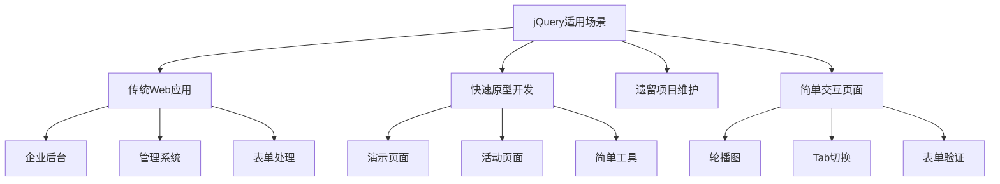

# 💎 jQuery 完全使用指南

> jQuery是一个快速、小巧、功能丰富的JavaScript库。它通过简洁的API使HTML文档遍历和操作、事件处理、动画和Ajax变得更加简单。

## 📋 目录导航

<details>
<summary>点击展开完整目录</summary>

### 🚀 快速入门
- [jQuery介绍](#jquery介绍)
- [引入和基础语法](#引入和基础语法)
- [选择器详解](#选择器详解)

### 🎯 核心功能
- [DOM操作](#dom操作)
- [事件处理](#事件处理)
- [CSS样式操作](#css样式操作)
- [动画效果](#动画效果)

### 🔄 AJAX操作
- [基础AJAX](#基础ajax)
- [表单处理](#表单处理)
- [数据加载](#数据加载)

### 🔧 高级功能
- [插件开发](#插件开发)
- [性能优化](#性能优化)
- [最佳实践](#最佳实践)

### 🆚 现代化替代
- [原生JavaScript对比](#原生javascript对比)
- [现代框架迁移](#现代框架迁移)
- [渐进式升级](#渐进式升级)

</details>

## 🚀 jQuery介绍

### ✨ 核心特性

| 特性 | 说明 | 优势 |
|------|------|------|
| **选择器** | CSS选择器语法 | 简洁的元素选择 |
| **链式调用** | 方法可以连续调用 | 代码简洁易读 |
| **跨浏览器** | 兼容性处理 | 减少兼容性代码 |
| **丰富API** | 完整的操作方法 | 功能全面 |
| **插件生态** | 大量第三方插件 | 快速扩展功能 |

### 🎯 适用场景



## 📦 引入和基础语法

### 引入方式

#### 1. CDN引入

```html
<!-- 从CDN引入jQuery -->
<!-- 最新版本 -->
<script src="https://cdn.jsdelivr.net/npm/jquery@3.7.1/dist/jquery.min.js"></script>

<!-- 指定版本 -->
<script src="https://cdnjs.cloudflare.com/ajax/libs/jquery/3.7.1/jquery.min.js"></script>

<!-- Google CDN -->
<script src="https://ajax.googleapis.com/ajax/libs/jquery/3.7.1/jquery.min.js"></script>

<!-- 本地备用 -->
<script>
  window.jQuery || document.write('<script src="/js/jquery-3.7.1.min.js"><\/script>');
</script>
```

#### 2. 本地文件引入

```html
<!-- 下载到本地 -->
<script src="./js/jquery-3.7.1.min.js"></script>
```

#### 3. NPM安装

```bash
# NPM安装
npm install jquery

# Yarn安装
yarn add jquery
```

```javascript
// ES6模块引入
import $ from 'jquery';

// CommonJS引入
const $ = require('jquery');

// 全局挂载
window.$ = window.jQuery = $;
```

### 基础语法

#### 文档就绪

```javascript
// 推荐方式
$(document).ready(function() {
  console.log('DOM准备完成');
});

// 简写方式
$(function() {
  console.log('DOM准备完成');
});

// 与window.onload的区别
$(document).ready(function() {
  // DOM结构加载完成就执行，不等待图片等资源
});

window.onload = function() {
  // 所有资源（包括图片）加载完成才执行
};
```

#### 基本语法结构

```javascript
// jQuery基本语法：$(selector).action()
$(selector).method(parameters);

// 示例
$('#myId').hide();           // 隐藏ID为myId的元素
$('.myClass').show();        // 显示class为myClass的元素
$('p').fadeIn();            // 淡入所有p元素

// 链式调用
$('#myDiv')
  .addClass('active')
  .css('color', 'red')
  .fadeIn(500);
```

## 🎯 选择器详解

### 基础选择器

```javascript
// 元素选择器
$('div')          // 选择所有div元素
$('p')            // 选择所有p元素

// ID选择器
$('#myId')        // 选择ID为myId的元素

// 类选择器
$('.myClass')     // 选择class为myClass的所有元素

// 通配符选择器
$('*')            // 选择所有元素

// 群组选择器
$('h1, h2, h3')   // 选择所有h1、h2、h3元素
```

### 层级选择器

```javascript
// 后代选择器
$('div p')        // 选择div内所有p元素

// 子元素选择器
$('div > p')      // 选择div的直接子元素p

// 相邻兄弟选择器
$('h1 + p')      // 选择紧跟在h1后的p元素

// 通用兄弟选择器
$('h1 ~ p')      // 选择h1后的所有同级p元素
```

### 筛选选择器

```javascript
// 位置筛选
$('li:first')     // 第一个li元素
$('li:last')      // 最后一个li元素
$('li:eq(2)')     // 索引为2的li元素（第三个）
$('li:gt(1)')     // 索引大于1的li元素
$('li:lt(3)')     // 索引小于3的li元素

// 内容筛选
$('div:contains("text")')  // 包含特定文本的div
$('input:empty')           // 空的input元素
$('div:has(p)')           // 包含p元素的div

// 可见性筛选
$('div:visible')  // 可见的div元素
$('div:hidden')   // 隐藏的div元素

// 属性筛选
$('[title]')              // 有title属性的元素
$('[title="test"]')       // title属性值为test的元素
$('[title!="test"]')      // title属性值不为test的元素
$('[title^="test"]')      // title属性值以test开头的元素
$('[title$="test"]')      // title属性值以test结尾的元素
$('[title*="test"]')      // title属性值包含test的元素
```

### 表单选择器

```javascript
// 表单元素
$(':input')       // 所有input、textarea、select、button元素
$(':text')        // 所有text类型的input
$(':password')    // 所有password类型的input
$(':radio')       // 所有radio类型的input
$(':checkbox')    // 所有checkbox类型的input
$(':submit')      // 所有submit类型的input和button
$(':reset')       // 所有reset类型的input和button
$(':button')      // 所有button元素和type为button的input
$(':file')        // 所有file类型的input

// 表单状态
$(':enabled')     // 所有可用的表单元素
$(':disabled')    // 所有不可用的表单元素
$(':checked')     // 所有被选中的checkbox和radio
$(':selected')    // 所有被选中的option元素
```

## 🎯 DOM操作

### 内容操作

```javascript
// 获取和设置文本内容
const text = $('p').text();        // 获取p元素的文本内容
$('p').text('新文本');             // 设置p元素的文本内容

// 获取和设置HTML内容
const html = $('div').html();      // 获取div的HTML内容
$('div').html('<strong>粗体文本</strong>');  // 设置HTML内容

// 获取和设置表单值
const value = $('input').val();    // 获取input的值
$('input').val('新值');           // 设置input的值

// 批量操作
$('p').text(function(index, oldText) {
  return '第' + (index + 1) + '段：' + oldText;
});
```

### 属性操作

```javascript
// 获取和设置属性
const src = $('img').attr('src');       // 获取img的src属性
$('img').attr('src', 'new-image.jpg');  // 设置src属性

// 批量设置属性
$('img').attr({
  'src': 'image.jpg',
  'alt': '图片描述',
  'title': '图片标题'
});

// 移除属性
$('img').removeAttr('title');

// 数据属性操作
$('div').data('key', 'value');     // 设置data-key属性
const value = $('div').data('key'); // 获取data-key属性值

// 属性判断
if ($('input').attr('checked')) {
  console.log('复选框被选中');
}
```

### CSS类操作

```javascript
// 添加类
$('div').addClass('highlight');
$('div').addClass('class1 class2');

// 移除类
$('div').removeClass('highlight');
$('div').removeClass('class1 class2');
$('div').removeClass(); // 移除所有类

// 切换类
$('div').toggleClass('active');

// 判断是否有某个类
if ($('div').hasClass('active')) {
  console.log('元素有active类');
}

// 链式操作
$('div')
  .addClass('show')
  .removeClass('hide')
  .toggleClass('active');
```

### 元素创建和插入

```javascript
// 创建元素
const $newDiv = $('<div>新元素</div>');
const $newP = $('<p>').text('段落文本').addClass('paragraph');

// 内部插入
$('body').append('<p>追加到末尾</p>');
$('body').prepend('<p>添加到开头</p>');
$('<p>新段落</p>').appendTo('body');
$('<p>新段落</p>').prependTo('body');

// 外部插入
$('h1').after('<p>在h1后插入</p>');
$('h1').before('<p>在h1前插入</p>');
$('<p>新段落</p>').insertAfter('h1');
$('<p>新段落</p>').insertBefore('h1');

// 包裹元素
$('p').wrap('<div class="wrapper"></div>');     // 每个p单独包裹
$('p').wrapAll('<div class="container"></div>'); // 所有p一起包裹
$('p').wrapInner('<span></span>');               // 包裹p的内容
```

### 元素删除和替换

```javascript
// 删除元素
$('p').remove();           // 完全删除p元素
$('p').remove('.class');   // 删除有特定class的p元素

// 清空内容（保留元素）
$('div').empty();

// 分离元素（保留事件和数据）
const $detached = $('p').detach();
$('body').append($detached);  // 重新插入

// 替换元素
$('p').replaceWith('<div>新内容</div>');
$('<div>新内容</div>').replaceAll('p');
```

### 元素遍历

```javascript
// 父级元素
$('p').parent();           // 直接父元素
$('p').parents();          // 所有祖先元素
$('p').parents('div');     // 特定的祖先元素
$('p').parentsUntil('body'); // 到body为止的祖先元素
$('p').closest('div');     // 最近的符合条件的祖先元素

// 子级元素
$('div').children();       // 所有直接子元素
$('div').children('p');    // 特定的直接子元素
$('div').find('p');        // 所有后代p元素

// 兄弟元素
$('p').siblings();         // 所有兄弟元素
$('p').siblings('span');   // 特定的兄弟元素
$('p').next();            // 下一个兄弟元素
$('p').nextAll();         // 后面所有兄弟元素
$('p').nextUntil('div');  // 到div为止的后续兄弟元素
$('p').prev();            // 前一个兄弟元素
$('p').prevAll();         // 前面所有兄弟元素
$('p').prevUntil('h1');   // 到h1为止的前面兄弟元素

// 过滤和搜索
$('li').first();          // 第一个li
$('li').last();           // 最后一个li
$('li').eq(2);           // 索引为2的li
$('li').filter('.active'); // 过滤出有active类的li
$('li').not('.disabled'); // 排除有disabled类的li
```

## 🎮 事件处理

### 基础事件

```javascript
// 点击事件
$('button').click(function() {
  console.log('按钮被点击');
});

// 双击事件
$('div').dblclick(function() {
  console.log('双击了div');
});

// 鼠标事件
$('div').mouseenter(function() {
  $(this).addClass('hover');
}).mouseleave(function() {
  $(this).removeClass('hover');
});

// 键盘事件
$('input').keydown(function(e) {
  console.log('按下键:', e.which);
});

$('input').keyup(function(e) {
  console.log('释放键:', e.which);
});

// 表单事件
$('form').submit(function(e) {
  e.preventDefault(); // 阻止默认提交
  console.log('表单提交');
});

$('input').focus(function() {
  $(this).addClass('focused');
}).blur(function() {
  $(this).removeClass('focused');
});

$('select').change(function() {
  console.log('选择改变:', $(this).val());
});
```

### 事件委托

```javascript
// 传统事件绑定（不推荐）
$('.button').click(function() {
  console.log('按钮点击');
});

// 事件委托（推荐）
$(document).on('click', '.button', function() {
  console.log('按钮点击');
});

// 复杂事件委托示例
$('#container').on('click', '.item .delete-btn', function(e) {
  e.stopPropagation();
  $(this).closest('.item').remove();
});

// 多事件委托
$('#list').on('click mouseenter mouseleave', '.item', function(e) {
  if (e.type === 'click') {
    console.log('点击项目');
  } else if (e.type === 'mouseenter') {
    $(this).addClass('hover');
  } else if (e.type === 'mouseleave') {
    $(this).removeClass('hover');
  }
});
```

### 自定义事件

```javascript
// 触发自定义事件
$('#myDiv').trigger('customEvent', ['参数1', '参数2']);

// 监听自定义事件
$('#myDiv').on('customEvent', function(e, param1, param2) {
  console.log('自定义事件触发:', param1, param2);
});

// 一次性事件
$('#button').one('click', function() {
  console.log('只会执行一次');
});

// 移除事件
$('#button').off('click');           // 移除所有click事件
$('#button').off('click', handler);  // 移除特定处理函数
$('#button').off();                  // 移除所有事件
```

### 事件对象详解

```javascript
$('a').click(function(event) {
  // 阻止默认行为
  event.preventDefault();
  
  // 阻止事件冒泡
  event.stopPropagation();
  
  // 同时阻止默认行为和冒泡
  return false;
  
  // 事件信息
  console.log('事件类型:', event.type);
  console.log('触发元素:', event.target);
  console.log('绑定元素:', event.currentTarget);
  console.log('鼠标位置:', event.pageX, event.pageY);
  console.log('按键代码:', event.which);
  console.log('修饰键:', event.ctrlKey, event.shiftKey, event.altKey);
});
```

## 🎨 CSS样式操作

### 样式获取和设置

```javascript
// 获取样式
const color = $('div').css('color');
const styles = $('div').css(['width', 'height', 'color']);

// 设置单个样式
$('div').css('color', 'red');
$('div').css('font-size', '16px');

// 设置多个样式
$('div').css({
  'color': 'blue',
  'font-size': '18px',
  'margin': '10px',
  'background-color': '#f0f0f0'
});

// 动态设置样式
$('div').css('width', function(index, value) {
  return parseInt(value) * 1.2 + 'px';
});
```

### 尺寸操作

```javascript
// 宽度和高度
$('div').width();           // 获取内容宽度
$('div').width(200);        // 设置内容宽度
$('div').innerWidth();      // 内容+padding宽度
$('div').outerWidth();      // 内容+padding+border宽度
$('div').outerWidth(true);  // 内容+padding+border+margin宽度

$('div').height();          // 获取内容高度
$('div').height(150);       // 设置内容高度
$('div').innerHeight();     // 内容+padding高度
$('div').outerHeight();     // 内容+padding+border高度
$('div').outerHeight(true); // 内容+padding+border+margin高度

// 页面和窗口尺寸
$(document).width();        // 文档宽度
$(document).height();       // 文档高度
$(window).width();          // 窗口宽度
$(window).height();         // 窗口高度
```

### 位置操作

```javascript
// 相对于文档的位置
const position = $('div').offset();
console.log(position.top, position.left);

// 设置位置
$('div').offset({
  top: 100,
  left: 200
});

// 相对于父元素的位置
const pos = $('div').position();
console.log(pos.top, pos.left);

// 滚动位置
const scrollTop = $('div').scrollTop();
$('div').scrollTop(0);  // 滚动到顶部

const scrollLeft = $('div').scrollLeft();
$('div').scrollLeft(0); // 滚动到左边
```

## 🎭 动画效果

### 基础动画

```javascript
// 显示和隐藏
$('#box').show();           // 立即显示
$('#box').show(1000);       // 1秒内显示
$('#box').hide('slow');     // 缓慢隐藏
$('#box').toggle('fast');   // 切换显示/隐藏

// 淡入淡出
$('#box').fadeIn();         // 淡入
$('#box').fadeIn(500);      // 0.5秒淡入
$('#box').fadeOut('slow');  // 缓慢淡出
$('#box').fadeToggle();     // 切换淡入/淡出
$('#box').fadeTo(1000, 0.5); // 1秒内淡化到50%透明度

// 滑动效果
$('#box').slideDown();      // 滑动显示
$('#box').slideUp('fast');  // 快速滑动隐藏
$('#box').slideToggle();    // 切换滑动
```

### 自定义动画

```javascript
// 基础animate方法
$('#box').animate({
  left: '250px',
  opacity: '0.5',
  height: '150px',
  width: '150px'
}, 1000);

// 相对动画
$('#box').animate({
  left: '+=50px',    // 相对当前位置右移50px
  height: '-=20px'   // 相对当前高度减少20px
}, 'slow');

// 使用预定义值
$('#box').animate({
  height: 'toggle',  // 在0和原始高度之间切换
  width: 'toggle'
}, 1000);

// 复杂动画序列
$('#box')
  .animate({ left: '100px' }, 1000)
  .animate({ top: '100px' }, 1000)
  .animate({ 
    left: '0px',
    top: '0px'
  }, 1000);
```

### 动画队列控制

```javascript
// 停止动画
$('#box').stop();              // 停止当前动画
$('#box').stop(true);          // 停止所有动画
$('#box').stop(true, true);    // 停止并立即完成

// 延迟执行
$('#box').delay(1000).fadeIn();

// 队列操作
$('#box').queue(function() {
  $(this).addClass('highlight');
  $(this).dequeue(); // 继续队列
});

// 清空队列
$('#box').clearQueue();

// 动画完成回调
$('#box').fadeIn(1000, function() {
  console.log('淡入完成');
  $(this).addClass('visible');
});
```

### 缓动效果

```javascript
// 使用jQuery UI的缓动效果
$('#box').animate({
  left: '200px'
}, {
  duration: 1000,
  easing: 'easeInOutCubic',
  complete: function() {
    console.log('动画完成');
  }
});

// 自定义缓动函数
$.easing.customEasing = function(x, t, b, c, d) {
  return c * ((t = t / d - 1) * t * t + 1) + b;
};
```

## 🔄 AJAX操作

### 基础AJAX方法

```javascript
// $.ajax() 基础用法
$.ajax({
  url: '/api/data',
  type: 'GET',
  dataType: 'json',
  success: function(data) {
    console.log('请求成功:', data);
  },
  error: function(xhr, status, error) {
    console.log('请求失败:', error);
  }
});

// 完整配置
$.ajax({
  url: '/api/users',
  type: 'POST',
  data: {
    name: 'John',
    age: 30
  },
  dataType: 'json',
  contentType: 'application/json',
  headers: {
    'Authorization': 'Bearer token'
  },
  timeout: 5000,
  beforeSend: function(xhr) {
    console.log('请求发送前');
  },
  success: function(data, textStatus, xhr) {
    console.log('请求成功:', data);
  },
  error: function(xhr, textStatus, error) {
    console.log('请求失败:', error);
  },
  complete: function(xhr, textStatus) {
    console.log('请求完成');
  }
});
```

### 快捷AJAX方法

```javascript
// GET请求
$.get('/api/data', function(data) {
  console.log(data);
});

$.get('/api/users', { page: 1, limit: 10 })
  .done(function(data) {
    console.log('成功:', data);
  })
  .fail(function() {
    console.log('失败');
  });

// POST请求
$.post('/api/users', {
  name: 'John',
  email: 'john@example.com'
}, function(data) {
  console.log('创建成功:', data);
});

// 获取JSON数据
$.getJSON('/api/config', function(data) {
  console.log('配置:', data);
});

// 加载HTML片段
$('#content').load('/api/partial.html');
$('#content').load('/api/data.html #section'); // 只加载特定部分
```

### 表单AJAX提交

```javascript
// 表单序列化
$('#myForm').submit(function(e) {
  e.preventDefault();
  
  const formData = $(this).serialize(); // 序列化表单数据
  
  $.post('/api/submit', formData)
    .done(function(response) {
      alert('提交成功!');
    })
    .fail(function() {
      alert('提交失败!');
    });
});

// 获取表单数据对象
function getFormData($form) {
  const data = {};
  $form.serializeArray().forEach(function(item) {
    data[item.name] = item.value;
  });
  return data;
}

// 文件上传
$('#fileForm').submit(function(e) {
  e.preventDefault();
  
  const formData = new FormData(this);
  
  $.ajax({
    url: '/api/upload',
    type: 'POST',
    data: formData,
    processData: false,
    contentType: false,
    success: function(response) {
      console.log('上传成功:', response);
    }
  });
});
```

### AJAX全局设置

```javascript
// 全局AJAX设置
$.ajaxSetup({
  timeout: 10000,
  cache: false,
  headers: {
    'X-Requested-With': 'XMLHttpRequest'
  }
});

// 全局AJAX事件
$(document).ajaxStart(function() {
  $('#loading').show();
});

$(document).ajaxStop(function() {
  $('#loading').hide();
});

$(document).ajaxError(function(event, xhr, settings, error) {
  console.log('AJAX错误:', error);
});

$(document).ajaxSuccess(function(event, xhr, settings) {
  console.log('AJAX成功');
});
```

## 🔧 插件开发

### 基础插件结构

```javascript
// 插件基本结构
(function($) {
  $.fn.myPlugin = function(options) {
    // 默认配置
    const defaults = {
      color: 'red',
      fontSize: '14px',
      duration: 300
    };
    
    // 合并配置
    const settings = $.extend({}, defaults, options);
    
    // 返回jQuery对象以支持链式调用
    return this.each(function() {
      const $this = $(this);
      
      // 插件逻辑
      $this.css({
        color: settings.color,
        fontSize: settings.fontSize
      });
    });
  };
})(jQuery);

// 使用插件
$('.text').myPlugin({
  color: 'blue',
  fontSize: '16px'
});
```

### 高级插件开发

```javascript
(function($) {
  // 插件名称
  const pluginName = 'advancedPlugin';
  
  // 插件构造函数
  function Plugin(element, options) {
    this.element = element;
    this.$element = $(element);
    this.options = $.extend({}, Plugin.defaults, options);
    this.init();
  }
  
  // 默认配置
  Plugin.defaults = {
    speed: 300,
    easing: 'linear',
    callback: function() {}
  };
  
  // 插件方法
  Plugin.prototype = {
    init: function() {
      this.bindEvents();
      this.render();
    },
    
    bindEvents: function() {
      const self = this;
      this.$element.on('click.advancedPlugin', function() {
        self.toggle();
      });
    },
    
    render: function() {
      this.$element.addClass('advanced-plugin');
    },
    
    toggle: function() {
      const self = this;
      this.$element.fadeToggle(this.options.speed, function() {
        self.options.callback.call(self.element);
      });
    },
    
    destroy: function() {
      this.$element
        .off('.advancedPlugin')
        .removeClass('advanced-plugin')
        .removeData(pluginName);
    }
  };
  
  // 插件包装函数
  $.fn[pluginName] = function(options) {
    return this.each(function() {
      const $this = $(this);
      let data = $this.data(pluginName);
      
      if (!data) {
        data = new Plugin(this, options);
        $this.data(pluginName, data);
      }
      
      if (typeof options === 'string') {
        data[options]();
      }
    });
  };
  
})(jQuery);

// 使用高级插件
$('.element').advancedPlugin({
  speed: 500,
  callback: function() {
    console.log('动画完成');
  }
});

// 调用插件方法
$('.element').advancedPlugin('destroy');
```

### 插件最佳实践

```javascript
// 完整的插件模板
;(function($, window, document, undefined) {
  'use strict';
  
  const pluginName = 'myAwesomePlugin';
  
  // 插件构造函数
  function Plugin(element, options) {
    this.element = element;
    this.$element = $(element);
    this.options = $.extend(true, {}, Plugin.defaults, options);
    this.metadata = this.$element.data('plugin-options');
    this.init();
  }
  
  // 默认配置
  Plugin.defaults = {
    property: 'value',
    callback: function() {}
  };
  
  Plugin.prototype = {
    init: function() {
      // 初始化逻辑
      this.buildCache();
      this.bindEvents();
    },
    
    buildCache: function() {
      // 缓存DOM元素
      this.$window = $(window);
      this.$document = $(document);
    },
    
    bindEvents: function() {
      // 绑定事件
      const plugin = this;
      
      plugin.$element.on('click.' + pluginName, function() {
        plugin.someMethod();
      });
    },
    
    unbindEvents: function() {
      // 解绑事件
      this.$element.off('.' + pluginName);
    },
    
    someMethod: function() {
      // 插件方法
    },
    
    destroy: function() {
      // 清理工作
      this.unbindEvents();
      this.$element.removeData(pluginName);
    }
  };
  
  // 插件包装函数
  $.fn[pluginName] = function(options) {
    return this.each(function() {
      if (!$.data(this, pluginName)) {
        $.data(this, pluginName, new Plugin(this, options));
      }
    });
  };
  
})(jQuery, window, document);
```

## ⚡ 性能优化

### 选择器优化

```javascript
// ❌ 低效的选择器
$('.container .item .title');
$('[attribute="value"]');
$(':visible');

// ✅ 高效的选择器
$('#specific-id');
$('.direct-class');
$('div.class'); // 指定元素类型

// 缓存选择器结果
// ❌ 重复查询
$('.button').addClass('active');
$('.button').css('color', 'red');
$('.button').fadeIn();

// ✅ 缓存查询结果
const $buttons = $('.button');
$buttons.addClass('active');
$buttons.css('color', 'red');
$buttons.fadeIn();

// 限制查询范围
// ❌ 全局查询
$('.item');

// ✅ 限制在特定容器内
$('.item', '#container');
$('#container').find('.item');
```

### DOM操作优化

```javascript
// ❌ 频繁DOM操作
for (let i = 0; i < 100; i++) {
  $('#list').append('<li>Item ' + i + '</li>');
}

// ✅ 批量DOM操作
let html = '';
for (let i = 0; i < 100; i++) {
  html += '<li>Item ' + i + '</li>';
}
$('#list').html(html);

// 或使用文档片段
const $fragment = $(document.createDocumentFragment());
for (let i = 0; i < 100; i++) {
  $fragment.append('<li>Item ' + i + '</li>');
}
$('#list').append($fragment);
```

### 事件优化

```javascript
// ❌ 为每个元素绑定事件
$('.button').each(function() {
  $(this).click(function() {
    // 处理逻辑
  });
});

// ✅ 使用事件委托
$(document).on('click', '.button', function() {
  // 处理逻辑
});

// 节流和防抖
function throttle(func, delay) {
  let timeoutId;
  let lastExecTime = 0;
  
  return function() {
    const currentTime = Date.now();
    
    if (currentTime - lastExecTime > delay) {
      func.apply(this, arguments);
      lastExecTime = currentTime;
    } else {
      clearTimeout(timeoutId);
      timeoutId = setTimeout(() => {
        func.apply(this, arguments);
        lastExecTime = Date.now();
      }, delay - (currentTime - lastExecTime));
    }
  };
}

$(window).on('scroll', throttle(function() {
  // 滚动处理逻辑
}, 100));
```

### 内存管理

```javascript
// 清理事件监听器
function cleanup() {
  $('.dynamic-element').off();
  $('.dynamic-element').removeData();
  $('.dynamic-element').remove();
}

// 避免循环引用
// ❌ 可能造成内存泄漏
const $element = $('#myElement');
$element.data('self', $element);

// ✅ 避免循环引用
const $element = $('#myElement');
$element.data('id', $element.attr('id'));
```

## 🆚 现代化替代方案

### 原生JavaScript对比

```javascript
// jQuery vs 原生JavaScript对比

// 选择器
// jQuery
$('#myId')
$('.myClass')
$('div p')

// 原生JavaScript
document.getElementById('myId')
document.getElementsByClassName('myClass')
document.querySelectorAll('div p')

// 事件处理
// jQuery
$('#button').click(function() {
  console.log('clicked');
});

// 原生JavaScript
document.getElementById('button').addEventListener('click', function() {
  console.log('clicked');
});

// DOM操作
// jQuery
$('#container').html('<p>新内容</p>');
$('#element').addClass('active');

// 原生JavaScript
document.getElementById('container').innerHTML = '<p>新内容</p>';
document.getElementById('element').classList.add('active');

// AJAX
// jQuery
$.get('/api/data', function(data) {
  console.log(data);
});

// 原生JavaScript (现代)
fetch('/api/data')
  .then(response => response.json())
  .then(data => console.log(data));
```

### 轻量级替代方案

```javascript
// Zepto.js (移动端jQuery替代)
// 语法与jQuery相同，但体积更小
$('#element').addClass('active');

// Cash (轻量级jQuery替代)
import $ from 'cash-dom';
$('#element').addClass('active');

// 自制轻量级jQuery
function $(selector) {
  return new MiniQuery(selector);
}

class MiniQuery {
  constructor(selector) {
    if (typeof selector === 'string') {
      this.elements = document.querySelectorAll(selector);
    } else {
      this.elements = [selector];
    }
    this.length = this.elements.length;
  }
  
  addClass(className) {
    this.elements.forEach(el => el.classList.add(className));
    return this;
  }
  
  removeClass(className) {
    this.elements.forEach(el => el.classList.remove(className));
    return this;
  }
  
  on(event, handler) {
    this.elements.forEach(el => el.addEventListener(event, handler));
    return this;
  }
  
  html(content) {
    if (content === undefined) {
      return this.elements[0].innerHTML;
    }
    this.elements.forEach(el => el.innerHTML = content);
    return this;
  }
}
```

### 渐进式迁移策略

```javascript
// 1. 首先识别jQuery使用情况
const jQueryUsage = {
  selectors: ['$(".class")', '$("#id")', '$("element")'],
  events: ['$(el).click()', '$(el).on()'],
  dom: ['$(el).html()', '$(el).addClass()'],
  ajax: ['$.get()', '$.post()', '$.ajax()']
};

// 2. 创建兼容函数
const jQueryCompat = {
  // 选择器兼容
  $: function(selector) {
    if (typeof selector === 'string') {
      return document.querySelectorAll(selector);
    }
    return selector;
  },
  
  // 类操作兼容
  addClass: function(elements, className) {
    if (elements.length) {
      Array.from(elements).forEach(el => el.classList.add(className));
    } else {
      elements.classList.add(className);
    }
  },
  
  // 事件兼容
  on: function(elements, event, handler) {
    if (elements.length) {
      Array.from(elements).forEach(el => el.addEventListener(event, handler));
    } else {
      elements.addEventListener(event, handler);
    }
  }
};

// 3. 逐步替换
// 原jQuery代码
// $('.button').addClass('active');

// 过渡期代码
// jQueryCompat.addClass(jQueryCompat.$('.button'), 'active');

// 最终原生代码
// document.querySelectorAll('.button').forEach(el => el.classList.add('active'));
```

## 📚 最佳实践总结

### 代码规范

```javascript
// 1. 变量命名
const $elements = $('.elements');  // jQuery对象用$前缀
const elements = document.querySelectorAll('.elements'); // 原生对象不用$

// 2. 链式调用格式化
$('#element')
  .addClass('active')
  .css('color', 'blue')
  .fadeIn(300);

// 3. 事件命名空间
$('#element').on('click.myPlugin', handler);
$('#element').off('.myPlugin'); // 清理时只移除特定命名空间

// 4. 配置对象
const config = {
  speed: 300,
  easing: 'swing',
  callback: function() {}
};

// 5. 错误处理
$('#element').fadeIn().fail(function() {
  console.error('动画执行失败');
});
```

### 性能考虑

| 场景 | 建议 | 原因 |
|------|------|------|
| **大量元素操作** | 使用原生JavaScript | 性能更好 |
| **简单DOM查询** | 使用原生querySelector | 减少库依赖 |
| **复杂动画** | 使用CSS3 + JavaScript | 硬件加速 |
| **现代浏览器项目** | 考虑不使用jQuery | 减少bundle大小 |
| **遗留项目维护** | 继续使用jQuery | 稳定性和兼容性 |

### 迁移建议

```javascript
// 迁移优先级
const migrationPriority = {
  high: [
    '选择器操作',      // 容易替换
    '类名操作',        // 原生支持好
    '简单事件绑定'     // 原生API完善
  ],
  medium: [
    'CSS操作',        // 需要注意兼容性
    'AJAX请求',       // fetch API替代
    '简单动画'        // CSS transition替代
  ],
  low: [
    '复杂动画',       // 可能需要动画库
    '插件功能',       // 需要重写或寻找替代
    '遗留代码'        // 维护成本高
  ]
};
```

::: tip 💡 使用建议
- **新项目**：优先考虑原生JavaScript，减少依赖
- **维护项目**：根据项目复杂度决定是否迁移
- **快速开发**：jQuery仍然是很好的选择
- **移动端**：考虑使用Zepto等轻量级替代
- **性能敏感**：使用原生JavaScript或现代框架
:::

---

> 📚 **相关资源**：
> - [jQuery官方文档](https://jquery.com/)
> - [jQuery API文档](https://api.jquery.com/)
> - [You Don't Need jQuery](https://github.com/nefe/You-Dont-Need-jQuery)
> - [原生JavaScript替代方案](https://github.com/oneuijs/You-Dont-Need-jQuery) 