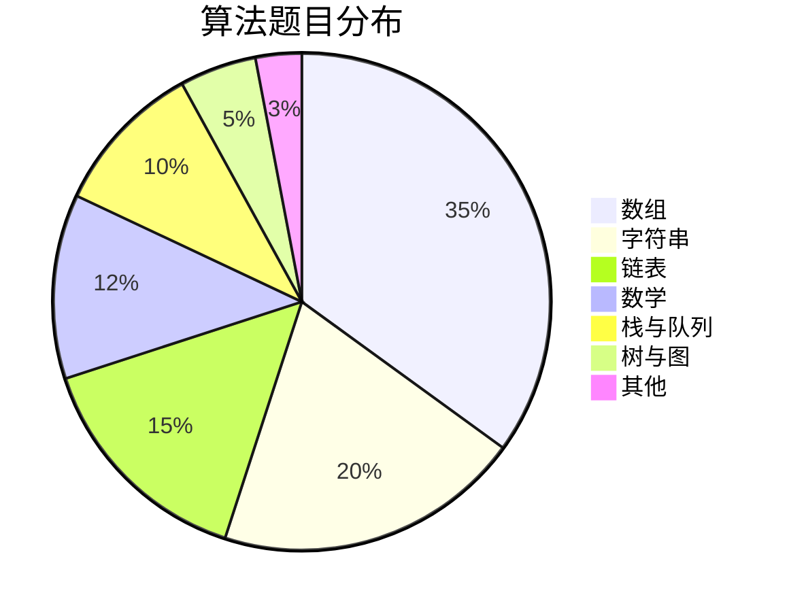
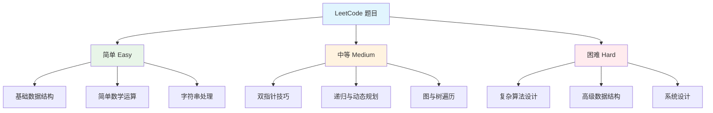
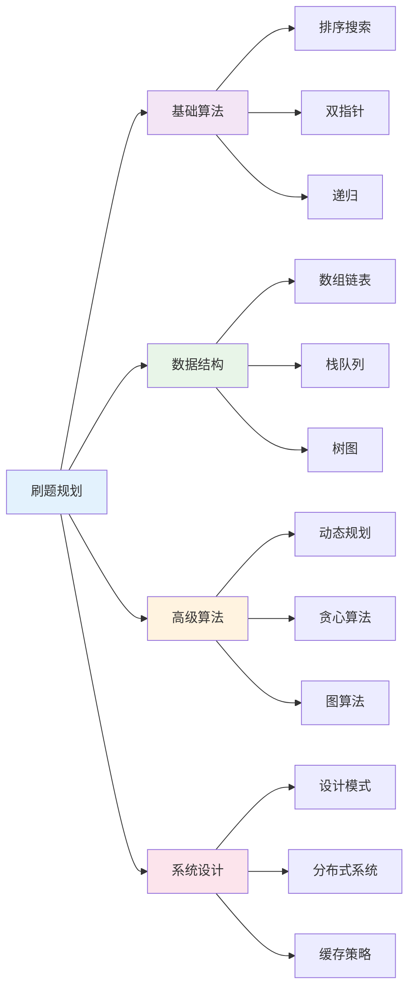

# 🧠 LeetCode 算法题解集合

> LeetCode 是提升编程技能的重要平台，本文收集了常见算法题的 JavaScript 解决方案，涵盖各种数据结构和算法思想。

## 📚 目录导航

::: details 🔍 点击展开完整目录
- [🎯 算法分类概览](#算法分类概览)
- [🔢 数组相关](#数组相关)
- [🔗 链表相关](#链表相关)
- [🔤 字符串相关](#字符串相关)
- [🧮 数学相关](#数学相关)
- [📊 栈与队列](#栈与队列)
- [🌳 树与图](#树与图)
- [🔍 查找与排序](#查找与排序)
- [🚀 高级算法](#高级算法)
- [💡 编程技巧](#编程技巧)
- [📈 复杂度分析](#复杂度分析)
- [🎯 解题技巧](#解题技巧)
:::

## 🎯 算法分类概览

### 📊 题目分布



### 🏆 难度分布


[Previous content remains the same until the end, then add:]

## 🎨 前端特色编程题

### 🔄 实现 Promise.all

**难度**: 🔥🔥 中等  
**标签**: `Promise` `异步编程`

```javascript
/**
 * 实现 Promise.all
 * @param {Promise[]} promises - Promise 数组
 * @return {Promise} 所有 Promise 的结果
 */
function promiseAll(promises) {
  return new Promise((resolve, reject) => {
    if (!Array.isArray(promises)) {
      return reject(new TypeError('promises must be an array'));
    }
    
    const results = [];
    let completed = 0;
    
    if (promises.length === 0) {
      return resolve(results);
    }
    
    promises.forEach((promise, index) => {
      Promise.resolve(promise)
        .then(result => {
          results[index] = result;
          completed++;
          
          if (completed === promises.length) {
            resolve(results);
          }
        })
        .catch(reject);
    });
  });
}

// 示例
const p1 = Promise.resolve(1);
const p2 = new Promise(resolve => setTimeout(() => resolve(2), 100));
const p3 = Promise.resolve(3);

promiseAll([p1, p2, p3]).then(console.log); // [1, 2, 3]
```

### 🎯 实现 Promise.race

**难度**: 🔥🔥 中等  
**标签**: `Promise` `竞态`

```javascript
/**
 * 实现 Promise.race
 * @param {Promise[]} promises - Promise 数组
 * @return {Promise} 最先完成的 Promise 结果
 */
function promiseRace(promises) {
  return new Promise((resolve, reject) => {
    if (!Array.isArray(promises)) {
      return reject(new TypeError('promises must be an array'));
    }
    
    promises.forEach(promise => {
      Promise.resolve(promise).then(resolve).catch(reject);
    });
  });
}

// 示例
const p1 = new Promise(resolve => setTimeout(() => resolve(1), 100));
const p2 = new Promise(resolve => setTimeout(() => resolve(2), 50));
promiseRace([p1, p2]).then(console.log); // 2
```

### 🔁 实现 Promise.retry

**难度**: 🔥🔥 中等  
**标签**: `Promise` `重试机制`

```javascript
/**
 * 实现带重试的 Promise
 * @param {Function} promiseFn - 返回 Promise 的函数
 * @param {number} times - 重试次数
 * @param {number} delay - 重试延迟(ms)
 * @return {Promise} 执行结果
 */
function promiseRetry(promiseFn, times, delay) {
  return new Promise(async (resolve, reject) => {
    while (times--) {
      try {
        const result = await promiseFn();
        return resolve(result);
      } catch (err) {
        if (times === 0) {
          return reject(err);
        }
        await new Promise(r => setTimeout(r, delay));
      }
    }
  });
}

// 示例
let count = 0;
const mockAPI = () => new Promise((resolve, reject) => {
  count++;
  if (count < 3) reject(new Error('失败'));
  else resolve('成功');
});

promiseRetry(mockAPI, 3, 1000).then(console.log); // 成功
```

### 🔄 实现 EventBus

**难度**: 🔥🔥 中等  
**标签**: `发布订阅` `事件系统`

```javascript
class EventBus {
  constructor() {
    this.events = new Map();
  }
  
  on(event, callback) {
    if (!this.events.has(event)) {
      this.events.set(event, new Set());
    }
    this.events.get(event).add(callback);
    return () => this.off(event, callback);
  }
  
  once(event, callback) {
    const wrapper = (...args) => {
      callback.apply(this, args);
      this.off(event, wrapper);
    };
    return this.on(event, wrapper);
  }
  
  emit(event, ...args) {
    if (!this.events.has(event)) return false;
    this.events.get(event).forEach(callback => {
      callback.apply(this, args);
    });
    return true;
  }
  
  off(event, callback) {
    if (!this.events.has(event)) return false;
    if (!callback) {
      return this.events.delete(event);
    }
    return this.events.get(event).delete(callback);
  }
}

// 示例
const bus = new EventBus();
const unsubscribe = bus.on('test', data => console.log(data));
bus.emit('test', 'hello'); // 输出: hello
unsubscribe(); // 取消订阅
```

### 🎯 实现 LRU 缓存

**难度**: 🔥🔥 中等  
**标签**: `缓存` `哈希表` `双向链表`

```javascript
class LRUCache {
  constructor(capacity) {
    this.capacity = capacity;
    this.cache = new Map();
  }
  
  get(key) {
    if (!this.cache.has(key)) return -1;
    
    // 更新位置
    const value = this.cache.get(key);
    this.cache.delete(key);
    this.cache.set(key, value);
    return value;
  }
  
  put(key, value) {
    if (this.cache.has(key)) {
      this.cache.delete(key);
    } else if (this.cache.size >= this.capacity) {
      // 删除最久未使用的项（第一个）
      const firstKey = this.cache.keys().next().value;
      this.cache.delete(firstKey);
    }
    this.cache.set(key, value);
  }
}

// 示例
const cache = new LRUCache(2);
cache.put(1, 1); // 缓存 {1=1}
cache.put(2, 2); // 缓存 {1=1, 2=2}
console.log(cache.get(1)); // 返回 1
cache.put(3, 3); // 删除 2，缓存 {1=1, 3=3}
console.log(cache.get(2)); // 返回 -1 (未找到)
```

### 🔄 实现深度优先遍历 DOM 树

**难度**: 🔥🔥 中等  
**标签**: `DOM` `递归` `树遍历`

```javascript
/**
 * 深度优先遍历 DOM 树
 * @param {Node} root - DOM 根节点
 * @param {Function} callback - 处理节点的回调函数
 */
function traverseDOM(root, callback) {
  if (!root) return;
  
  // 处理当前节点
  callback(root);
  
  // 遍历子节点
  const children = root.childNodes;
  for (let i = 0; i < children.length; i++) {
    traverseDOM(children[i], callback);
  }
}

// 示例
traverseDOM(document.body, node => {
  if (node.nodeType === 1) { // 元素节点
    console.log(node.tagName);
  }
});
```

### 🎯 实现虚拟 DOM 的 diff 算法

**难度**: 🔥🔥🔥 困难  
**标签**: `虚拟DOM` `diff算法` `树比较`

```javascript
/**
 * 虚拟 DOM diff 算法
 * @param {Object} oldNode - 旧虚拟 DOM 节点
 * @param {Object} newNode - 新虚拟 DOM 节点
 * @return {Array} 差异操作数组
 */
function diff(oldNode, newNode) {
  const patches = [];
  
  // 节点被删除
  if (!newNode) {
    patches.push({ type: 'REMOVE', node: oldNode });
    return patches;
  }
  
  // 节点被替换
  if (oldNode.type !== newNode.type) {
    patches.push({ type: 'REPLACE', oldNode, newNode });
    return patches;
  }
  
  // 文本节点变化
  if (typeof oldNode === 'string' && typeof newNode === 'string') {
    if (oldNode !== newNode) {
      patches.push({ type: 'TEXT', content: newNode });
    }
    return patches;
  }
  
  // 属性变化
  const propsPatches = diffProps(oldNode.props || {}, newNode.props || {});
  if (Object.keys(propsPatches).length > 0) {
    patches.push({ type: 'PROPS', patches: propsPatches });
  }
  
  // 子节点变化
  diffChildren(oldNode.children || [], newNode.children || [], patches);
  
  return patches;
}

// 辅助函数：比较属性
function diffProps(oldProps, newProps) {
  const patches = {};
  
  // 检查属性更新和删除
  Object.keys(oldProps).forEach(key => {
    if (oldProps[key] !== newProps[key]) {
      patches[key] = newProps[key];
    }
  });
  
  // 检查新增属性
  Object.keys(newProps).forEach(key => {
    if (!oldProps.hasOwnProperty(key)) {
      patches[key] = newProps[key];
    }
  });
  
  return patches;
}

// 辅助函数：比较子节点
function diffChildren(oldChildren, newChildren, patches) {
  oldChildren.forEach((child, i) => {
    diff(child, newChildren[i]).forEach(patch => {
      patch.index = i;
      patches.push(patch);
    });
  });
}

// 示例
const oldNode = {
  type: 'div',
  props: { className: 'old' },
  children: [
    { type: 'span', children: ['Hello'] }
  ]
};

const newNode = {
  type: 'div',
  props: { className: 'new' },
  children: [
    { type: 'span', children: ['World'] }
  ]
};

console.log(diff(oldNode, newNode));
```

## 🔢 数组相关

### 🎯 寻找两个数组的中位数

**难度**: 🔥🔥🔥 困难  
**标签**: `数组` `二分查找` `分治`

**题目描述**: 给定两个有序数组，找到两个数组合并后的中位数。

```javascript
/**
 * 寻找两个数组的中位数
 * @param {number[]} nums1 - 第一个有序数组
 * @param {number[]} nums2 - 第二个有序数组
 * @return {number} 中位数
 * 
 * 时间复杂度: O((m+n)log(m+n))
 * 空间复杂度: O(m+n)
 */
function findMedianSortedArrays(nums1, nums2) {
  // 合并两个数组并排序
  const merged = [...nums1, ...nums2].sort((a, b) => a - b);
  const length = merged.length;
  const middle = Math.floor(length / 2);
  
  // 如果数组长度为偶数，返回中间两个数的平均值
  if (length % 2 === 0) {
    return (merged[middle - 1] + merged[middle]) / 2;
  }
  
  // 如果数组长度为奇数，返回中间的数
  return merged[middle];
}

// 示例
console.log(findMedianSortedArrays([1, 3], [2])); // 2
console.log(findMedianSortedArrays([1, 2], [3, 4])); // 2.5
```

### 🌸 种花问题

**难度**: 🔥 简单  
**标签**: `数组` `贪心算法`

**题目描述**: 在花坛中种花，花不能相邻种植。

```javascript
/**
 * 种花问题
 * @param {number[]} flowerbed - 花坛数组
 * @param {number} n - 需要种植的花朵数量
 * @return {boolean} 是否能种植
 * 
 * 时间复杂度: O(n)
 * 空间复杂度: O(1)
 */
function canPlaceFlowers(flowerbed, n) {
  let count = 0;
  let i = 0;
  
  while (i < flowerbed.length) {
    // 检查当前位置是否可以种花
    if (flowerbed[i] === 0) {
      const prevEmpty = (i === 0) || (flowerbed[i - 1] === 0);
      const nextEmpty = (i === flowerbed.length - 1) || (flowerbed[i + 1] === 0);
      
      if (prevEmpty && nextEmpty) {
        flowerbed[i] = 1; // 种花
        count++;
        i += 2; // 跳过下一个位置
      } else {
        i++;
      }
    } else {
      i++;
    }
  }
  
  return count >= n;
}

// 示例
console.log(canPlaceFlowers([1, 0, 0, 0, 1], 1)); // true
console.log(canPlaceFlowers([1, 0, 0, 0, 1], 2)); // false
```

### 🎲 卡牌分组

**难度**: 🔥 简单  
**标签**: `数组` `数学` `最大公约数`

```javascript
/**
 * 卡牌分组
 * @param {number[]} deck - 卡牌数组
 * @return {boolean} 是否可以分组
 * 
 * 时间复杂度: O(n)
 * 空间复杂度: O(n)
 */
function hasGroupsSizeX(deck) {
  // 计算最大公约数
  function gcd(a, b) {
    return b === 0 ? a : gcd(b, a % b);
  }
  
  // 统计每张卡牌的出现次数
  const countMap = new Map();
  for (const card of deck) {
    countMap.set(card, (countMap.get(card) || 0) + 1);
  }
  
  // 获取所有出现次数
  const counts = Array.from(countMap.values());
  
  // 计算所有出现次数的最大公约数
  let result = counts[0];
  for (let i = 1; i < counts.length; i++) {
    result = gcd(result, counts[i]);
  }
  
  return result >= 2;
}

// 示例
console.log(hasGroupsSizeX([1, 2, 3, 4, 4, 3, 2, 1])); // true
console.log(hasGroupsSizeX([1, 1, 1, 2, 2, 2, 3, 3])); // false
```

### 🔍 数组中的重复元素

**难度**: 🔥 简单  
**标签**: `数组` `哈希表`

```javascript
/**
 * 检查数组中是否有重复元素
 * @param {number[]} nums - 数组
 * @return {boolean} 是否有重复
 * 
 * 时间复杂度: O(n)
 * 空间复杂度: O(n)
 */
function containsDuplicate(nums) {
  const seen = new Set();
  
  for (const num of nums) {
    if (seen.has(num)) {
      return true;
    }
    seen.add(num);
  }
  
  return false;
}

// 优化版本 - 利用 Set 去重特性
function containsDuplicateOptimized(nums) {
  return new Set(nums).size !== nums.length;
}

// 示例
console.log(containsDuplicate([1, 2, 3, 1])); // true
console.log(containsDuplicate([1, 2, 3, 4])); // false
```

### 🎯 两数之和

**难度**: 🔥 简单  
**标签**: `数组` `哈希表` `双指针`

```javascript
/**
 * 两数之和
 * @param {number[]} nums - 数组
 * @param {number} target - 目标值
 * @return {number[]} 两数的索引
 * 
 * 时间复杂度: O(n)
 * 空间复杂度: O(n)
 */
function twoSum(nums, target) {
  const map = new Map();
  
  for (let i = 0; i < nums.length; i++) {
    const complement = target - nums[i];
    
    if (map.has(complement)) {
      return [map.get(complement), i];
    }
    
    map.set(nums[i], i);
  }
  
  return [];
}

// 双指针解法（适用于有序数组）
function twoSumSorted(nums, target) {
  let left = 0;
  let right = nums.length - 1;
  
  while (left < right) {
    const sum = nums[left] + nums[right];
    
    if (sum === target) {
      return [left, right];
    } else if (sum < target) {
      left++;
    } else {
      right--;
    }
  }
  
  return [];
}

// 示例
console.log(twoSum([2, 7, 11, 15], 9)); // [0, 1]
console.log(twoSum([3, 2, 4], 6)); // [1, 2]
```

## 🔗 链表相关

### 🔄 链表节点定义

```javascript
/**
 * 链表节点定义
 * @param {*} val - 节点值
 */
function ListNode(val, next) {
  this.val = (val === undefined ? 0 : val);
  this.next = (next === undefined ? null : next);
}
```

### ➕ 两数相加

**难度**: 🔥🔥 中等  
**标签**: `链表` `数学` `递归`

```javascript
/**
 * 两数相加（链表表示）
 * @param {ListNode} l1 - 第一个链表
 * @param {ListNode} l2 - 第二个链表
 * @return {ListNode} 结果链表
 * 
 * 时间复杂度: O(max(m, n))
 * 空间复杂度: O(max(m, n))
 */
function addTwoNumbers(l1, l2) {
  const dummy = new ListNode(0);
  let current = dummy;
  let carry = 0;
  
  while (l1 || l2 || carry) {
    const val1 = l1 ? l1.val : 0;
    const val2 = l2 ? l2.val : 0;
    const sum = val1 + val2 + carry;
    
    carry = Math.floor(sum / 10);
    current.next = new ListNode(sum % 10);
    current = current.next;
    
    if (l1) l1 = l1.next;
    if (l2) l2 = l2.next;
  }
  
  return dummy.next;
}

// 示例
const l1 = new ListNode(2, new ListNode(4, new ListNode(3)));
const l2 = new ListNode(5, new ListNode(6, new ListNode(4)));
console.log(addTwoNumbers(l1, l2)); // [7, 0, 8]
```

### 🔄 合并两个有序链表

**难度**: 🔥 简单  
**标签**: `链表` `递归` `迭代`

```javascript
/**
 * 合并两个有序链表
 * @param {ListNode} list1 - 第一个链表
 * @param {ListNode} list2 - 第二个链表
 * @return {ListNode} 合并后的链表
 * 
 * 时间复杂度: O(m + n)
 * 空间复杂度: O(1)
 */
function mergeTwoLists(list1, list2) {
  const dummy = new ListNode(0);
  let current = dummy;
  
  while (list1 && list2) {
    if (list1.val <= list2.val) {
      current.next = list1;
      list1 = list1.next;
    } else {
      current.next = list2;
      list2 = list2.next;
    }
    current = current.next;
  }
  
  // 连接剩余的节点
  current.next = list1 || list2;
  
  return dummy.next;
}

// 递归解法
function mergeTwoListsRecursive(list1, list2) {
  if (!list1) return list2;
  if (!list2) return list1;
  
  if (list1.val <= list2.val) {
    list1.next = mergeTwoListsRecursive(list1.next, list2);
    return list1;
  } else {
    list2.next = mergeTwoListsRecursive(list1, list2.next);
    return list2;
  }
}
```

## 🔤 字符串相关

### 🔢 罗马数字转整数

**难度**: 🔥 简单  
**标签**: `字符串` `数学` `哈希表`

```javascript
/**
 * 罗马数字转整数
 * @param {string} s - 罗马数字字符串
 * @return {number} 整数
 * 
 * 时间复杂度: O(n)
 * 空间复杂度: O(1)
 */
function romanToInt(s) {
  const romanMap = {
    'I': 1,
    'V': 5,
    'X': 10,
    'L': 50,
    'C': 100,
    'D': 500,
    'M': 1000
  };
  
  let result = 0;
  
  for (let i = 0; i < s.length; i++) {
    const current = romanMap[s[i]];
    const next = romanMap[s[i + 1]];
    
    // 如果当前数字小于下一个数字，则需要减去当前数字
    if (current < next) {
      result -= current;
    } else {
      result += current;
    }
  }
  
  return result;
}

// 示例
console.log(romanToInt("III")); // 3
console.log(romanToInt("IV")); // 4
console.log(romanToInt("IX")); // 9
console.log(romanToInt("LVIII")); // 58
console.log(romanToInt("MCMXC")); // 1994
```

### 🔄 删除字符串中的所有相邻重复项

**难度**: 🔥 简单  
**标签**: `字符串` `栈`

```javascript
/**
 * 删除字符串中的所有相邻重复项
 * @param {string} s - 输入字符串
 * @return {string} 处理后的字符串
 * 
 * 时间复杂度: O(n)
 * 空间复杂度: O(n)
 */
function removeDuplicates(s) {
  const stack = [];
  
  for (const char of s) {
    if (stack.length > 0 && stack[stack.length - 1] === char) {
      stack.pop(); // 删除相邻重复项
    } else {
      stack.push(char);
    }
  }
  
  return stack.join('');
}

// 删除 k 个相邻重复项
function removeDuplicatesK(s, k) {
  const stack = [];
  
  for (const char of s) {
    if (stack.length > 0 && stack[stack.length - 1][0] === char) {
      stack[stack.length - 1] += char;
      if (stack[stack.length - 1].length === k) {
        stack.pop();
      }
    } else {
      stack.push(char);
    }
  }
  
  return stack.join('');
}

// 示例
console.log(removeDuplicates("abbaca")); // "ca"
console.log(removeDuplicatesK("abcd", 2)); // "abcd"
console.log(removeDuplicatesK("deeedbbcccbdaa", 3)); // "aa"
```

## 🧮 数学相关

### 🔄 整数反转

**难度**: 🔥 简单  
**标签**: `数学` `递归`

```javascript
/**
 * 整数反转
 * @param {number} x - 输入整数
 * @return {number} 反转后的整数
 * 
 * 时间复杂度: O(log(x))
 * 空间复杂度: O(1)
 */
function reverse(x) {
  const INT_MAX = 2147483647;
  const INT_MIN = -2147483648;
  
  let result = 0;
  
  while (x !== 0) {
    const digit = x % 10;
    x = Math.trunc(x / 10);
    
    // 检查溢出
    if (result > INT_MAX / 10 || (result === INT_MAX / 10 && digit > 7)) {
      return 0;
    }
    if (result < INT_MIN / 10 || (result === INT_MIN / 10 && digit < -8)) {
      return 0;
    }
    
    result = result * 10 + digit;
  }
  
  return result;
}

// 递归解法（字符串处理）
function reverseRecursive(num) {
  if (num < 10) {
    return num.toString();
  }
  
  return `${num % 10}${reverseRecursive(Math.floor(num / 10))}`;
}

// 示例
console.log(reverse(123)); // 321
console.log(reverse(-123)); // -321
console.log(reverse(120)); // 21
```

### ➕ 各位相加

**难度**: 🔥 简单  
**标签**: `数学` `递归`

```javascript
/**
 * 各位相加
 * @param {number} num - 输入数字
 * @return {number} 各位相加的结果
 * 
 * 时间复杂度: O(log(num))
 * 空间复杂度: O(1)
 */
function addDigits(num) {
  while (num >= 10) {
    let sum = 0;
    while (num > 0) {
      sum += num % 10;
      num = Math.floor(num / 10);
    }
    num = sum;
  }
  return num;
}

// 数学规律解法（数字根）
function addDigitsOptimized(num) {
  return num === 0 ? 0 : 1 + (num - 1) % 9;
}

// 示例
console.log(addDigits(38)); // 2 (3 + 8 = 11, 1 + 1 = 2)
console.log(addDigits(0)); // 0
```

### 🎯 将整数转换为两个无零整数的和

**难度**: 🔥 简单  
**标签**: `数学` `模拟`

```javascript
/**
 * 将整数转换为两个无零整数的和
 * @param {number} n - 输入整数
 * @return {number[]} 两个无零整数
 * 
 * 时间复杂度: O(log(n))
 * 空间复杂度: O(1)
 */
function getNoZeroIntegers(n) {
  function hasZero(num) {
    return num.toString().includes('0');
  }
  
  for (let i = 1; i < n; i++) {
    if (!hasZero(i) && !hasZero(n - i)) {
      return [i, n - i];
    }
  }
  
  return [];
}

// 示例
console.log(getNoZeroIntegers(2)); // [1, 1]
console.log(getNoZeroIntegers(11)); // [2, 9]
```

### 🔍 寻找质数

**难度**: 🔥🔥 中等  
**标签**: `数学` `枚举`

```javascript
/**
 * 寻找范围内的所有质数
 * @param {number} n - 范围上限
 * @return {number[]} 质数数组
 * 
 * 时间复杂度: O(n√n)
 * 空间复杂度: O(n)
 */
function findPrimes(n) {
  if (n <= 1) return [];
  
  const primes = [];
  
  for (let i = 2; i < n; i++) {
    let isPrime = true;
    
    for (let j = 2; j * j <= i; j++) {
      if (i % j === 0) {
        isPrime = false;
        break;
      }
    }
    
    if (isPrime) {
      primes.push(i);
    }
  }
  
  return primes;
}

// 埃拉托斯特尼筛法（更高效）
function sieveOfEratosthenes(n) {
  const isPrime = new Array(n).fill(true);
  isPrime[0] = isPrime[1] = false;
  
  for (let i = 2; i * i < n; i++) {
    if (isPrime[i]) {
      for (let j = i * i; j < n; j += i) {
        isPrime[j] = false;
      }
    }
  }
  
  const primes = [];
  for (let i = 2; i < n; i++) {
    if (isPrime[i]) {
      primes.push(i);
    }
  }
  
  return primes;
}

// 示例
console.log(findPrimes(10)); // [2, 3, 5, 7]
console.log(sieveOfEratosthenes(30)); // [2, 3, 5, 7, 11, 13, 17, 19, 23, 29]
```

## 📊 栈与队列

### 🎯 栈的基本操作

```javascript
/**
 * 栈的实现
 */
class Stack {
  constructor() {
    this.items = [];
  }
  
  push(item) {
    this.items.push(item);
  }
  
  pop() {
    return this.items.pop();
  }
  
  peek() {
    return this.items[this.items.length - 1];
  }
  
  isEmpty() {
    return this.items.length === 0;
  }
  
  size() {
    return this.items.length;
  }
}
```

### 📊 最近请求次数

**难度**: 🔥 简单  
**标签**: `队列` `设计`

```javascript
/**
 * 最近请求次数统计
 * 统计最近 3000 毫秒内的请求次数
 */
class RecentCounter {
  constructor() {
    this.requests = [];
  }
  
  /**
   * 添加新请求并返回最近3000ms内的请求数
   * @param {number} t - 请求时间
   * @return {number} 最近3000ms内的请求数
   * 
   * 时间复杂度: O(1) 平均情况
   * 空间复杂度: O(W) W为时间窗口大小
   */
  ping(t) {
    this.requests.push(t);
    
    // 移除超出时间窗口的请求
    while (this.requests[0] < t - 3000) {
      this.requests.shift();
    }
    
    return this.requests.length;
  }
}

// 示例
const counter = new RecentCounter();
console.log(counter.ping(1)); // 1
console.log(counter.ping(100)); // 2
console.log(counter.ping(3001)); // 3
console.log(counter.ping(3002)); // 3
```

## 🔍 查找与排序

### 🎯 二分查找

**难度**: 🔥 简单  
**标签**: `数组` `二分查找`

```javascript
/**
 * 二分查找
 * @param {number[]} nums - 有序数组
 * @param {number} target - 目标值
 * @return {number} 目标值的索引，不存在返回-1
 * 
 * 时间复杂度: O(log(n))
 * 空间复杂度: O(1)
 */
function binarySearch(nums, target) {
  let left = 0;
  let right = nums.length - 1;
  
  while (left <= right) {
    const mid = Math.floor((left + right) / 2);
    
    if (nums[mid] === target) {
      return mid;
    } else if (nums[mid] < target) {
      left = mid + 1;
    } else {
      right = mid - 1;
    }
  }
  
  return -1;
}

// 递归版本
function binarySearchRecursive(nums, target, left = 0, right = nums.length - 1) {
  if (left > right) return -1;
  
  const mid = Math.floor((left + right) / 2);
  
  if (nums[mid] === target) {
    return mid;
  } else if (nums[mid] < target) {
    return binarySearchRecursive(nums, target, mid + 1, right);
  } else {
    return binarySearchRecursive(nums, target, left, mid - 1);
  }
}

// 示例
console.log(binarySearch([1, 2, 3, 4, 5], 3)); // 2
console.log(binarySearch([1, 2, 3, 4, 5], 6)); // -1
```

## 🚀 高级算法

### 💰 动态规划 - 硬币找零

**难度**: 🔥🔥🔥 困难  
**标签**: `动态规划` `递归` `记忆化`

```javascript
/**
 * 硬币找零问题
 * @param {number[]} coins - 硬币面额数组
 * @param {number} amount - 目标金额
 * @return {number} 最少硬币数量
 * 
 * 时间复杂度: O(amount * coins.length)
 * 空间复杂度: O(amount)
 */
function coinChange(coins, amount) {
  const dp = new Array(amount + 1).fill(amount + 1);
  dp[0] = 0;
  
  for (let i = 1; i <= amount; i++) {
    for (const coin of coins) {
      if (i >= coin) {
        dp[i] = Math.min(dp[i], dp[i - coin] + 1);
      }
    }
  }
  
  return dp[amount] > amount ? -1 : dp[amount];
}

// 递归 + 记忆化版本
function coinChangeRecursive(coins, amount) {
  const memo = new Map();
  
  function dp(remaining) {
    if (remaining === 0) return 0;
    if (remaining < 0) return -1;
    if (memo.has(remaining)) return memo.get(remaining);
    
    let min = Infinity;
    
    for (const coin of coins) {
      const result = dp(remaining - coin);
      if (result !== -1) {
        min = Math.min(min, result + 1);
      }
    }
    
    const finalResult = min === Infinity ? -1 : min;
    memo.set(remaining, finalResult);
    return finalResult;
  }
  
  return dp(amount);
}

// 示例
console.log(coinChange([1, 3, 4], 6)); // 2 (3 + 3)
console.log(coinChange([2], 3)); // -1
```

### 🎯 大整数相加

**难度**: 🔥🔥 中等  
**标签**: `字符串` `数学` `模拟`

```javascript
/**
 * 大整数相加
 * @param {string} num1 - 第一个大整数
 * @param {string} num2 - 第二个大整数
 * @return {string} 相加结果
 * 
 * 时间复杂度: O(max(m, n))
 * 空间复杂度: O(max(m, n))
 */
function addStrings(num1, num2) {
  const maxLength = Math.max(num1.length, num2.length);
  const paddedNum1 = num1.padStart(maxLength, '0');
  const paddedNum2 = num2.padStart(maxLength, '0');
  
  let carry = 0;
  let result = [];
  
  for (let i = maxLength - 1; i >= 0; i--) {
    const sum = parseInt(paddedNum1[i]) + parseInt(paddedNum2[i]) + carry;
    
    if (sum >= 10) {
      carry = 1;
      result.unshift(sum % 10);
    } else {
      carry = 0;
      result.unshift(sum);
    }
  }
  
  // 处理最后的进位
  if (carry > 0) {
    result.unshift(carry);
  }
  
  return result.join('');
}

// 示例
console.log(addStrings("11", "123")); // "134"
console.log(addStrings("456", "77")); // "533"
console.log(addStrings("999", "1")); // "1000"
```

## 💡 编程技巧

### 🎯 链式调用实现

```javascript
/**
 * 链式调用实现 - 支持延迟执行
 */
class ChainExecutor {
  constructor() {
    this.tasks = [];
    // 使用微任务确保所有链式调用都已完成
    Promise.resolve().then(() => this.execute());
  }
  
  print(value) {
    this.tasks.push(() => {
      console.log(value);
      return Promise.resolve();
    });
    return this;
  }
  
  wait(seconds) {
    this.tasks.push(() => {
      console.log(`等待 ${seconds} 秒...`);
      return new Promise(resolve => {
        setTimeout(resolve, seconds * 1000);
      });
    });
    return this;
  }
  
  firstWait(seconds) {
    this.tasks.unshift(() => {
      console.log(`首先等待 ${seconds} 秒...`);
      return new Promise(resolve => {
        setTimeout(resolve, seconds * 1000);
      });
    });
    return this;
  }
  
  async execute() {
    for (const task of this.tasks) {
      await task();
    }
  }
}

// 使用示例
new ChainExecutor()
  .print(1)
  .wait(1)
  .print(2)
  .wait(1)
  .print(3)
  .firstWait(2);
```

### 🔍 数组交集

```javascript
/**
 * 求两个数组的交集
 * @param {number[]} arr1 - 第一个数组
 * @param {number[]} arr2 - 第二个数组
 * @return {number[]} 交集数组
 * 
 * 时间复杂度: O(m + n)
 * 空间复杂度: O(min(m, n))
 */
function intersection(arr1, arr2) {
  const set1 = new Set(arr1);
  const result = [];
  
  for (const num of arr2) {
    if (set1.has(num)) {
      result.push(num);
      set1.delete(num); // 避免重复
    }
  }
  
  return result;
}

// 保留重复元素的交集
function intersectionWithDuplicates(arr1, arr2) {
  const arr2Copy = [...arr2];
  const result = [];
  
  for (const num of arr1) {
    const index = arr2Copy.indexOf(num);
    if (index !== -1) {
      result.push(num);
      arr2Copy.splice(index, 1); // 移除已使用的元素
    }
  }
  
  return result;
}

// 示例
console.log(intersection([1, 2, 2, 1], [2, 2])); // [2]
console.log(intersectionWithDuplicates([1, 2, 2, 1], [2, 2])); // [2, 2]
```

## 📈 复杂度分析

### ⏱️ 时间复杂度

```mermaid
graph TD
    A[时间复杂度] --> B[O(1) 常数时间]
    A --> C[O(log n) 对数时间]
    A --> D[O(n) 线性时间]
    A --> E[O(n log n) 线性对数时间]
    A --> F[O(n²) 平方时间]
    A --> G[O(2^n) 指数时间]
    
    B --> B1[数组访问、哈希表查找]
    C --> C1[二分查找、堆操作]
    D --> D1[数组遍历、链表遍历]
    E --> E1[归并排序、快速排序]
    F --> F1[冒泡排序、选择排序]
    G --> G1[递归求解、动态规划]
    
    style B fill:#e8f5e8
    style C fill:#e1f5fe
    style D fill:#fff3e0
    style E fill:#f3e5f5
    style F fill:#ffebee
    style G fill:#fce4ec
```

### 💾 空间复杂度

| 复杂度 | 名称 | 示例 |
|--------|------|------|
| O(1) | 常数空间 | 变量、指针 |
| O(log n) | 对数空间 | 递归调用栈 |
| O(n) | 线性空间 | 数组、链表 |
| O(n²) | 平方空间 | 二维数组 |

## 🎯 解题技巧

### 🔧 常用技巧

::: tip 💡 算法解题技巧

1. **双指针技巧**
   - 适用于数组、链表、字符串问题
   - 可以将 O(n²) 优化为 O(n)

2. **滑动窗口**
   - 适用于子数组、子字符串问题
   - 维护一个可变长度的窗口

3. **哈希表**
   - 快速查找、去重、计数
   - 空间换时间的经典应用

4. **递归与动态规划**
   - 将复杂问题分解为子问题
   - 记忆化避免重复计算

5. **贪心算法**
   - 每一步都做出最优选择
   - 适用于特定的优化问题
:::

### 📚 刷题建议



---

::: tip 🎯 学习建议
1. **循序渐进**: 从简单题目开始，逐步提高难度
2. **总结规律**: 相同类型的题目往往有相似的解法
3. **多种解法**: 尝试不同的算法思路，比较优劣
4. **时间管理**: 合理分配刷题时间，注重质量而非数量
5. **实践应用**: 将算法思想应用到实际项目中
:::
