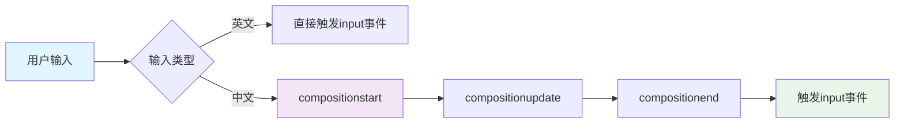
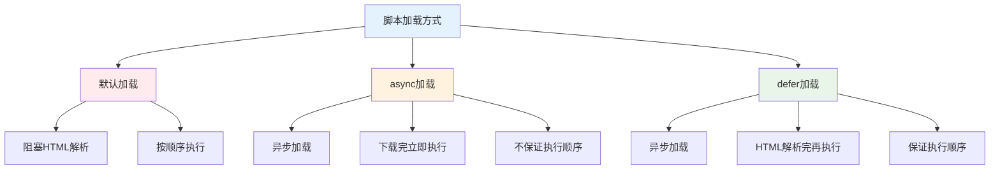
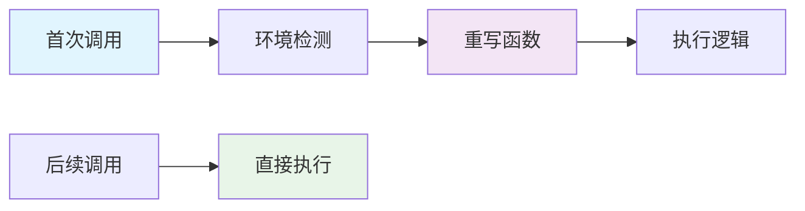
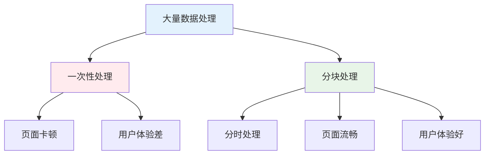
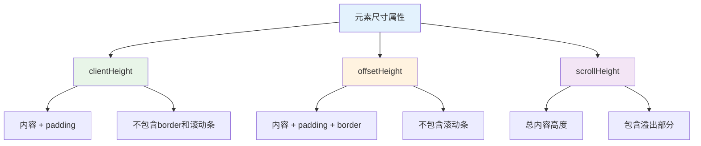

# 🔧 前端开发常见问题解决方案

> 前端开发过程中会遇到各种技术问题，本文汇总了常见问题的解决方案和最佳实践，帮助开发者快速解决实际问题。

## 📚 目录导航

::: details 🔍 点击展开完整目录
- [🎯 用户交互问题](#用户交互问题)
  - [中文输入事件处理](#中文输入事件处理)
  - [脚本加载优化](#脚本加载优化)
- [⚡ 性能优化技巧](#性能优化技巧)
  - [惰性函数](#惰性函数)
  - [数组分块技术](#数组分块技术)
- [📐 布局与样式](#布局与样式)
  - [元素尺寸属性](#元素尺寸属性)
  - [URL编码处理](#url编码处理)
- [🔧 工具函数库](#工具函数库)
  - [数据验证](#数据验证)
  - [时间格式化](#时间格式化)
  - [字符串处理](#字符串处理)
- [🎮 实战案例](#实战案例)
  - [抽奖程序实现](#抽奖程序实现)
- [💡 最佳实践](#最佳实践)
:::

## 🎯 用户交互问题

### 📝 中文输入事件处理

**问题**: 监听 `input` 事件时，中文输入会触发多次事件，影响用户体验。

**解决方案**: 使用 `compositionstart`、`compositionend` 事件来处理中文输入。



#### 🔧 核心事件

| 事件 | 触发时机 | 作用 |
|------|----------|------|
| **compositionstart** | 输入法开始输入 | 🚀 标记合成事件开始 |
| **compositionupdate** | 输入法更新输入 | 🔄 输入内容更新中 |
| **compositionend** | 输入法结束输入 | ✅ 标记合成事件结束 |

#### 💻 代码实现

```javascript
/**
 * 中文输入事件处理器
 * 解决中文输入时多次触发input事件的问题
 */
class ChineseInputHandler {
  constructor(element) {
    this.element = element;
    this.isComposing = false;
    this.bindEvents();
  }
  
  bindEvents() {
    this.element.addEventListener('input', this.handleInput.bind(this));
    this.element.addEventListener('compositionstart', this.handleCompositionStart.bind(this));
    this.element.addEventListener('compositionend', this.handleCompositionEnd.bind(this));
  }
  
  handleInput(event) {
    // 如果正在进行中文输入，则不处理
    if (this.isComposing) {
      return;
    }
    
    // 处理正常的输入逻辑
    this.processInput(event.target.value);
  }
  
  handleCompositionStart(event) {
    this.isComposing = true;
    console.log('开始中文输入');
  }
  
  handleCompositionEnd(event) {
    this.isComposing = false;
    // 中文输入结束后，手动触发一次输入处理
    this.processInput(event.target.value);
    console.log('结束中文输入');
  }
  
  processInput(value) {
    // 具体的输入处理逻辑
    console.log('处理输入:', value);
    // 这里可以进行搜索建议、实时验证等操作
  }
}

// 使用示例
const inputElement = document.getElementById('search-input');
const handler = new ChineseInputHandler(inputElement);
```

### 🚀 脚本加载优化

**问题**: HTML 文档中的 JavaScript 脚本默认会阻塞文档解析和渲染。

**解决方案**: 使用 `async` 和 `defer` 属性优化脚本加载。



#### 📊 属性对比

| 属性 | 加载方式 | 执行时机 | 执行顺序 | 适用场景 |
|------|----------|----------|----------|----------|
| **默认** | 同步加载 | 下载完立即执行 | 按顺序执行 | 关键脚本 |
| **async** | 异步加载 | 下载完立即执行 | 不保证顺序 | 独立脚本 |
| **defer** | 异步加载 | HTML解析完执行 | 保证顺序 | 依赖脚本 |

#### 💻 实际应用

```html
<!-- 默认加载：会阻塞HTML解析 -->
<script src="/js/critical.js"></script>

<!-- async加载：适用于独立的第三方脚本 -->
<script src="/js/analytics.js" async></script>
<script src="/js/chat-widget.js" async></script>

<!-- defer加载：适用于有依赖关系的脚本 -->
<script src="/js/jquery.js" defer></script>
<script src="/js/main.js" defer></script>

<!-- 加载时序图 -->
<!--
HTML解析: |-------- pause --------|-------- continue --------|
脚本下载: |          |------------|          |
脚本执行: |          |     exec   |          |
-->
```

## ⚡ 性能优化技巧

### 🏃 惰性函数

**定义**: 惰性函数在第一次执行时根据环境条件重写自身，后续调用直接执行优化后的版本。

**优势**:
- 🚀 避免重复的环境检测
- 💡 首次执行后性能提升
- 🔧 常用于兼容性处理



#### 💻 实现示例

```javascript
/**
 * 惰性函数：事件监听器兼容性处理
 * 第一次执行时检测浏览器支持情况，然后重写函数
 */
function addEvent(element, type, handler) {
  // 检测浏览器支持情况
  if (element.addEventListener) {
    // 现代浏览器
    addEvent = function(element, type, handler) {
      element.addEventListener(type, handler, false);
    };
  } else if (element.attachEvent) {
    // IE8及以下
    addEvent = function(element, type, handler) {
      element.attachEvent('on' + type, handler);
    };
  } else {
    // 降级方案
    addEvent = function(element, type, handler) {
      element['on' + type] = handler;
    };
  }
  
  // 执行重写后的函数
  return addEvent(element, type, handler);
}

/**
 * 惰性函数：AJAX请求兼容性处理
 */
function createXHR() {
  let xhr = null;
  
  if (typeof XMLHttpRequest !== 'undefined') {
    xhr = new XMLHttpRequest();
    createXHR = function() {
      return new XMLHttpRequest();
    };
  } else if (typeof ActiveXObject !== 'undefined') {
    // IE6/7
    try {
      xhr = new ActiveXObject('Msxml2.XMLHTTP');
      createXHR = function() {
        return new ActiveXObject('Msxml2.XMLHTTP');
      };
    } catch (e) {
      try {
        xhr = new ActiveXObject('Microsoft.XMLHTTP');
        createXHR = function() {
          return new ActiveXObject('Microsoft.XMLHTTP');
        };
      } catch (e) {
        createXHR = function() {
          return null;
        };
      }
    }
  }
  
  return xhr;
}

// 使用示例
const xhr1 = createXHR(); // 第一次调用，进行环境检测
const xhr2 = createXHR(); // 后续调用，直接执行优化后的版本
```

#### 🔧 自执行函数版本

```javascript
/**
 * 使用自执行函数和闭包实现惰性函数
 * 在代码加载时就完成环境检测
 */
const addEvent = (function() {
  if (document.addEventListener) {
    return function(element, type, handler) {
      element.addEventListener(type, handler, false);
    };
  } else if (document.attachEvent) {
    return function(element, type, handler) {
      element.attachEvent('on' + type, handler);
    };
  } else {
    return function(element, type, handler) {
      element['on' + type] = handler;
    };
  }
})();

// 使用示例
addEvent(document.getElementById('btn'), 'click', function() {
  console.log('按钮被点击');
});
```

### 📊 数组分块技术

**问题**: 一次性处理大量数据会导致页面卡顿。

**解决方案**: 使用定时器将大任务分解为多个小任务。



#### 💻 实现方案

```javascript
/**
 * 数组分块处理函数
 * @param {Array} array - 需要处理的数组
 * @param {Function} process - 处理函数
 * @param {number} chunkSize - 每次处理的数量
 * @param {number} delay - 时间间隔（毫秒）
 * @returns {Function} 启动函数
 */
function chunk(array, process, chunkSize = 100, delay = 10) {
  // 复制数组，避免修改原数组
  const items = [...array];
  
  const start = function() {
    // 计算本次处理的数量
    const currentChunkSize = Math.min(chunkSize, items.length);
    
    // 处理当前批次的数据
    for (let i = 0; i < currentChunkSize; i++) {
      process(items.shift());
    }
  };
  
  return function() {
    // 首次立即处理一批数据
    start();
    
    // 设置定时器处理剩余数据
    const timer = setInterval(() => {
      if (items.length === 0) {
        clearInterval(timer);
        return;
      }
      start();
    }, delay);
  };
}

// 使用示例1：大量DOM操作
const data = new Array(10000).fill(0).map((_, i) => ({ id: i, name: `Item ${i}` }));
const container = document.getElementById('container');

const processItem = (item) => {
  const div = document.createElement('div');
  div.textContent = item.name;
  div.className = 'item';
  container.appendChild(div);
};

// 启动分块处理
const chunkProcessor = chunk(data, processItem, 50, 10);
chunkProcessor();

// 使用示例2：数据计算
const numbers = new Array(1000000).fill(0).map(() => Math.random() * 100);
let sum = 0;

const calculateSum = (num) => {
  sum += num;
};

const calculate = chunk(numbers, calculateSum, 1000, 1);
calculate();
```

#### 🚀 进阶版本：支持进度回调

```javascript
/**
 * 增强版数组分块处理函数
 * 支持进度回调和错误处理
 */
class ChunkProcessor {
  constructor(options = {}) {
    this.chunkSize = options.chunkSize || 100;
    this.delay = options.delay || 10;
    this.onProgress = options.onProgress || null;
    this.onComplete = options.onComplete || null;
    this.onError = options.onError || null;
  }
  
  process(array, processor) {
    return new Promise((resolve, reject) => {
      const items = [...array];
      const total = items.length;
      let processed = 0;
      
      const processChunk = () => {
        try {
          const currentChunkSize = Math.min(this.chunkSize, items.length);
          
          for (let i = 0; i < currentChunkSize; i++) {
            processor(items.shift());
            processed++;
          }
          
          // 触发进度回调
          if (this.onProgress) {
            this.onProgress(processed, total);
          }
          
          if (items.length === 0) {
            // 处理完成
            if (this.onComplete) {
              this.onComplete();
            }
            resolve();
          } else {
            // 继续处理下一批
            setTimeout(processChunk, this.delay);
          }
        } catch (error) {
          if (this.onError) {
            this.onError(error);
          }
          reject(error);
        }
      };
      
      processChunk();
    });
  }
}

// 使用示例
const processor = new ChunkProcessor({
  chunkSize: 100,
  delay: 10,
  onProgress: (processed, total) => {
    const percentage = Math.round((processed / total) * 100);
    console.log(`处理进度: ${percentage}%`);
  },
  onComplete: () => {
    console.log('处理完成！');
  },
  onError: (error) => {
    console.error('处理出错:', error);
  }
});

// 异步处理
processor.process(data, processItem);
```

## 📐 布局与样式

### 📏 元素尺寸属性

**问题**: 经常混淆各种尺寸属性的含义和用法。

**解决方案**: 理解不同尺寸属性的计算方式和使用场景。



#### 📊 属性对比

| 属性 | 包含内容 | 计算方式 | 使用场景 |
|------|----------|----------|----------|
| **clientHeight** | 内容 + padding | 可视区域高度 | 🖼️ 获取元素可视区域大小 |
| **offsetHeight** | 内容 + padding + border | 元素占用空间 | 📐 获取元素实际占用高度 |
| **scrollHeight** | 全部内容高度 | 包含溢出部分 | 📜 判断是否有滚动内容 |

#### 💻 实际应用

```javascript
/**
 * 元素尺寸工具类
 * 提供常用的尺寸计算方法
 */
class ElementSizeUtil {
  /**
   * 获取元素的所有尺寸信息
   * @param {HTMLElement} element - 目标元素
   * @returns {Object} 尺寸信息对象
   */
  static getSizeInfo(element) {
    return {
      // 客户端尺寸（不包含边框和滚动条）
      clientWidth: element.clientWidth,
      clientHeight: element.clientHeight,
      
      // 偏移尺寸（包含边框，不包含滚动条）
      offsetWidth: element.offsetWidth,
      offsetHeight: element.offsetHeight,
      
      // 滚动尺寸（包含溢出内容）
      scrollWidth: element.scrollWidth,
      scrollHeight: element.scrollHeight,
      
      // 滚动位置
      scrollTop: element.scrollTop,
      scrollLeft: element.scrollLeft,
      
      // 边框尺寸
      borderTop: element.clientTop,
      borderLeft: element.clientLeft
    };
  }
  
  /**
   * 判断元素是否有垂直滚动条
   * @param {HTMLElement} element - 目标元素
   * @returns {boolean} 是否有滚动条
   */
  static hasVerticalScrollbar(element) {
    return element.scrollHeight > element.clientHeight;
  }
  
  /**
   * 判断元素是否有水平滚动条
   * @param {HTMLElement} element - 目标元素
   * @returns {boolean} 是否有滚动条
   */
  static hasHorizontalScrollbar(element) {
    return element.scrollWidth > element.clientWidth;
  }
  
  /**
   * 判断元素是否滚动到底部
   * @param {HTMLElement} element - 目标元素
   * @returns {boolean} 是否滚动到底部
   */
  static isScrolledToBottom(element) {
    return element.scrollTop + element.clientHeight >= element.scrollHeight;
  }
  
  /**
   * 平滑滚动到指定位置
   * @param {HTMLElement} element - 目标元素
   * @param {number} position - 滚动位置
   */
  static smoothScrollTo(element, position) {
    element.scrollTo({
      top: position,
      behavior: 'smooth'
    });
  }
}

// 使用示例
const container = document.getElementById('container');
const sizeInfo = ElementSizeUtil.getSizeInfo(container);

console.log('尺寸信息:', sizeInfo);
console.log('是否有垂直滚动条:', ElementSizeUtil.hasVerticalScrollbar(container));
console.log('是否滚动到底部:', ElementSizeUtil.isScrolledToBottom(container));
```

### 🔗 URL编码处理

**问题**: 处理URL中的特殊字符和中文字符。

**解决方案**: 使用正确的编码函数进行处理。

```javascript
/**
 * URL编码工具类
 * 处理URL中的特殊字符和中文字符
 */
class URLEncoder {
  /**
   * 编码整个URL（保留URL结构）
   * @param {string} url - 需要编码的URL
   * @returns {string} 编码后的URL
   */
  static encodeURL(url) {
    return encodeURI(url);
  }
  
  /**
   * 解码整个URL
   * @param {string} encodedURL - 需要解码的URL
   * @returns {string} 解码后的URL
   */
  static decodeURL(encodedURL) {
    return decodeURI(encodedURL);
  }
  
  /**
   * 编码URL组件（如参数值）
   * @param {string} component - 需要编码的组件
   * @returns {string} 编码后的组件
   */
  static encodeComponent(component) {
    return encodeURIComponent(component);
  }
  
  /**
   * 解码URL组件
   * @param {string} encodedComponent - 需要解码的组件
   * @returns {string} 解码后的组件
   */
  static decodeComponent(encodedComponent) {
    return decodeURIComponent(encodedComponent);
  }
  
  /**
   * 构建带参数的URL
   * @param {string} baseURL - 基础URL
   * @param {Object} params - 参数对象
   * @returns {string} 完整的URL
   */
  static buildURL(baseURL, params) {
    const url = new URL(baseURL);
    
    Object.keys(params).forEach(key => {
      if (params[key] !== null && params[key] !== undefined) {
        url.searchParams.set(key, params[key]);
      }
    });
    
    return url.toString();
  }
  
  /**
   * 解析URL参数
   * @param {string} url - 完整URL
   * @returns {Object} 参数对象
   */
  static parseParams(url) {
    const urlObj = new URL(url);
    const params = {};
    
    urlObj.searchParams.forEach((value, key) => {
      params[key] = value;
    });
    
    return params;
  }
}

// 使用示例
const baseURL = 'https://api.example.com/search';
const params = {
  q: '前端开发',
  page: 1,
  size: 10
};

const fullURL = URLEncoder.buildURL(baseURL, params);
console.log('完整URL:', fullURL);

const parsedParams = URLEncoder.parseParams(fullURL);
console.log('解析参数:', parsedParams);
```

## 🔧 工具函数库

### ✅ 数据验证

```javascript
/**
 * 数据验证工具类
 * 提供常用的数据验证方法
 */
class Validator {
  /**
   * 判断值是否为空
   * @param {any} value - 需要验证的值
   * @returns {boolean} 是否为空
   */
  static isEmpty(value) {
    if (value === null || value === undefined || value === '') {
      return true;
    }
    
    if (Array.isArray(value)) {
      return value.length === 0;
    }
    
    if (typeof value === 'object') {
      return Object.keys(value).length === 0;
    }
    
    return false;
  }
  
  /**
   * 验证邮箱格式
   * @param {string} email - 邮箱地址
   * @returns {boolean} 是否有效
   */
  static isEmail(email) {
    const emailRegex = /^[^\s@]+@[^\s@]+\.[^\s@]+$/;
    return emailRegex.test(email);
  }
  
  /**
   * 验证手机号格式
   * @param {string} phone - 手机号
   * @returns {boolean} 是否有效
   */
  static isPhone(phone) {
    const phoneRegex = /^1[3-9]\d{9}$/;
    return phoneRegex.test(phone);
  }
  
  /**
   * 验证身份证号
   * @param {string} idCard - 身份证号
   * @returns {boolean} 是否有效
   */
  static isIdCard(idCard) {
    const idCardRegex = /(^\d{15}$)|(^\d{18}$)|(^\d{17}(\d|X|x)$)/;
    return idCardRegex.test(idCard);
  }
  
  /**
   * 验证URL格式
   * @param {string} url - URL地址
   * @returns {boolean} 是否有效
   */
  static isURL(url) {
    try {
      new URL(url);
      return true;
    } catch {
      return false;
    }
  }
  
  /**
   * 验证密码强度
   * @param {string} password - 密码
   * @returns {Object} 验证结果
   */
  static checkPasswordStrength(password) {
    const result = {
      strength: 0,
      message: '密码强度：',
      suggestions: []
    };
    
    if (password.length < 8) {
      result.suggestions.push('密码长度至少8位');
    } else {
      result.strength += 1;
    }
    
    if (!/[a-z]/.test(password)) {
      result.suggestions.push('包含小写字母');
    } else {
      result.strength += 1;
    }
    
    if (!/[A-Z]/.test(password)) {
      result.suggestions.push('包含大写字母');
    } else {
      result.strength += 1;
    }
    
    if (!/\d/.test(password)) {
      result.suggestions.push('包含数字');
    } else {
      result.strength += 1;
    }
    
    if (!/[!@#$%^&*(),.?":{}|<>]/.test(password)) {
      result.suggestions.push('包含特殊字符');
    } else {
      result.strength += 1;
    }
    
    const strengthLevels = ['很弱', '弱', '一般', '强', '很强'];
    result.message += strengthLevels[result.strength] || '很弱';
    
    return result;
  }
}

// 使用示例
console.log('是否为空:', Validator.isEmpty('')); // true
console.log('邮箱验证:', Validator.isEmail('user@example.com')); // true
console.log('手机验证:', Validator.isPhone('13812345678')); // true
console.log('密码强度:', Validator.checkPasswordStrength('Abc123!@#'));
```

### ⏰ 时间格式化

```javascript
/**
 * 时间格式化工具类
 * 提供灵活的时间格式化方法
 */
class DateFormatter {
  /**
   * 格式化时间
   * @param {string|number|Date} time - 时间
   * @param {string} format - 格式字符串
   * @returns {string} 格式化后的时间
   */
  static formatTime(time, format = 'yyyy-mm-dd') {
    const date = time ? new Date(time) : new Date();
    
    const pad = (num) => num.toString().padStart(2, '0');
    
    const year = date.getFullYear();
    const month = date.getMonth() + 1;
    const day = date.getDate();
    const hour = date.getHours();
    const minute = date.getMinutes();
    const second = date.getSeconds();
    const weekday = date.getDay();
    
    const weekDaysCN = ['日', '一', '二', '三', '四', '五', '六'];
    const weekDaysEN = ['Sunday', 'Monday', 'Tuesday', 'Wednesday', 'Thursday', 'Friday', 'Saturday'];
    
    return format.replace(
      /(yyyy|yy|mm|m|dd|d|hh|h|ii|i|ss|s|w|ww)/gi,
      (match) => {
        switch (match.toLowerCase()) {
          case 'yyyy': return year;
          case 'yy': return year.toString().slice(2);
          case 'mm': return pad(month);
          case 'm': return month;
          case 'dd': return pad(day);
          case 'd': return day;
          case 'hh': return pad(hour);
          case 'h': return hour;
          case 'ii': return pad(minute);
          case 'i': return minute;
          case 'ss': return pad(second);
          case 's': return second;
          case 'w': return `星期${weekDaysCN[weekday]}`;
          case 'ww': return weekDaysEN[weekday];
          default: return match;
        }
      }
    );
  }
  
  /**
   * 获取相对时间
   * @param {string|number|Date} time - 时间
   * @returns {string} 相对时间描述
   */
  static getRelativeTime(time) {
    const now = new Date();
    const target = new Date(time);
    const diff = now.getTime() - target.getTime();
    
    const minute = 60 * 1000;
    const hour = 60 * minute;
    const day = 24 * hour;
    const week = 7 * day;
    const month = 30 * day;
    const year = 365 * day;
    
    if (diff < minute) {
      return '刚刚';
    } else if (diff < hour) {
      return `${Math.floor(diff / minute)}分钟前`;
    } else if (diff < day) {
      return `${Math.floor(diff / hour)}小时前`;
    } else if (diff < week) {
      return `${Math.floor(diff / day)}天前`;
    } else if (diff < month) {
      return `${Math.floor(diff / week)}周前`;
    } else if (diff < year) {
      return `${Math.floor(diff / month)}个月前`;
    } else {
      return `${Math.floor(diff / year)}年前`;
    }
  }
  
  /**
   * 判断是否是今天
   * @param {string|number|Date} time - 时间
   * @returns {boolean} 是否是今天
   */
  static isToday(time) {
    const today = new Date();
    const target = new Date(time);
    
    return today.toDateString() === target.toDateString();
  }
  
  /**
   * 获取时间范围描述
   * @param {string|number|Date} startTime - 开始时间
   * @param {string|number|Date} endTime - 结束时间
   * @returns {string} 时间范围描述
   */
  static getTimeRange(startTime, endTime) {
    const start = new Date(startTime);
    const end = new Date(endTime);
    
    const isSameDay = start.toDateString() === end.toDateString();
    
    if (isSameDay) {
      return `${this.formatTime(start, 'yyyy-mm-dd hh:ii')} - ${this.formatTime(end, 'hh:ii')}`;
    } else {
      return `${this.formatTime(start, 'yyyy-mm-dd hh:ii')} - ${this.formatTime(end, 'yyyy-mm-dd hh:ii')}`;
    }
  }
}

// 使用示例
console.log(DateFormatter.formatTime(new Date(), 'yyyy-mm-dd hh:ii:ss')); // 2024-01-15 14:30:45
console.log(DateFormatter.getRelativeTime(Date.now() - 3600000)); // 1小时前
console.log(DateFormatter.isToday(new Date())); // true
```

### 📝 字符串处理

```javascript
/**
 * 字符串处理工具类
 * 提供常用的字符串处理方法
 */
class StringUtil {
  /**
   * 下划线转驼峰
   * @param {string} str - 下划线字符串
   * @returns {string} 驼峰字符串
   */
  static toCamelCase(str) {
    return str.replace(/_([a-z])/g, (match, letter) => letter.toUpperCase());
  }
  
  /**
   * 驼峰转下划线
   * @param {string} str - 驼峰字符串
   * @returns {string} 下划线字符串
   */
  static toSnakeCase(str) {
    return str.replace(/([A-Z])/g, '_$1').toLowerCase();
  }
  
  /**
   * 首字母大写
   * @param {string} str - 字符串
   * @returns {string} 首字母大写的字符串
   */
  static capitalize(str) {
    return str.charAt(0).toUpperCase() + str.slice(1);
  }
  
  /**
   * HTML转义
   * @param {string} str - 需要转义的字符串
   * @returns {string} 转义后的字符串
   */
  static escapeHtml(str) {
    if (!str) return '';
    
    const escapeMap = {
      '&': '&amp;',
      '<': '&lt;',
      '>': '&gt;',
      '"': '&quot;',
      "'": '&#39;'
    };
    
    return str.replace(/[&<>"']/g, (match) => escapeMap[match]);
  }
  
  /**
   * 生成随机字符串
   * @param {number} length - 字符串长度
   * @param {string} chars - 字符集
   * @returns {string} 随机字符串
   */
  static randomString(length = 8, chars = 'ABCDEFGHIJKLMNOPQRSTUVWXYZabcdefghijklmnopqrstuvwxyz0123456789') {
    let result = '';
    for (let i = 0; i < length; i++) {
      result += chars.charAt(Math.floor(Math.random() * chars.length));
    }
    return result;
  }
  
  /**
   * 截取字符串并添加省略号
   * @param {string} str - 原字符串
   * @param {number} maxLength - 最大长度
   * @param {string} ellipsis - 省略号
   * @returns {string} 截取后的字符串
   */
  static truncate(str, maxLength, ellipsis = '...') {
    if (str.length <= maxLength) {
      return str;
    }
    return str.slice(0, maxLength - ellipsis.length) + ellipsis;
  }
}

// 使用示例
console.log(StringUtil.toCamelCase('hello_world')); // helloWorld
console.log(StringUtil.toSnakeCase('helloWorld')); // hello_world
console.log(StringUtil.capitalize('hello')); // Hello
console.log(StringUtil.escapeHtml('<script>alert("xss")</script>'));
console.log(StringUtil.randomString(10)); // 随机10位字符串
console.log(StringUtil.truncate('这是一个很长的字符串', 10)); // 这是一个很长...
```

## 🎮 实战案例

### 🎰 抽奖程序实现

**需求**: 实现一个功能完整的前端抽奖程序。

**功能特点**:
- 🎯 可配置奖品和概率
- 🎨 动态滚动效果
- 📊 概率控制
- 🎉 中奖动画

```javascript
/**
 * 抽奖程序类
 * 实现可配置的抽奖功能
 */
class LotteryMachine {
  constructor(options = {}) {
    this.container = options.container || document.body;
    this.prizes = options.prizes || [];
    this.isRunning = false;
    this.onResult = options.onResult || null;
    this.onProgress = options.onProgress || null;
    
    this.init();
  }
  
  init() {
    this.createUI();
    this.bindEvents();
  }
  
  createUI() {
    this.container.innerHTML = `
      <div class="lottery-machine">
        <div class="prize-display" id="prizeDisplay">
          <h2>点击开始抽奖</h2>
        </div>
        <div class="prize-list" id="prizeList">
          ${this.renderPrizeList()}
        </div>
        <button class="lottery-btn" id="lotteryBtn">
          🎰 开始抽奖
        </button>
        <div class="result-display" id="resultDisplay"></div>
      </div>
    `;
    
    this.addStyles();
  }
  
  addStyles() {
    const style = document.createElement('style');
    style.textContent = `
      .lottery-machine {
        text-align: center;
        padding: 20px;
        background: linear-gradient(135deg, #667eea 0%, #764ba2 100%);
        border-radius: 15px;
        color: white;
        font-family: Arial, sans-serif;
      }
      
      .prize-display {
        background: rgba(255, 255, 255, 0.1);
        padding: 30px;
        border-radius: 10px;
        margin-bottom: 20px;
        min-height: 100px;
        display: flex;
        align-items: center;
        justify-content: center;
        backdrop-filter: blur(10px);
      }
      
      .prize-list {
        display: grid;
        grid-template-columns: repeat(auto-fit, minmax(200px, 1fr));
        gap: 10px;
        margin-bottom: 20px;
      }
      
      .prize-item {
        background: rgba(255, 255, 255, 0.1);
        padding: 15px;
        border-radius: 8px;
        backdrop-filter: blur(5px);
      }
      
      .lottery-btn {
        background: linear-gradient(45deg, #ff6b6b, #ee5a24);
        color: white;
        border: none;
        padding: 15px 30px;
        border-radius: 25px;
        font-size: 18px;
        cursor: pointer;
        transition: all 0.3s ease;
      }
      
      .lottery-btn:hover {
        transform: translateY(-2px);
        box-shadow: 0 5px 15px rgba(0, 0, 0, 0.2);
      }
      
      .lottery-btn:disabled {
        opacity: 0.6;
        cursor: not-allowed;
        transform: none;
      }
      
      .result-display {
        margin-top: 20px;
        padding: 20px;
        background: rgba(255, 255, 255, 0.1);
        border-radius: 10px;
        min-height: 60px;
        display: flex;
        align-items: center;
        justify-content: center;
        backdrop-filter: blur(5px);
      }
      
      .rolling {
        animation: roll 0.1s infinite;
      }
      
      @keyframes roll {
        0% { transform: rotateY(0deg); }
        100% { transform: rotateY(360deg); }
      }
      
      .winner {
        animation: celebrate 0.5s ease-in-out;
        font-size: 24px;
        font-weight: bold;
      }
      
      @keyframes celebrate {
        0% { transform: scale(1); }
        50% { transform: scale(1.2); }
        100% { transform: scale(1); }
      }
    `;
    document.head.appendChild(style);
  }
  
  renderPrizeList() {
    return this.prizes.map(prize => `
      <div class="prize-item">
        <h3>${prize.name}</h3>
        <p>${prize.title}</p>
        <small>概率: ${Math.round((prize.probability[1] - prize.probability[0]) * 100)}%</small>
      </div>
    `).join('');
  }
  
  bindEvents() {
    const lotteryBtn = this.container.querySelector('#lotteryBtn');
    lotteryBtn.addEventListener('click', () => this.startLottery());
  }
  
  async startLottery() {
    if (this.isRunning) return;
    
    this.isRunning = true;
    const lotteryBtn = this.container.querySelector('#lotteryBtn');
    const prizeDisplay = this.container.querySelector('#prizeDisplay');
    const resultDisplay = this.container.querySelector('#resultDisplay');
    
    lotteryBtn.disabled = true;
    lotteryBtn.textContent = '抽奖中...';
    
    // 开始滚动动画
    prizeDisplay.classList.add('rolling');
    prizeDisplay.innerHTML = '<h2>🎰 抽奖中...</h2>';
    
    // 滚动显示奖品
    await this.rollPrizes();
    
    // 确定中奖结果
    const winner = this.determineWinner();
    
    // 停止滚动动画
    prizeDisplay.classList.remove('rolling');
    prizeDisplay.classList.add('winner');
    prizeDisplay.innerHTML = `
      <div>
        <h2>🎉 恭喜中奖！</h2>
        <h3>${winner.name}</h3>
        <p>${winner.title}</p>
      </div>
    `;
    
    // 显示结果
    resultDisplay.innerHTML = `
      <p>🎊 中奖奖品：${winner.name}</p>
      <p>📊 中奖概率：${Math.round((winner.probability[1] - winner.probability[0]) * 100)}%</p>
    `;
    
    // 触发结果回调
    if (this.onResult) {
      this.onResult(winner);
    }
    
    // 重置状态
    setTimeout(() => {
      this.reset();
    }, 3000);
  }
  
  async rollPrizes() {
    const prizeDisplay = this.container.querySelector('#prizeDisplay');
    const rollDuration = 3000; // 滚动持续时间
    const rollInterval = 100; // 滚动间隔
    const totalRolls = rollDuration / rollInterval;
    
    for (let i = 0; i < totalRolls; i++) {
      const randomPrize = this.prizes[Math.floor(Math.random() * this.prizes.length)];
      prizeDisplay.innerHTML = `
        <div>
          <h2>${randomPrize.name}</h2>
          <p>${randomPrize.title}</p>
        </div>
      `;
      
      // 触发进度回调
      if (this.onProgress) {
        this.onProgress(i + 1, totalRolls);
      }
      
      await new Promise(resolve => setTimeout(resolve, rollInterval));
    }
  }
  
  determineWinner() {
    const randomValue = Math.random();
    
    for (const prize of this.prizes) {
      const [min, max] = prize.probability;
      if (randomValue >= min && randomValue < max) {
        return prize;
      }
    }
    
    // 默认返回最后一个奖品
    return this.prizes[this.prizes.length - 1];
  }
  
  reset() {
    this.isRunning = false;
    const lotteryBtn = this.container.querySelector('#lotteryBtn');
    const prizeDisplay = this.container.querySelector('#prizeDisplay');
    const resultDisplay = this.container.querySelector('#resultDisplay');
    
    lotteryBtn.disabled = false;
    lotteryBtn.textContent = '🎰 开始抽奖';
    
    prizeDisplay.classList.remove('winner');
    prizeDisplay.innerHTML = '<h2>点击开始抽奖</h2>';
    
    resultDisplay.innerHTML = '';
  }
  
  /**
   * 更新奖品列表
   * @param {Array} prizes - 新的奖品列表
   */
  updatePrizes(prizes) {
    this.prizes = prizes;
    const prizeList = this.container.querySelector('#prizeList');
    prizeList.innerHTML = this.renderPrizeList();
  }
}

// 使用示例
const prizes = [
  { name: '一等奖', title: 'iPhone 15 Pro', probability: [0, 0.01] },
  { name: '二等奖', title: 'MacBook Air', probability: [0.01, 0.05] },
  { name: '三等奖', title: 'AirPods Pro', probability: [0.05, 0.15] },
  { name: '四等奖', title: '小米充电宝', probability: [0.15, 0.35] },
  { name: '谢谢参与', title: '再来一次', probability: [0.35, 1] }
];

const lottery = new LotteryMachine({
  container: document.getElementById('lotteryContainer'),
  prizes: prizes,
  onResult: (winner) => {
    console.log('中奖结果:', winner);
  },
  onProgress: (current, total) => {
    console.log(`抽奖进度: ${current}/${total}`);
  }
});
```

## 💡 最佳实践

### 🎯 性能优化原则

::: tip 💡 性能优化建议
1. **避免不必要的 DOM 操作**
2. **使用事件委托减少事件监听器**
3. **合理使用防抖和节流**
4. **优化图片加载和资源请求**
5. **使用 Web Workers 处理复杂计算**
:::

### 🔧 代码质量保证

```javascript
/**
 * 代码质量检查工具
 * 帮助开发者编写更好的代码
 */
class CodeQuality {
  /**
   * 检查函数是否是生成器函数
   * @param {Function} fn - 需要检查的函数
   * @returns {boolean} 是否是生成器函数
   */
  static isGeneratorFunction(fn) {
    return fn && fn.constructor && fn.constructor.name === 'GeneratorFunction';
  }
  
  /**
   * 检查对象是否为空
   * @param {any} obj - 需要检查的对象
   * @returns {boolean} 是否为空
   */
  static isEmptyObject(obj) {
    return obj && typeof obj === 'object' && Object.keys(obj).length === 0;
  }
  
  /**
   * 深度克隆对象
   * @param {any} obj - 需要克隆的对象
   * @returns {any} 克隆后的对象
   */
  static deepClone(obj) {
    if (obj === null || typeof obj !== 'object') {
      return obj;
    }
    
    if (obj instanceof Date) {
      return new Date(obj.getTime());
    }
    
    if (obj instanceof Array) {
      return obj.map(item => this.deepClone(item));
    }
    
    if (typeof obj === 'object') {
      const cloned = {};
      for (const key in obj) {
        if (obj.hasOwnProperty(key)) {
          cloned[key] = this.deepClone(obj[key]);
        }
      }
      return cloned;
    }
    
    return obj;
  }
}

// 使用示例
const obj = { a: 1, b: { c: 2 } };
const cloned = CodeQuality.deepClone(obj);
console.log('深度克隆:', cloned);
```

---

::: tip 🎯 总结
前端开发中会遇到各种各样的问题，掌握这些常见问题的解决方案能够显著提升开发效率。记住：
- 优先考虑用户体验
- 注重代码质量和可维护性
- 保持学习和实践的态度
- 多总结和分享经验
:::
