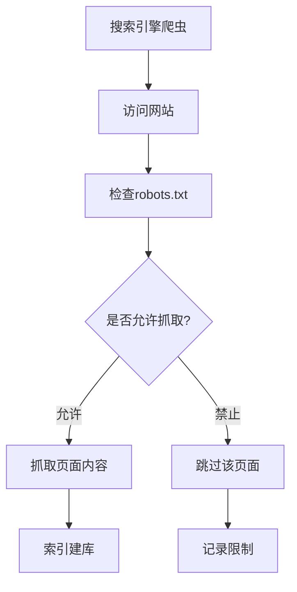
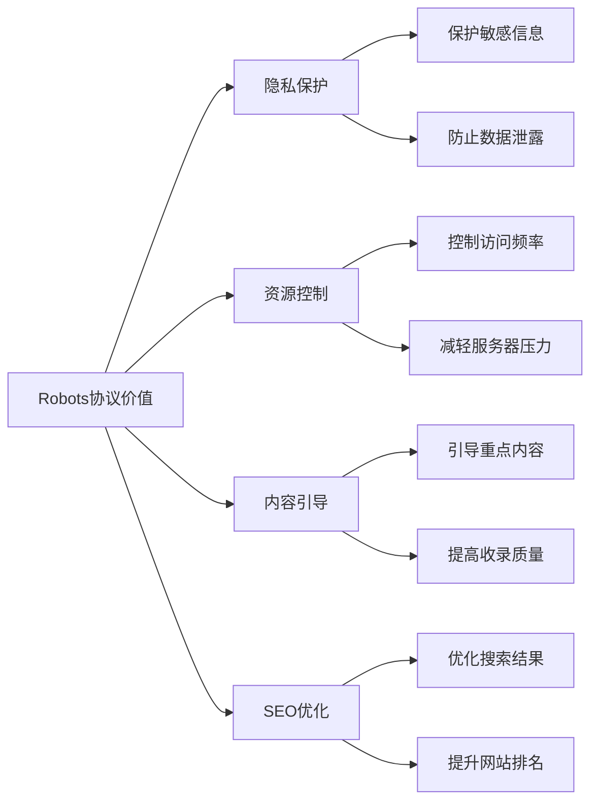
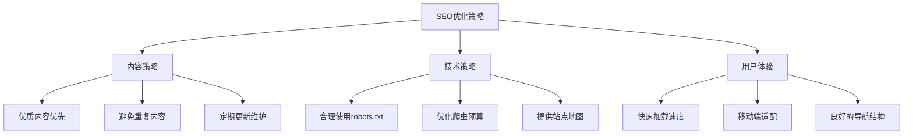

# 🤖 Robots协议完全指南

> Robots协议（也称为爬虫协议、机器人协议）全称是"网络爬虫排除标准"(Robots Exclusion Protocol)，是网站管理员控制搜索引擎爬虫行为的重要工具。

## 📋 目录导航

<details>
<summary>点击展开完整目录</summary>

### 🎯 基础概念
- [什么是Robots协议](#什么是robots协议)
- [为什么需要Robots协议](#为什么需要robots协议)
- [协议的组成部分](#协议的组成部分)

### 📄 robots.txt文件
- [文件位置和访问](#robotstxt文件位置)
- [基本语法规则](#基本语法规则)
- [常用指令详解](#常用指令详解)
- [配置示例](#配置示例)

### 🏷️ Robots Meta标签
- [Meta标签语法](#robots-meta标签)
- [指令说明](#meta标签指令)
- [使用场景](#meta标签使用场景)

### 🛠️ 实践应用
- [SEO优化策略](#seo优化策略)
- [安全防护措施](#安全防护措施)
- [常见问题解决](#常见问题解决)

</details>

## 🎯 什么是Robots协议

**Robots协议**是一个互联网标准，用于网站和网络爬虫之间的通信。它告诉搜索引擎爬虫哪些页面可以抓取，哪些页面不能抓取。



### 协议的组成部分

Robots协议主要由两个部分组成：

| 组成部分 | 文件位置 | 作用范围 | 优先级 |
|----------|----------|----------|--------|
| **robots.txt文件** | 网站根目录 | 整个网站 | 🔴 高 |
| **Robots Meta标签** | HTML页面头部 | 单个页面 | 🟡 中 |

## 💡 为什么需要Robots协议

### 核心价值



### 具体作用

| 作用 | 说明 | 实际应用 |
|------|------|----------|
| **🔒 保护网站隐私** | 阻止敏感信息被抓取 | 用户数据、内部文档、测试页面 |
| **⚡ 控制访问频率** | 限制爬虫访问次数 | 防止服务器过载，确保用户体验 |
| **🎯 引导重点内容** | 指导爬虫优先抓取重要页面 | 提高重要内容的搜索引擎曝光率 |
| **🛡️ 防止资源滥用** | 避免不必要的带宽消耗 | 减少图片、视频等大文件抓取 |

## 📄 robots.txt文件位置

### 文件位置要求

robots.txt文件**必须**放置在网站的根目录下，且文件名必须是小写。

```bash
✅ 正确位置：
https://www.example.com/robots.txt
https://subdomain.example.com/robots.txt

❌ 错误位置：
https://www.example.com/files/robots.txt
https://www.example.com/ROBOTS.TXT
https://www.example.com/Robots.txt
```

### 访问和检测

```bash
# 检查网站的robots.txt文件
curl https://www.example.com/robots.txt

# 或在浏览器中直接访问
https://yoursite.com/robots.txt
```

## 📝 基本语法规则

### 核心指令

| 指令 | 作用 | 语法 | 示例 |
|------|------|------|------|
| **User-agent** | 指定目标爬虫 | `User-agent: <爬虫名称>` | `User-agent: *` |
| **Disallow** | 禁止访问 | `Disallow: <路径>` | `Disallow: /admin/` |
| **Allow** | 允许访问 | `Allow: <路径>` | `Allow: /public/` |
| **Crawl-delay** | 访问延迟 | `Crawl-delay: <秒数>` | `Crawl-delay: 1` |
| **Sitemap** | 站点地图 | `Sitemap: <URL>` | `Sitemap: https://example.com/sitemap.xml` |

### 语法要点

::: tip 📋 语法规则
- 每个指令独占一行
- 指令不区分大小写，但路径区分大小写
- 空行和以`#`开头的行被视为注释
- `*`表示所有爬虫，`?`和`*`可用作通配符
- 路径以`/`开头，表示相对于域名根目录
:::

## 🔧 常用指令详解

### User-agent指令

指定规则适用的搜索引擎爬虫：

```bash
# 所有搜索引擎爬虫
User-agent: *

# 百度搜索引擎
User-agent: Baiduspider

# 谷歌搜索引擎
User-agent: Googlebot

# 360搜索引擎
User-agent: 360Spider

# 搜狗搜索引擎
User-agent: Sogou web spider
```

### Disallow指令

禁止爬虫访问特定路径：

```bash
# 禁止访问admin目录
Disallow: /admin/

# 禁止抓取所有.jpg格式图片
Disallow: /*.jpg$

# 禁止访问包含"private"的路径
Disallow: /*private*

# 禁止访问所有页面
Disallow: /

# 禁止访问特定文件
Disallow: /secret.html
```

### Allow指令

明确允许访问（通常用于覆盖Disallow规则）：

```bash
# 允许访问HTML文件
Allow: /*.html$

# 允许访问public目录
Allow: /public/

# 允许访问特定CSS文件
Allow: /css/style.css

# 在禁止目录中允许特定子目录
User-agent: *
Disallow: /admin/
Allow: /admin/public/
```

### Crawl-delay指令

设置爬虫访问延迟（单位：秒）：

```bash
User-agent: *
Crawl-delay: 1    # 每次请求间隔1秒

User-agent: Baiduspider
Crawl-delay: 2    # 百度爬虫间隔2秒
```

### Sitemap指令

指定网站地图位置：

```bash
# 指定XML站点地图
Sitemap: https://www.example.com/sitemap.xml

# 指定多个站点地图
Sitemap: https://www.example.com/sitemap.xml
Sitemap: https://www.example.com/news-sitemap.xml
Sitemap: https://www.example.com/image-sitemap.xml
```

## 📄 配置示例

### 基础配置

```bash
# robots.txt 基础配置
User-agent: *
Disallow: /admin/
Disallow: /private/
Disallow: /temp/
Allow: /public/
Crawl-delay: 1

# 指定站点地图
Sitemap: https://www.example.com/sitemap.xml
```

### 高级配置

```bash
# robots.txt 高级配置示例

# 所有搜索引擎的通用规则
User-agent: *
Disallow: /admin/
Disallow: /api/
Disallow: /temp/
Disallow: /*.json$
Disallow: /*?*        # 禁止带参数的URL
Allow: /api/public/   # 允许公开API
Crawl-delay: 1

# 百度爬虫特殊配置
User-agent: Baiduspider
Disallow: /en/        # 禁止百度抓取英文版
Crawl-delay: 2

# 谷歌爬虫特殊配置
User-agent: Googlebot
Allow: /               # 允许谷歌抓取所有内容
Disallow: /private/
Crawl-delay: 1

# 禁止特定爬虫
User-agent: BadBot
Disallow: /

# 站点地图
Sitemap: https://www.example.com/sitemap.xml
Sitemap: https://www.example.com/news.xml
```

### 电商网站配置

```bash
# 电商网站robots.txt示例
User-agent: *
Disallow: /cart/
Disallow: /checkout/
Disallow: /account/
Disallow: /admin/
Disallow: /search?
Disallow: /*?sort=*
Disallow: /*?filter=*
Allow: /products/
Allow: /categories/
Crawl-delay: 1

# 允许搜索引擎访问产品图片
User-agent: Googlebot-Image
Allow: /images/products/
Disallow: /images/users/

Sitemap: https://shop.example.com/sitemap.xml
Sitemap: https://shop.example.com/products.xml
```

## 🏷️ Robots Meta标签

### Meta标签语法

在HTML页面的`<head>`部分添加robots meta标签：

```html
<!-- 基本语法 -->
<meta name="robots" content="指令1,指令2,指令3">

<!-- 针对特定搜索引擎 -->
<meta name="googlebot" content="指令1,指令2">
<meta name="bingbot" content="指令1,指令2">
```

### Meta标签指令

| 指令 | 作用 | 说明 |
|------|------|------|
| **index** | 允许索引 | 默认值，允许搜索引擎索引页面 |
| **noindex** | 禁止索引 | 禁止搜索引擎索引页面 |
| **follow** | 跟踪链接 | 默认值，允许跟踪页面中的链接 |
| **nofollow** | 不跟踪链接 | 禁止跟踪页面中的链接 |
| **noarchive** | 禁止缓存 | 禁止搜索引擎缓存页面 |
| **nosnippet** | 禁止摘要 | 禁止在搜索结果中显示摘要 |
| **noimageindex** | 禁止图片索引 | 禁止索引页面中的图片 |

### Meta标签使用场景

```html
<!-- 完全禁止搜索引擎 -->
<meta name="robots" content="noindex,nofollow">

<!-- 允许索引但不跟踪链接 -->
<meta name="robots" content="index,nofollow">

<!-- 允许索引但禁止缓存 -->
<meta name="robots" content="index,follow,noarchive">

<!-- 针对谷歌的特殊设置 -->
<meta name="googlebot" content="index,follow,nosnippet">

<!-- 用户登录页面 -->
<meta name="robots" content="noindex,nofollow,noarchive">

<!-- 感谢页面 -->
<meta name="robots" content="noindex,follow">
```

## 🎯 SEO优化策略

### 最佳实践



### 实用技巧

| 策略 | 实施方法 | 预期效果 |
|------|----------|----------|
| **🎯 重点页面优化** | 确保重要页面不被robots.txt阻止 | 提高关键页面收录率 |
| **🚫 垃圾页面屏蔽** | 阻止搜索、筛选、临时页面 | 提升整体内容质量 |
| **⚡ 爬虫预算优化** | 合理设置Crawl-delay | 平衡服务器负载和收录速度 |
| **📍 站点地图提交** | 在robots.txt中声明站点地图 | 帮助搜索引擎发现内容 |

### 常见错误避免

::: warning ⚠️ 注意事项
- **不要阻止CSS和JS文件**：这会影响搜索引擎对页面的理解
- **避免过度限制**：不要为了"保护"而阻止所有爬虫
- **定期检查更新**：robots.txt文件需要根据网站变化及时更新
- **测试验证**：使用搜索引擎提供的robots.txt测试工具
:::

## 🛡️ 安全防护措施

### 隐私保护

```bash
# 保护敏感目录和文件
User-agent: *
Disallow: /admin/
Disallow: /database/
Disallow: /config/
Disallow: /backup/
Disallow: /.env
Disallow: /logs/
Disallow: /tmp/
```

### 防止信息泄露

```bash
# 防止重要文件被索引
User-agent: *
Disallow: /*.sql$
Disallow: /*.log$
Disallow: /*.bak$
Disallow: /*.config$
Disallow: /*password*
Disallow: /*secret*
```

## 🔧 常见问题解决

### 问题诊断

| 问题 | 可能原因 | 解决方案 |
|------|----------|----------|
| **页面未被收录** | robots.txt阻止了爬虫 | 检查并修改robots.txt配置 |
| **收录了不需要的页面** | 未正确配置禁止规则 | 添加Disallow规则或使用noindex |
| **服务器负载过高** | 爬虫访问过于频繁 | 设置合适的Crawl-delay值 |
| **重要页面被误阻** | 规则过于宽泛 | 细化规则，使用Allow覆盖 |

### 测试工具

```bash
# 在线测试工具
- Google Search Console robots.txt测试工具
- 百度搜索资源平台robots检测工具
- 第三方robots.txt验证器

# 本地测试命令
curl -A "Googlebot" https://yoursite.com/robots.txt
```

## 🎯 总结建议

### 最佳实践清单

- [x] **📄 创建robots.txt文件**：放置在网站根目录
- [x] **🎯 明确目标**：确定哪些内容需要被索引
- [x] **🔒 保护隐私**：阻止敏感信息被抓取  
- [x] **⚡ 优化性能**：合理设置访问延迟
- [x] **📍 提供地图**：在robots.txt中声明站点地图
- [x] **🔍 定期检查**：监控robots.txt的有效性
- [x] **🧪 测试验证**：使用工具验证配置正确性

::: tip 💡 专家建议
- **渐进式配置**：从宽松的规则开始，逐步细化
- **监控效果**：定期检查搜索引擎收录情况
- **保持更新**：随着网站结构变化及时调整
- **多引擎测试**：在不同搜索引擎上验证效果
:::

---

> 📚 **相关资源**：
> - [Google Robots.txt 规范](https://developers.google.com/search/docs/advanced/robots/robots_txt)
> - [百度搜索引擎robots协议](https://ziyuan.baidu.com/college/courseinfo?id=267&page=2)
> - [Robots.txt 测试工具](https://support.google.com/webmasters/answer/6062598)
> - [SEO优化指南](https://developers.google.com/search/docs/beginner/seo-starter-guide)
