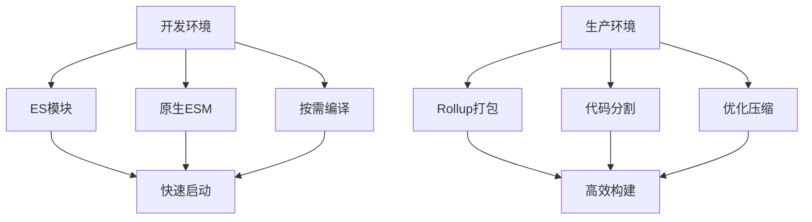

# ⚡ Vite 完全使用指南

> Vite是一个现代化的前端构建工具，提供极速的开发体验和高效的生产构建。本指南将全面介绍Vite的使用方法和最佳实践。

## 📋 目录导航

<details>
<summary>点击展开完整目录</summary>

### 🚀 快速开始
- [Vite介绍](#vite介绍)
- [安装和创建项目](#安装和创建项目)
- [目录结构](#目录结构)

### ⚙️ 配置详解
- [基础配置](#基础配置)
- [开发服务器配置](#开发服务器配置)
- [构建配置](#构建配置)
- [环境变量](#环境变量)

### 🔌 插件系统
- [官方插件](#官方插件)
- [社区插件](#社区插件)
- [自定义插件](#自定义插件)

### 🛠️ 框架集成
- [Vue项目](#vue项目)
- [React项目](#react项目)
- [Svelte项目](#svelte项目)
- [原生JavaScript](#原生javascript)

### 📦 资源处理
- [静态资源](#静态资源)
- [CSS处理](#css处理)
- [JSON导入](#json导入)
- [Worker模块](#worker模块)

### 🚀 构建优化
- [代码分割](#代码分割)
- [Tree Shaking](#tree-shaking)
- [构建分析](#构建分析)
- [部署优化](#部署优化)

### 🔧 高级功能
- [服务端渲染SSR](#服务端渲染ssr)
- [Library模式](#library模式)
- [多页面应用](#多页面应用)

</details>

## 🚀 Vite介绍

### ✨ 核心特性

| 特性 | 说明 | 优势 |
|------|------|------|
| **极速冷启动** | 基于ES模块的开发服务器 | 无需打包，即时启动 |
| **闪电热更新** | 高效的HMR机制 | 快速反映代码变化 |
| **丰富功能** | 内置TypeScript、JSX等支持 | 开箱即用 |
| **优化构建** | 基于Rollup的生产构建 | 高效的代码分割 |
| **通用插件** | 兼容Rollup插件生态 | 丰富的扩展能力 |

### 🎯 工作原理



### 🆚 与其他工具对比

```javascript
// 启动时间对比
const buildToolComparison = {
  webpack: {
    coldStart: '20-30s',
    hmr: '1-3s',
    buildSize: '大',
    complexity: '高'
  },
  
  vite: {
    coldStart: '1-2s',
    hmr: '<100ms',
    buildSize: '小',
    complexity: '低'
  },
  
  parcel: {
    coldStart: '10-15s',
    hmr: '0.5-1s',
    buildSize: '中',
    complexity: '低'
  }
};
```

## 📦 安装和创建项目

### 快速创建项目

```bash
# 使用npm
npm create vite@latest my-project

# 使用yarn
yarn create vite my-project

# 使用pnpm
pnpm create vite my-project

# 使用特定模板
npm create vite@latest my-project -- --template react
npm create vite@latest my-project -- --template vue
npm create vite@latest my-project -- --template svelte
```

### 可用模板

```bash
# JavaScript模板
vanilla          # 原生JavaScript
vanilla-ts       # TypeScript
vue              # Vue 3
vue-ts           # Vue 3 + TypeScript
react            # React
react-ts         # React + TypeScript
preact           # Preact
preact-ts        # Preact + TypeScript
lit              # Lit
lit-ts           # Lit + TypeScript
svelte           # Svelte
svelte-ts        # Svelte + TypeScript

# 社区模板
create-vite-extra/template-electron
create-vite-extra/template-ssr-vue
```

### 手动安装

```bash
# 安装Vite
npm install -D vite

# 创建配置文件
touch vite.config.js

# 添加脚本到package.json
{
  "scripts": {
    "dev": "vite",
    "build": "vite build",
    "preview": "vite preview"
  }
}
```

## ⚙️ 配置详解

### 基础配置

```javascript
// vite.config.js
import { defineConfig } from 'vite'
import vue from '@vitejs/plugin-vue'
import { resolve } from 'path'

export default defineConfig({
  // 插件配置
  plugins: [vue()],
  
  // 根目录
  root: process.cwd(),
  
  // 公共基础路径
  base: '/',
  
  // 静态资源服务目录
  publicDir: 'public',
  
  // 缓存目录
  cacheDir: 'node_modules/.vite',
  
  // 路径别名
  resolve: {
    alias: {
      '@': resolve(__dirname, 'src'),
      '@components': resolve(__dirname, 'src/components'),
      '@utils': resolve(__dirname, 'src/utils'),
      '@assets': resolve(__dirname, 'src/assets')
    },
    extensions: ['.js', '.ts', '.jsx', '.tsx', '.vue']
  },
  
  // 全局常量定义
  define: {
    __APP_VERSION__: JSON.stringify(process.env.npm_package_version),
    __DEV__: process.env.NODE_ENV === 'development'
  },
  
  // CSS配置
  css: {
    preprocessorOptions: {
      scss: {
        additionalData: `@import "@/styles/variables.scss";`
      },
      less: {
        modifyVars: {
          '@primary-color': '#1890ff'
        }
      }
    },
    modules: {
      localsConvention: 'camelCase'
    }
  },
  
  // 环境变量配置
  envPrefix: 'VITE_',
  envDir: '.'
})
```

### 条件配置

```javascript
// 根据环境条件配置
import { defineConfig } from 'vite'

export default defineConfig(({ command, mode }) => {
  const isDev = command === 'serve'
  const isProd = command === 'build'
  
  if (isDev) {
    // 开发环境配置
    return {
      plugins: [/* 开发插件 */],
      server: {
        port: 3000,
        open: true
      }
    }
  } else {
    // 生产环境配置
    return {
      plugins: [/* 生产插件 */],
      build: {
        minify: 'terser',
        rollupOptions: {
          // Rollup配置
        }
      }
    }
  }
})

// 异步配置
export default defineConfig(async ({ command, mode }) => {
  const data = await loadConfigFromFile()
  
  return {
    // 使用异步数据的配置
  }
})
```

### 开发服务器配置

```javascript
// vite.config.js
export default defineConfig({
  server: {
    // 端口号
    port: 3000,
    
    // 主机名
    host: true, // 监听所有地址
    
    // 自动打开浏览器
    open: true,
    
    // HTTPS配置
    https: false,
    // https: {
    //   key: fs.readFileSync('path/to/key.pem'),
    //   cert: fs.readFileSync('path/to/cert.pem')
    // },
    
    // 代理配置
    proxy: {
      '/api': {
        target: 'http://localhost:8080',
        changeOrigin: true,
        rewrite: (path) => path.replace(/^\/api/, '')
      },
      '/ws': {
        target: 'ws://localhost:8080',
        ws: true
      }
    },
    
    // CORS配置
    cors: true,
    
    // 强制预打包依赖
    force: false,
    
    // 中间件配置
    middlewareMode: false,
    
    // 文件系统严格模式
    fs: {
      strict: true,
      allow: ['..'],
      deny: ['.env', '.env.*', '*.{pem,crt}']
    },
    
    // HMR配置
    hmr: {
      port: 24678,
      overlay: true
    }
  }
})
```

### 构建配置

```javascript
// vite.config.js
export default defineConfig({
  build: {
    // 输出目录
    outDir: 'dist',
    
    // 静态资源目录
    assetsDir: 'assets',
    
    // 内联阈值（字节）
    assetsInlineLimit: 4096,
    
    // CSS代码分割
    cssCodeSplit: true,
    
    // CSS目标
    cssTarget: 'chrome80',
    
    // 构建目标
    target: 'es2015',
    
    // 压缩方式
    minify: 'terser',
    // minify: 'esbuild', // 更快但功能较少
    
    // Terser配置
    terserOptions: {
      compress: {
        drop_console: true,
        drop_debugger: true
      }
    },
    
    // 生成Source Map
    sourcemap: false,
    
    // 库模式
    lib: {
      entry: resolve(__dirname, 'lib/main.js'),
      name: 'MyLib',
      fileName: (format) => `my-lib.${format}.js`
    },
    
    // Rollup选项
    rollupOptions: {
      // 外部依赖
      external: ['vue', 'react'],
      
      // 输出配置
      output: {
        globals: {
          vue: 'Vue',
          react: 'React'
        },
        
        // 手动代码分割
        manualChunks: {
          vendor: ['vue', 'vue-router'],
          utils: ['lodash', 'axios']
        }
      }
    },
    
    // 构建监听
    watch: {
      buildDelay: 100,
      include: 'src/**',
      exclude: 'node_modules/**'
    },
    
    // 清空输出目录
    emptyOutDir: true,
    
    // 报告压缩结果
    reportCompressedSize: true,
    
    // chunk大小警告限制
    chunkSizeWarningLimit: 500
  }
})
```

## 🔌 插件系统

### 官方插件

```javascript
// Vue支持
import vue from '@vitejs/plugin-vue'
import vueJsx from '@vitejs/plugin-vue-jsx'

// React支持
import react from '@vitejs/plugin-react'

// 传统浏览器支持
import legacy from '@vitejs/plugin-legacy'

export default defineConfig({
  plugins: [
    // Vue插件
    vue({
      include: [/\.vue$/, /\.md$/]
    }),
    
    // Vue JSX插件
    vueJsx(),
    
    // React插件
    react({
      include: "**/*.{jsx,tsx}",
      babel: {
        plugins: ['babel-plugin-styled-components']
      }
    }),
    
    // Legacy插件
    legacy({
      targets: ['defaults', 'not IE 11']
    })
  ]
})
```

### 社区插件

```javascript
import { defineConfig } from 'vite'
import eslint from 'vite-plugin-eslint'
import { createHtmlPlugin } from 'vite-plugin-html'
import { visualizer } from 'rollup-plugin-visualizer'
import { resolve } from 'path'

export default defineConfig({
  plugins: [
    // ESLint插件
    eslint({
      include: ['src/**/*.{js,jsx,ts,tsx,vue}'],
      exclude: ['node_modules', 'dist']
    }),
    
    // HTML插件
    createHtmlPlugin({
      minify: true,
      inject: {
        data: {
          title: 'My App',
          injectScript: `<script src="./inject.js"></script>`
        }
      }
    }),
    
    // 打包分析插件
    visualizer({
      filename: 'dist/stats.html',
      open: true,
      gzipSize: true
    }),
    
    // PWA插件
    VitePWA({
      registerType: 'autoUpdate',
      workbox: {
        globPatterns: ['**/*.{js,css,html,ico,png,svg}']
      }
    }),
    
    // Mock插件
    viteMockServe({
      mockPath: 'mock',
      localEnabled: command === 'serve',
      prodEnabled: false
    })
  ]
})
```

### 自定义插件

```javascript
// 简单插件示例
function myPlugin() {
  return {
    name: 'my-plugin',
    buildStart() {
      console.log('构建开始')
    },
    transform(code, id) {
      if (id.endsWith('.special')) {
        return `export default ${JSON.stringify(code)}`
      }
    }
  }
}

// 复杂插件示例
function createBannerPlugin(options = {}) {
  const { content, position = 'top' } = options
  
  return {
    name: 'banner-plugin',
    generateBundle(options, bundle) {
      const banner = typeof content === 'function' ? content() : content
      
      for (const fileName in bundle) {
        const chunk = bundle[fileName]
        if (chunk.type === 'chunk') {
          if (position === 'top') {
            chunk.code = banner + '\n' + chunk.code
          } else {
            chunk.code = chunk.code + '\n' + banner
          }
        }
      }
    }
  }
}

// 使用自定义插件
export default defineConfig({
  plugins: [
    myPlugin(),
    createBannerPlugin({
      content: '/*! My App v1.0.0 | MIT License */'
    })
  ]
})

// 条件插件
function conditionalPlugin(condition) {
  if (condition) {
    return {
      name: 'conditional-plugin',
      // 插件逻辑
    }
  }
  return null
}

// 插件数组
const plugins = [
  vue(),
  conditionalPlugin(process.env.NODE_ENV === 'development'),
  // 过滤掉null值
].filter(Boolean)
```

## 🛠️ 框架集成

### Vue项目配置

```javascript
// vite.config.js
import { defineConfig } from 'vite'
import vue from '@vitejs/plugin-vue'
import vueJsx from '@vitejs/plugin-vue-jsx'
import { quasar, transformAssetUrls } from '@quasar/vite-plugin'

export default defineConfig({
  plugins: [
    vue({
      template: { transformAssetUrls }
    }),
    vueJsx(),
    quasar({
      sassVariables: 'src/quasar-variables.sass'
    })
  ],
  
  // Vue特定配置
  resolve: {
    alias: {
      '@': resolve(__dirname, 'src'),
      'vue': 'vue/dist/vue.esm-bundler.js'
    }
  },
  
  define: {
    __VUE_OPTIONS_API__: true,
    __VUE_PROD_DEVTOOLS__: false
  }
})
```

```vue
<!-- Vue 3 组合式API示例 -->
<template>
  <div class="app">
    <h1>{{ title }}</h1>
    <button @click="increment">Count: {{ count }}</button>
  </div>
</template>

<script setup>
import { ref, computed } from 'vue'
import { useStore } from 'vuex'

// 响应式数据
const count = ref(0)
const store = useStore()

// 计算属性
const title = computed(() => `Vue App - ${count.value}`)

// 方法
const increment = () => {
  count.value++
}

// 导入样式
import './styles/app.scss'
</script>

<style scoped>
.app {
  text-align: center;
  padding: 2rem;
}
</style>
```

### React项目配置

```javascript
// vite.config.js
import { defineConfig } from 'vite'
import react from '@vitejs/plugin-react'
import { resolve } from 'path'

export default defineConfig({
  plugins: [
    react({
      // Babel配置
      babel: {
        plugins: [
          'babel-plugin-styled-components',
          ['babel-plugin-import', {
            libraryName: 'antd',
            libraryDirectory: 'es',
            style: 'css'
          }]
        ]
      }
    })
  ],
  
  resolve: {
    alias: {
      '@': resolve(__dirname, 'src'),
      '@components': resolve(__dirname, 'src/components'),
      '@hooks': resolve(__dirname, 'src/hooks'),
      '@utils': resolve(__dirname, 'src/utils')
    }
  },
  
  // React特定配置
  esbuild: {
    jsxFactory: 'React.createElement',
    jsxFragment: 'React.Fragment'
  }
})
```

```jsx
// React组件示例
import React, { useState, useEffect } from 'react'
import styled from 'styled-components'
import { Button } from 'antd'

const Container = styled.div`
  text-align: center;
  padding: 2rem;
  
  h1 {
    color: #1890ff;
  }
`

const App = () => {
  const [count, setCount] = useState(0)
  const [data, setData] = useState(null)
  
  useEffect(() => {
    // 异步数据加载
    import('./data.json').then(module => {
      setData(module.default)
    })
  }, [])
  
  const increment = () => {
    setCount(prev => prev + 1)
  }
  
  return (
    <Container>
      <h1>React App - {count}</h1>
      <Button type="primary" onClick={increment}>
        Count: {count}
      </Button>
      {data && <pre>{JSON.stringify(data, null, 2)}</pre>}
    </Container>
  )
}

export default App
```

### TypeScript配置

```typescript
// vite-env.d.ts
/// <reference types="vite/client" />

interface ImportMetaEnv {
  readonly VITE_API_URL: string
  readonly VITE_APP_TITLE: string
}

interface ImportMeta {
  readonly env: ImportMetaEnv
}

// 声明模块
declare module '*.vue' {
  import type { DefineComponent } from 'vue'
  const component: DefineComponent<{}, {}, any>
  export default component
}

declare module '*.svg' {
  const src: string
  export default src
}

declare module '*.png' {
  const src: string
  export default src
}
```

```json
// tsconfig.json
{
  "compilerOptions": {
    "target": "ES2020",
    "useDefineForClassFields": true,
    "lib": ["ES2020", "DOM", "DOM.Iterable"],
    "module": "ESNext",
    "skipLibCheck": true,
    
    /* Bundler mode */
    "moduleResolution": "bundler",
    "allowImportingTsExtensions": true,
    "resolveJsonModule": true,
    "isolatedModules": true,
    "noEmit": true,
    "jsx": "react-jsx",
    
    /* Linting */
    "strict": true,
    "noUnusedLocals": true,
    "noUnusedParameters": true,
    "noFallthroughCasesInSwitch": true,
    
    /* Path mapping */
    "baseUrl": ".",
    "paths": {
      "@/*": ["src/*"],
      "@components/*": ["src/components/*"],
      "@utils/*": ["src/utils/*"]
    }
  },
  "include": ["src/**/*.ts", "src/**/*.tsx", "src/**/*.vue"],
  "exclude": ["node_modules", "dist"]
}
```

## 📦 资源处理

### 静态资源

```javascript
// 静态资源导入
import imgUrl from './img.png'          // 显式URL导入
import Worker from './worker.js?worker' // Worker导入
import assetAsURL from './asset.glb?url' // 强制URL导入

// 动态资源导入
function getImageUrl(name) {
  return new URL(`./dir/${name}.png`, import.meta.url).href
}

// 资源内联
import inlineString from './shader.glsl?raw'     // 原始字符串
import inlineWorker from './worker.js?worker&inline' // 内联Worker

// 公共目录资源
// public/icon.png -> /icon.png
const iconUrl = '/icon.png'
```

### CSS处理

```scss
// CSS模块
// styles.module.scss
.container {
  padding: 1rem;
  
  .title {
    color: blue;
    
    &:hover {
      color: red;
    }
  }
}

// 全局样式
:global(.global-class) {
  font-size: 16px;
}
```

```javascript
// 在组件中使用CSS模块
import styles from './styles.module.scss'

const Component = () => {
  return (
    <div className={styles.container}>
      <h1 className={styles.title}>Title</h1>
    </div>
  )
}
```

### PostCSS配置

```javascript
// postcss.config.js
export default {
  plugins: {
    'postcss-preset-env': {
      stage: 3,
      features: {
        'nesting-rules': true
      }
    },
    'autoprefixer': {},
    'tailwindcss': {},
    'cssnano': process.env.NODE_ENV === 'production' ? {} : false
  }
}
```

### JSON导入

```javascript
// 导入JSON文件
import pkg from './package.json'
import data from './data.json'

// 命名导入
import { version } from './package.json'

// 动态导入
const loadConfig = async () => {
  const config = await import('./config.json')
  return config.default
}
```

## 🚀 构建优化

### 代码分割

```javascript
// 动态导入实现代码分割
const LazyComponent = lazy(() => import('./LazyComponent'))

// 路由级代码分割
const routes = [
  {
    path: '/home',
    component: () => import('./pages/Home.vue')
  },
  {
    path: '/about',
    component: () => import('./pages/About.vue')
  }
]

// Rollup手动分割
export default defineConfig({
  build: {
    rollupOptions: {
      output: {
        manualChunks: {
          // 将vendor库单独打包
          vendor: ['vue', 'vue-router', 'vuex'],
          
          // 将工具库单独打包
          utils: ['lodash', 'date-fns', 'axios'],
          
          // 将UI组件库单独打包
          ui: ['element-plus', 'ant-design-vue']
        },
        
        // 动态分割函数
        manualChunks(id) {
          if (id.includes('node_modules')) {
            return 'vendor'
          }
          
          if (id.includes('src/components')) {
            return 'components'
          }
          
          if (id.includes('src/utils')) {
            return 'utils'
          }
        }
      }
    }
  }
})
```

### 预加载优化

```javascript
// 预加载关键资源
import.meta.preload = (url) => {
  const link = document.createElement('link')
  link.rel = 'modulepreload'
  link.href = url
  document.head.appendChild(link)
}

// 预加载策略
const preloadImportantModules = () => {
  import.meta.preload('./critical-module.js')
  import.meta.preload('./vendor-chunk.js')
}

// 路由预加载
const router = createRouter({
  routes: [
    {
      path: '/dashboard',
      component: () => import('./Dashboard.vue'),
      meta: { preload: true }
    }
  ]
})

router.beforeEach(async (to, from, next) => {
  if (to.meta.preload) {
    try {
      await to.component()
    } catch (error) {
      console.error('Route preload failed:', error)
    }
  }
  next()
})
```

### 构建分析

```javascript
// 安装分析插件
import { visualizer } from 'rollup-plugin-visualizer'
import { BundleAnalyzerPlugin } from 'rollup-plugin-analyzer'

export default defineConfig({
  plugins: [
    // 打包体积分析
    visualizer({
      filename: 'dist/stats.html',
      open: true,
      gzipSize: true,
      brotliSize: true
    }),
    
    // 详细分析报告
    BundleAnalyzerPlugin({
      analyzerMode: 'static',
      reportFilename: 'bundle-report.html'
    })
  ]
})
```

## 🔧 高级功能

### 服务端渲染SSR

```javascript
// vite.config.js
export default defineConfig({
  build: {
    ssr: true,
    rollupOptions: {
      input: {
        server: 'src/entry-server.js',
        client: 'src/entry-client.js'
      }
    }
  },
  ssr: {
    noExternal: ['some-package'],
    external: ['express']
  }
})
```

```javascript
// entry-server.js
import { createSSRApp } from 'vue'
import { renderToString } from 'vue/server-renderer'
import { createApp } from './main'

export async function render(url, manifest) {
  const { app, router } = createApp()
  
  await router.push(url)
  await router.isReady()
  
  const ctx = {}
  const html = await renderToString(app, ctx)
  
  return { html }
}
```

```javascript
// server.js
import express from 'express'
import { createServer as createViteServer } from 'vite'

async function createServer() {
  const app = express()
  
  const vite = await createViteServer({
    server: { middlewareMode: true },
    appType: 'custom'
  })
  
  app.use(vite.ssrLoadModule)
  
  app.use('*', async (req, res) => {
    try {
      const url = req.originalUrl
      const { render } = await vite.ssrLoadModule('/src/entry-server.js')
      const { html } = await render(url)
      
      res.status(200).set({ 'Content-Type': 'text/html' }).end(html)
    } catch (e) {
      vite.ssrFixStacktrace(e)
      console.error(e)
      res.status(500).end(e.message)
    }
  })
  
  app.listen(3000)
}

createServer()
```

### Library模式

```javascript
// vite.config.js
export default defineConfig({
  build: {
    lib: {
      entry: resolve(__dirname, 'lib/main.js'),
      name: 'MyLib',
      fileName: (format) => `my-lib.${format}.js`,
      formats: ['es', 'cjs', 'umd', 'iife']
    },
    rollupOptions: {
      // 确保外部化处理那些你不想打包进库的依赖
      external: ['vue', 'react'],
      output: {
        // 在 UMD 构建模式下为这些外部化的依赖提供一个全局变量
        globals: {
          vue: 'Vue',
          react: 'React'
        }
      }
    }
  }
})
```

### 多页面应用

```javascript
// vite.config.js
export default defineConfig({
  build: {
    rollupOptions: {
      input: {
        main: resolve(__dirname, 'index.html'),
        admin: resolve(__dirname, 'admin.html'),
        mobile: resolve(__dirname, 'mobile.html')
      }
    }
  }
})
```

```html
<!-- index.html -->
<!DOCTYPE html>
<html>
<head>
  <title>Main App</title>
</head>
<body>
  <div id="app"></div>
  <script type="module" src="/src/main.js"></script>
</body>
</html>

<!-- admin.html -->
<!DOCTYPE html>
<html>
<head>
  <title>Admin Panel</title>
</head>
<body>
  <div id="admin"></div>
  <script type="module" src="/src/admin.js"></script>
</body>
</html>
```

## 🛠️ 实用工具和技巧

### 环境变量管理

```bash
# .env.local
VITE_API_URL=http://localhost:8080/api
VITE_APP_TITLE=My Local App

# .env.development
VITE_API_URL=https://dev-api.example.com
VITE_APP_TITLE=My Dev App

# .env.production
VITE_API_URL=https://api.example.com
VITE_APP_TITLE=My Production App
```

```javascript
// 在代码中使用环境变量
const apiUrl = import.meta.env.VITE_API_URL
const appTitle = import.meta.env.VITE_APP_TITLE
const isDev = import.meta.env.DEV
const isProd = import.meta.env.PROD

console.log('Environment:', {
  apiUrl,
  appTitle,
  isDev,
  isProd,
  mode: import.meta.env.MODE
})
```

### 性能监控

```javascript
// 性能监控插件
function performanceMonitor() {
  return {
    name: 'performance-monitor',
    buildStart() {
      this.startTime = Date.now()
    },
    buildEnd() {
      const duration = Date.now() - this.startTime
      console.log(`Build completed in ${duration}ms`)
    },
    generateBundle() {
      console.log('Bundle generation completed')
    }
  }
}

// 构建时间分析
export default defineConfig({
  plugins: [
    performanceMonitor(),
    // 其他插件
  ]
})
```

### 调试技巧

```javascript
// 开发时的调试配置
export default defineConfig({
  // 开启source map
  build: {
    sourcemap: true
  },
  
  // 开发服务器调试
  server: {
    // 网络调试
    host: '0.0.0.0',
    
    // 代理调试
    proxy: {
      '/api': {
        target: 'http://localhost:8080',
        changeOrigin: true,
        configure: (proxy, options) => {
          proxy.on('error', (err, req, res) => {
            console.log('proxy error', err)
          })
          proxy.on('proxyReq', (proxyReq, req, res) => {
            console.log('Sending Request to the Target:', req.method, req.url)
          })
          proxy.on('proxyRes', (proxyRes, req, res) => {
            console.log('Received Response from the Target:', proxyRes.statusCode, req.url)
          })
        }
      }
    }
  },
  
  // 日志级别
  logLevel: 'info', // 'error' | 'warn' | 'info' | 'silent'
  
  // 清屏控制
  clearScreen: false
})
```

## 📚 最佳实践

### 项目结构建议

```
my-vite-project/
├── public/                 # 静态资源
│   ├── favicon.ico
│   └── robots.txt
├── src/                    # 源代码
│   ├── assets/            # 项目资源
│   │   ├── images/
│   │   ├── styles/
│   │   └── fonts/
│   ├── components/        # 组件
│   │   ├── common/
│   │   └── ui/
│   ├── pages/             # 页面
│   ├── utils/             # 工具函数
│   ├── stores/            # 状态管理
│   ├── services/          # API服务
│   ├── hooks/             # React Hooks / Vue Composables
│   ├── types/             # TypeScript类型定义
│   └── main.js            # 入口文件
├── .env                   # 环境变量
├── .gitignore
├── index.html             # HTML模板
├── package.json
├── vite.config.js         # Vite配置
└── README.md
```

### 性能优化建议

```javascript
// 1. 依赖预构建优化
export default defineConfig({
  optimizeDeps: {
    include: ['lodash', 'axios'],
    exclude: ['some-large-dep']
  }
})

// 2. 构建缓存
export default defineConfig({
  build: {
    // 启用构建缓存
    cache: true,
    
    // 增量构建
    incremental: true
  }
})

// 3. 并行处理
export default defineConfig({
  esbuild: {
    // 启用并行处理
    target: 'es2015',
    minify: true
  }
})
```

### 团队协作配置

```javascript
// .vscode/settings.json
{
  "typescript.preferences.importModuleSpecifier": "relative",
  "editor.codeActionsOnSave": {
    "source.fixAll.eslint": true
  },
  "files.associations": {
    "*.vue": "vue"
  }
}

// .eslintrc.js
module.exports = {
  extends: [
    '@vue/eslint-config-typescript',
    '@vue/eslint-config-prettier'
  ],
  rules: {
    // 项目特定规则
  }
}

// prettier.config.js
module.exports = {
  semi: false,
  singleQuote: true,
  trailingComma: 'es5'
}
```

## 📋 常见问题解决

### 依赖问题

```javascript
// 1. 预构建问题
export default defineConfig({
  optimizeDeps: {
    // 强制预构建
    include: ['problematic-package'],
    
    // 排除预构建
    exclude: ['some-package']
  }
})

// 2. CommonJS兼容
export default defineConfig({
  build: {
    commonjsOptions: {
      include: [/node_modules/],
      transformMixedEsModules: true
    }
  }
})

// 3. 外部依赖处理
export default defineConfig({
  build: {
    rollupOptions: {
      external: ['some-external-lib'],
      output: {
        globals: {
          'some-external-lib': 'SomeLib'
        }
      }
    }
  }
})
```

### 兼容性问题

```javascript
// 1. 浏览器兼容性
import legacy from '@vitejs/plugin-legacy'

export default defineConfig({
  plugins: [
    legacy({
      targets: ['defaults', 'not IE 11']
    })
  ]
})

// 2. Node.js兼容性
export default defineConfig({
  define: {
    global: 'globalThis',
    'process.env': {}
  },
  
  resolve: {
    alias: {
      // Node.js polyfills
      process: 'process/browser',
      buffer: 'buffer',
      util: 'util'
    }
  }
})
```

::: tip 💡 使用建议
- **合理使用插件**：只安装必要的插件，避免过度配置
- **优化构建性能**：使用缓存、并行处理等技术
- **监控构建大小**：定期检查bundle大小，优化依赖
- **保持更新**：及时更新Vite和相关插件版本
- **团队规范**：建立统一的配置和代码规范
:::

---

> 📚 **相关资源**：
> - [Vite官方文档](https://vitejs.dev/)
> - [Rollup插件列表](https://github.com/rollup/plugins)
> - [Vue + Vite最佳实践](https://vuejs.org/guide/best-practices/)
> - [React + Vite集成指南](https://vitejs.dev/guide/features.html#jsx) 