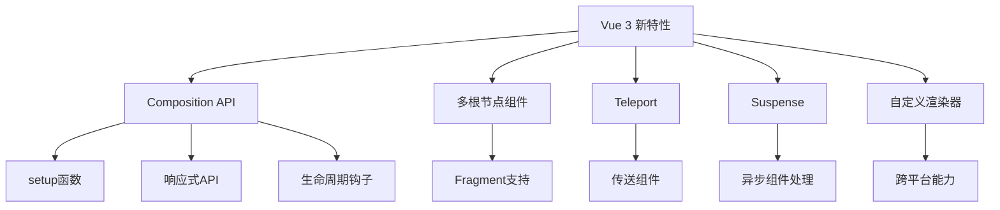

# 🟢 Vue 生态系统完全指南

> Vue.js是一个渐进式JavaScript框架，以其简洁的语法、强大的功能和丰富的生态系统而闻名。本指南将全面介绍Vue生态系统的各个方面。

## 📋 目录导航

<details>
<summary>点击展开完整目录</summary>

### 🚀 Vue 核心
- [Vue 3 核心特性](#vue-3-核心特性)
- [Composition API](#composition-api)
- [响应式系统](#响应式系统)
- [组件系统](#组件系统)

### 🎯 Vue Router
- [路由基础](#路由基础)
- [动态路由](#动态路由)
- [路由守卫](#路由守卫)
- [路由懒加载](#路由懒加载)

### 🗃️ 状态管理
- [Vuex使用](#vuex使用)
- [Pinia新方案](#pinia新方案)
- [组合式状态管理](#组合式状态管理)

### 🛠️ 构建工具
- [Vue CLI](#vue-cli)
- [Vite + Vue](#vite-vue)
- [构建配置](#构建配置)

### 🎨 UI框架
- [Element Plus](#element-plus)
- [Ant Design Vue](#ant-design-vue)
- [Vuetify](#vuetify)
- [Quasar](#quasar)

### 📱 移动端开发
- [Vue Mobile](#vue-mobile)
- [NativeScript Vue](#nativescript-vue)
- [Ionic Vue](#ionic-vue)

### 🔧 开发工具
- [Vue DevTools](#vue-devtools)
- [VSCode插件](#vscode插件)
- [测试工具](#测试工具)

### 📚 最佳实践
- [项目结构](#项目结构)
- [性能优化](#性能优化)
- [代码规范](#代码规范)

</details>

## 🚀 Vue 3 核心特性

### ✨ 主要改进

| 特性 | Vue 2 | Vue 3 | 优势 |
|------|-------|-------|------|
| **性能** | Options API | Composition API | 更好的逻辑复用 |
| **包体积** | 34KB | 13.5KB | Tree-shaking支持 |
| **TypeScript** | 插件支持 | 原生支持 | 更好的类型推导 |
| **渲染** | Virtual DOM | 优化Virtual DOM | 更快的渲染 |
| **响应式** | Object.defineProperty | Proxy | 更完整的拦截 |

### 🎯 新特性概览



## 🎯 Composition API

### 基础语法

```vue
<template>
  <div class="counter-app">
    <h1>{{ title }}</h1>
    <p>当前计数：{{ count }}</p>
    <button @click="increment">增加</button>
    <button @click="decrement">减少</button>
    <button @click="reset">重置</button>
    
    <!-- 计算属性展示 -->
    <p>双倍计数：{{ doubleCount }}</p>
    <p>计数状态：{{ countStatus }}</p>
    
    <!-- 用户信息 -->
    <div v-if="user">
      <h3>用户信息</h3>
      <p>姓名：{{ user.name }}</p>
      <p>邮箱：{{ user.email }}</p>
    </div>
  </div>
</template>

<script setup>
import { ref, reactive, computed, watch, onMounted, onUnmounted } from 'vue'
import { useUser } from '@/composables/useUser'

// 响应式数据
const title = ref('Vue 3 计数器')
const count = ref(0)

// 响应式对象
const state = reactive({
  loading: false,
  error: null
})

// 计算属性
const doubleCount = computed(() => count.value * 2)

const countStatus = computed(() => {
  if (count.value === 0) return '初始状态'
  if (count.value > 0) return '正数'
  return '负数'
})

// 方法
const increment = () => {
  count.value++
}

const decrement = () => {
  count.value--
}

const reset = () => {
  count.value = 0
}

// 监听器
watch(count, (newVal, oldVal) => {
  console.log(`计数从 ${oldVal} 变为 ${newVal}`)
})

// 深度监听
watch(() => state, (newState) => {
  console.log('状态更新:', newState)
}, { deep: true })

// 组合式函数
const { user, loading, error, fetchUser } = useUser()

// 生命周期
onMounted(async () => {
  console.log('组件已挂载')
  await fetchUser(1)
})

onUnmounted(() => {
  console.log('组件即将卸载')
})

// 暴露给模板的数据和方法
defineExpose({
  count,
  increment,
  reset
})
</script>

<style scoped>
.counter-app {
  max-width: 400px;
  margin: 0 auto;
  padding: 2rem;
  text-align: center;
}

button {
  margin: 0.5rem;
  padding: 0.5rem 1rem;
  border: none;
  border-radius: 4px;
  background: #42b883;
  color: white;
  cursor: pointer;
}

button:hover {
  background: #369870;
}
</style>
```

### 组合式函数 (Composables)

```javascript
// composables/useCounter.js
import { ref, computed } from 'vue'

export function useCounter(initialValue = 0) {
  const count = ref(initialValue)
  
  const increment = () => count.value++
  const decrement = () => count.value--
  const reset = () => count.value = initialValue
  
  const isEven = computed(() => count.value % 2 === 0)
  const isPositive = computed(() => count.value > 0)
  
  return {
    count,
    increment,
    decrement,
    reset,
    isEven,
    isPositive
  }
}

// composables/useUser.js
import { ref, reactive } from 'vue'
import axios from 'axios'

export function useUser() {
  const user = ref(null)
  const loading = ref(false)
  const error = ref(null)
  
  const fetchUser = async (id) => {
    loading.value = true
    error.value = null
    
    try {
      const response = await axios.get(`/api/users/${id}`)
      user.value = response.data
    } catch (err) {
      error.value = err.message
    } finally {
      loading.value = false
    }
  }
  
  const updateUser = async (userData) => {
    loading.value = true
    
    try {
      const response = await axios.put(`/api/users/${user.value.id}`, userData)
      user.value = response.data
    } catch (err) {
      error.value = err.message
    } finally {
      loading.value = false
    }
  }
  
  return {
    user,
    loading,
    error,
    fetchUser,
    updateUser
  }
}

// composables/useLocalStorage.js
import { ref, watch } from 'vue'

export function useLocalStorage(key, defaultValue) {
  const storedValue = localStorage.getItem(key)
  const value = ref(storedValue ? JSON.parse(storedValue) : defaultValue)
  
  // 监听值的变化并同步到localStorage
  watch(value, (newValue) => {
    localStorage.setItem(key, JSON.stringify(newValue))
  }, { deep: true })
  
  return value
}
```

### 响应式系统深入

```javascript
// 响应式API详解
import { 
  ref, 
  reactive, 
  readonly, 
  computed, 
  watch, 
  watchEffect,
  toRef,
  toRefs,
  unref,
  isRef,
  isReactive,
  isReadonly,
  isProxy
} from 'vue'

// ref - 基本类型响应式
const count = ref(0)
const message = ref('Hello')

// reactive - 对象响应式
const state = reactive({
  name: 'Vue',
  version: 3,
  features: ['Composition API', 'Performance', 'TypeScript']
})

// readonly - 只读代理
const readonlyState = readonly(state)

// toRef - 将响应式对象的属性转为ref
const name = toRef(state, 'name')

// toRefs - 将响应式对象的所有属性转为ref
const { version, features } = toRefs(state)

// 计算属性
const doubleCount = computed({
  get: () => count.value * 2,
  set: (val) => {
    count.value = val / 2
  }
})

// watchEffect - 自动追踪依赖
const stop = watchEffect(() => {
  console.log(`Count is: ${count.value}`)
})

// watch - 明确指定依赖
watch(
  () => state.name,
  (newName, oldName) => {
    console.log(`Name changed from ${oldName} to ${newName}`)
  },
  { immediate: true }
)

// 工具函数
console.log('isRef(count):', isRef(count))
console.log('isReactive(state):', isReactive(state))
console.log('isReadonly(readonlyState):', isReadonly(readonlyState))
console.log('unref(count):', unref(count))

// 手动停止监听
// stop()
```

## 🎯 Vue Router

### 路由基础配置

```javascript
// router/index.js
import { createRouter, createWebHistory } from 'vue-router'

// 路由组件懒加载
const Home = () => import('@/views/Home.vue')
const About = () => import('@/views/About.vue')
const User = () => import('@/views/User.vue')

const routes = [
  {
    path: '/',
    name: 'Home',
    component: Home,
    meta: {
      title: '首页',
      requiresAuth: false
    }
  },
  {
    path: '/about',
    name: 'About',
    component: About,
    meta: {
      title: '关于我们',
      requiresAuth: false
    }
  },
  {
    path: '/user/:id',
    name: 'User',
    component: User,
    props: true,
    meta: {
      title: '用户详情',
      requiresAuth: true
    }
  },
  {
    path: '/dashboard',
    name: 'Dashboard',
    component: () => import('@/views/Dashboard.vue'),
    meta: {
      title: '控制台',
      requiresAuth: true,
      roles: ['admin', 'user']
    },
    children: [
      {
        path: 'profile',
        name: 'Profile',
        component: () => import('@/views/Profile.vue')
      },
      {
        path: 'settings',
        name: 'Settings',
        component: () => import('@/views/Settings.vue')
      }
    ]
  },
  {
    path: '/:pathMatch(.*)*',
    name: 'NotFound',
    component: () => import('@/views/NotFound.vue')
  }
]

const router = createRouter({
  history: createWebHistory(),
  routes,
  scrollBehavior(to, from, savedPosition) {
    if (savedPosition) {
      return savedPosition
    } else {
      return { top: 0 }
    }
  }
})

export default router
```

### 路由守卫

```javascript
// router/guards.js
import router from './index'
import { useAuthStore } from '@/stores/auth'

// 全局前置守卫
router.beforeEach(async (to, from, next) => {
  const authStore = useAuthStore()
  
  // 设置页面标题
  document.title = to.meta.title || 'Vue App'
  
  // 检查认证要求
  if (to.meta.requiresAuth) {
    if (!authStore.isAuthenticated) {
      next({
        name: 'Login',
        query: { redirect: to.fullPath }
      })
      return
    }
    
    // 检查角色权限
    if (to.meta.roles && !to.meta.roles.includes(authStore.user.role)) {
      next({ name: 'Forbidden' })
      return
    }
  }
  
  next()
})

// 全局后置钩子
router.afterEach((to, from) => {
  // 发送页面访问统计
  if (typeof gtag !== 'undefined') {
    gtag('config', 'GA_MEASUREMENT_ID', {
      page_path: to.path
    })
  }
})

// 路由错误处理
router.onError((error) => {
  console.error('路由错误:', error)
})
```

### 路由组合式API

```vue
<template>
  <div class="user-profile">
    <h1>用户 #{{ userId }}</h1>
    <nav>
      <router-link :to="{ name: 'UserPosts', params: { id: userId } }">
        文章列表
      </router-link>
      <router-link :to="{ name: 'UserSettings', params: { id: userId } }">
        用户设置
      </router-link>
    </nav>
    
    <router-view />
    
    <button @click="goBack">返回</button>
    <button @click="goToHome">回到首页</button>
  </div>
</template>

<script setup>
import { computed } from 'vue'
import { useRoute, useRouter } from 'vue-router'

const route = useRoute()
const router = useRouter()

// 获取路由参数
const userId = computed(() => route.params.id)

// 导航方法
const goBack = () => {
  router.go(-1)
}

const goToHome = () => {
  router.push({ name: 'Home' })
}

// 监听路由变化
watch(() => route.params.id, (newId) => {
  console.log('用户ID变更:', newId)
})
</script>
```

## 🗃️ 状态管理

### Pinia 使用指南

```javascript
// stores/index.js
import { createPinia } from 'pinia'

const pinia = createPinia()

export default pinia

// stores/counter.js
import { defineStore } from 'pinia'

export const useCounterStore = defineStore('counter', {
  state: () => ({
    count: 0,
    name: 'Counter'
  }),
  
  getters: {
    doubleCount: (state) => state.count * 2,
    
    // 访问其他getter
    countPlusOne() {
      return this.count + 1
    },
    
    // 带参数的getter
    getCountById: (state) => {
      return (id) => state.items.find(item => item.id === id)?.count || 0
    }
  },
  
  actions: {
    increment() {
      this.count++
    },
    
    decrement() {
      this.count--
    },
    
    async fetchCount() {
      try {
        const response = await fetch('/api/count')
        const data = await response.json()
        this.count = data.count
      } catch (error) {
        console.error('获取计数失败:', error)
      }
    },
    
    // 重置状态
    $reset() {
      this.count = 0
      this.name = 'Counter'
    }
  }
})

// Composition API 风格
export const useUserStore = defineStore('user', () => {
  const user = ref(null)
  const loading = ref(false)
  const error = ref(null)
  
  const isLoggedIn = computed(() => !!user.value)
  const userName = computed(() => user.value?.name || 'Guest')
  
  const login = async (credentials) => {
    loading.value = true
    error.value = null
    
    try {
      const response = await api.login(credentials)
      user.value = response.data
      
      // 保存到localStorage
      localStorage.setItem('token', response.data.token)
    } catch (err) {
      error.value = err.message
    } finally {
      loading.value = false
    }
  }
  
  const logout = () => {
    user.value = null
    localStorage.removeItem('token')
  }
  
  return {
    user,
    loading,
    error,
    isLoggedIn,
    userName,
    login,
    logout
  }
})
```

### 在组件中使用Store

```vue
<template>
  <div class="app">
    <header>
      <h1>{{ appTitle }}</h1>
      <div class="user-info">
        <span v-if="userStore.isLoggedIn">
          欢迎，{{ userStore.userName }}
        </span>
        <button v-else @click="showLogin = true">
          登录
        </button>
      </div>
    </header>
    
    <main>
      <div class="counter">
        <p>计数：{{ counterStore.count }}</p>
        <p>双倍计数：{{ counterStore.doubleCount }}</p>
        <button @click="counterStore.increment">+</button>
        <button @click="counterStore.decrement">-</button>
      </div>
    </main>
    
    <!-- 登录表单 -->
    <LoginModal v-if="showLogin" @close="showLogin = false" />
  </div>
</template>

<script setup>
import { ref } from 'vue'
import { useCounterStore } from '@/stores/counter'
import { useUserStore } from '@/stores/user'
import LoginModal from '@/components/LoginModal.vue'

const counterStore = useCounterStore()
const userStore = useUserStore()

const appTitle = ref('My Vue App')
const showLogin = ref(false)

// 直接修改状态
counterStore.count++

// 使用$patch批量更新
counterStore.$patch({
  count: counterStore.count + 1,
  name: 'Updated Counter'
})

// 使用$patch函数形式
counterStore.$patch((state) => {
  state.count++
  state.items.push({ name: 'New Item' })
})

// 监听状态变化
counterStore.$subscribe((mutation, state) => {
  console.log(mutation.type) // 'direct' | 'patch object' | 'patch function'
  console.log(mutation.storeId) // 'counter'
  console.log(mutation.payload) // 传递给$patch的对象
  console.log(state) // 新状态
})

// 重置到初始状态
const resetCounter = () => {
  counterStore.$reset()
}
</script>
```

### Store插件和持久化

```javascript
// plugins/persistence.js
import { watch } from 'vue'

export function createPersistedState(options = {}) {
  return (context) => {
    const { store } = context
    const {
      key = store.$id,
      storage = localStorage,
      paths = null
    } = options
    
    // 从存储中恢复状态
    const stored = storage.getItem(key)
    if (stored) {
      store.$patch(JSON.parse(stored))
    }
    
    // 监听状态变化并持久化
    store.$subscribe((mutation, state) => {
      const dataToStore = paths 
        ? paths.reduce((obj, path) => {
            obj[path] = state[path]
            return obj
          }, {})
        : state
        
      storage.setItem(key, JSON.stringify(dataToStore))
    })
  }
}

// stores/index.js
import { createPinia } from 'pinia'
import { createPersistedState } from '@/plugins/persistence'

const pinia = createPinia()

// 使用持久化插件
pinia.use(createPersistedState({
  storage: sessionStorage,
  paths: ['user', 'settings']
}))

export default pinia
```

## 🛠️ 构建工具

### Vite + Vue 配置

```javascript
// vite.config.js
import { defineConfig } from 'vite'
import vue from '@vitejs/plugin-vue'
import vueJsx from '@vitejs/plugin-vue-jsx'
import { resolve } from 'path'

export default defineConfig({
  plugins: [
    vue({
      template: {
        compilerOptions: {
          // 自定义元素处理
          isCustomElement: (tag) => tag.startsWith('my-')
        }
      }
    }),
    vueJsx()
  ],
  
  resolve: {
    alias: {
      '@': resolve(__dirname, 'src'),
      '@components': resolve(__dirname, 'src/components'),
      '@views': resolve(__dirname, 'src/views'),
      '@stores': resolve(__dirname, 'src/stores'),
      '@utils': resolve(__dirname, 'src/utils')
    }
  },
  
  css: {
    preprocessorOptions: {
      scss: {
        additionalData: `
          @import "@/styles/variables.scss";
          @import "@/styles/mixins.scss";
        `
      }
    }
  },
  
  server: {
    port: 3000,
    proxy: {
      '/api': {
        target: 'http://localhost:8080',
        changeOrigin: true,
        rewrite: (path) => path.replace(/^\/api/, '')
      }
    }
  },
  
  build: {
    rollupOptions: {
      output: {
        manualChunks: {
          vendor: ['vue', 'vue-router', 'pinia'],
          ui: ['element-plus']
        }
      }
    }
  }
})
```

### Vue CLI 配置

```javascript
// vue.config.js
const { defineConfig } = require('@vue/cli-service')

module.exports = defineConfig({
  publicPath: process.env.NODE_ENV === 'production' ? '/my-app/' : '/',
  
  outputDir: 'dist',
  
  assetsDir: 'static',
  
  configureWebpack: {
    resolve: {
      alias: {
        '@': require('path').resolve(__dirname, 'src')
      }
    }
  },
  
  chainWebpack: config => {
    // 优化
    config.optimization.splitChunks({
      chunks: 'all'
    })
    
    // 添加别名
    config.resolve.alias
      .set('@components', resolve('src/components'))
      .set('@views', resolve('src/views'))
  },
  
  css: {
    loaderOptions: {
      sass: {
        additionalData: `@import "@/styles/variables.scss";`
      }
    }
  },
  
  devServer: {
    port: 8080,
    proxy: {
      '/api': {
        target: 'http://localhost:3000',
        changeOrigin: true
      }
    }
  },
  
  pwa: {
    name: 'My Vue App',
    themeColor: '#4DBA87',
    msTileColor: '#000000',
    appleMobileWebAppCapable: 'yes',
    appleMobileWebAppStatusBarStyle: 'black',
    
    workboxPluginMode: 'GenerateSW',
    workboxOptions: {
      skipWaiting: true
    }
  }
})
```

## 🎨 UI框架集成

### Element Plus

```javascript
// main.js
import { createApp } from 'vue'
import ElementPlus from 'element-plus'
import 'element-plus/dist/index.css'
import zhCn from 'element-plus/es/locale/lang/zh-cn'

const app = createApp(App)

app.use(ElementPlus, {
  locale: zhCn,
})

// 按需导入
import { ElButton, ElMessage } from 'element-plus'

app.use(ElButton)
app.config.globalProperties.$message = ElMessage
```

```vue
<!-- Element Plus 使用示例 -->
<template>
  <div class="form-container">
    <el-form 
      ref="formRef" 
      :model="form" 
      :rules="rules" 
      label-width="120px"
    >
      <el-form-item label="用户名" prop="username">
        <el-input v-model="form.username" placeholder="请输入用户名" />
      </el-form-item>
      
      <el-form-item label="邮箱" prop="email">
        <el-input v-model="form.email" type="email" placeholder="请输入邮箱" />
      </el-form-item>
      
      <el-form-item label="生日" prop="birthday">
        <el-date-picker
          v-model="form.birthday"
          type="date"
          placeholder="选择日期"
        />
      </el-form-item>
      
      <el-form-item>
        <el-button type="primary" @click="submitForm">提交</el-button>
        <el-button @click="resetForm">重置</el-button>
      </el-form-item>
    </el-form>
  </div>
</template>

<script setup>
import { ref, reactive } from 'vue'
import { ElMessage } from 'element-plus'

const formRef = ref()

const form = reactive({
  username: '',
  email: '',
  birthday: ''
})

const rules = reactive({
  username: [
    { required: true, message: '请输入用户名', trigger: 'blur' },
    { min: 3, max: 20, message: '长度在 3 到 20 个字符', trigger: 'blur' }
  ],
  email: [
    { required: true, message: '请输入邮箱地址', trigger: 'blur' },
    { type: 'email', message: '请输入正确的邮箱地址', trigger: 'blur' }
  ]
})

const submitForm = async () => {
  try {
    await formRef.value.validate()
    ElMessage.success('提交成功！')
  } catch (error) {
    ElMessage.error('表单验证失败！')
  }
}

const resetForm = () => {
  formRef.value.resetFields()
}
</script>
```

### Ant Design Vue

```javascript
// main.js
import { createApp } from 'vue'
import Antd from 'ant-design-vue'
import 'ant-design-vue/dist/antd.css'

const app = createApp(App)
app.use(Antd)

// 按需导入
import { Button, message } from 'ant-design-vue'

app.use(Button)
app.config.globalProperties.$message = message
```

### Vuetify

```javascript
// plugins/vuetify.js
import { createVuetify } from 'vuetify'
import * as components from 'vuetify/components'
import * as directives from 'vuetify/directives'

const vuetify = createVuetify({
  components,
  directives,
  theme: {
    defaultTheme: 'light',
    themes: {
      light: {
        colors: {
          primary: '#1976D2',
          secondary: '#424242',
          accent: '#82B1FF',
          error: '#FF5252',
          info: '#2196F3',
          success: '#4CAF50',
          warning: '#FFC107'
        }
      }
    }
  }
})

export default vuetify
```

## 🔧 开发工具

### Vue DevTools

```javascript
// 在开发环境中启用DevTools
if (process.env.NODE_ENV === 'development') {
  window.__VUE_DEVTOOLS_GLOBAL_HOOK__ = window.__VUE_DEVTOOLS_GLOBAL_HOOK__ || {}
  window.__VUE_DEVTOOLS_GLOBAL_HOOK__.Vue = app
}

// Pinia DevTools集成
import { createPinia } from 'pinia'

const pinia = createPinia()

// 在开发环境中启用时间旅行
if (process.env.NODE_ENV === 'development') {
  pinia.use(({ store }) => {
    store._customProperties = new Set(['router'])
  })
}
```

### VSCode 插件配置

```json
// .vscode/settings.json
{
  "typescript.preferences.importModuleSpecifier": "relative",
  "typescript.suggest.autoImports": true,
  "vetur.experimental.templateInterpolationService": true,
  "vetur.validation.template": false,
  "vetur.validation.script": false,
  "vetur.validation.style": false,
  "editor.codeActionsOnSave": {
    "source.fixAll.eslint": true
  },
  "files.associations": {
    "*.vue": "vue"
  },
  "emmet.includeLanguages": {
    "vue-html": "html"
  }
}

// .vscode/extensions.json
{
  "recommendations": [
    "Vue.volar",
    "Vue.vscode-typescript-vue-plugin",
    "bradlc.vscode-tailwindcss",
    "esbenp.prettier-vscode",
    "dbaeumer.vscode-eslint"
  ]
}
```

### 测试配置

```javascript
// vitest.config.js
import { defineConfig } from 'vitest/config'
import vue from '@vitejs/plugin-vue'

export default defineConfig({
  plugins: [vue()],
  test: {
    environment: 'jsdom',
    globals: true,
    setupFiles: ['./tests/setup.js']
  }
})

// tests/setup.js
import { vi } from 'vitest'
import { config } from '@vue/test-utils'

// 全局mock
global.fetch = vi.fn()

// Vue Test Utils配置
config.global.plugins = []
```

```javascript
// 组件测试示例
import { mount } from '@vue/test-utils'
import { describe, it, expect, vi } from 'vitest'
import Counter from '@/components/Counter.vue'

describe('Counter', () => {
  it('renders initial count', () => {
    const wrapper = mount(Counter, {
      props: { initialCount: 5 }
    })
    
    expect(wrapper.text()).toContain('5')
  })
  
  it('increments count when button clicked', async () => {
    const wrapper = mount(Counter)
    
    await wrapper.find('button').trigger('click')
    
    expect(wrapper.vm.count).toBe(1)
    expect(wrapper.text()).toContain('1')
  })
  
  it('emits increment event', async () => {
    const wrapper = mount(Counter)
    
    await wrapper.find('button').trigger('click')
    
    expect(wrapper.emitted()).toHaveProperty('increment')
    expect(wrapper.emitted('increment')).toHaveLength(1)
  })
})
```

## 📚 最佳实践

### 项目结构规范

```
src/
├── assets/                 # 静态资源
│   ├── images/
│   ├── fonts/
│   └── styles/
├── components/             # 通用组件
│   ├── base/              # 基础组件
│   ├── common/            # 公共组件
│   └── ui/                # UI组件
├── composables/           # 组合式函数
├── directives/            # 自定义指令
├── layouts/               # 布局组件
├── pages/                 # 页面组件
├── plugins/               # 插件
├── router/                # 路由配置
├── stores/                # 状态管理
├── types/                 # TypeScript类型
├── utils/                 # 工具函数
├── views/                 # 视图组件
├── App.vue               # 根组件
└── main.js               # 入口文件
```

### 组件设计原则

```vue
<!-- 好的组件设计 -->
<template>
  <div class="user-card" :class="cardClasses">
    <!-- 头像插槽 -->
    <div class="user-avatar">
      <slot name="avatar" :user="user">
        
      </slot>
    </div>
    
    <!-- 用户信息 -->
    <div class="user-info">
      <h3 class="user-name">{{ user.name }}</h3>
      <p class="user-email">{{ user.email }}</p>
      
      <!-- 默认插槽 -->
      <div class="user-content">
        <slot :user="user" />
      </div>
    </div>
    
    <!-- 操作按钮 -->
    <div class="user-actions">
      <slot name="actions" :user="user">
        <button @click="$emit('edit', user)">编辑</button>
        <button @click="$emit('delete', user)">删除</button>
      </slot>
    </div>
  </div>
</template>

<script setup>
import { computed } from 'vue'

// Props定义
const props = defineProps({
  user: {
    type: Object,
    required: true,
    validator: (user) => {
      return user && typeof user.id === 'number' && typeof user.name === 'string'
    }
  },
  size: {
    type: String,
    default: 'medium',
    validator: (value) => ['small', 'medium', 'large'].includes(value)
  },
  bordered: {
    type: Boolean,
    default: true
  }
})

// Emits定义
const emit = defineEmits(['edit', 'delete'])

// 计算属性
const cardClasses = computed(() => ({
  [`user-card--${props.size}`]: true,
  'user-card--bordered': props.bordered
}))

// 暴露给父组件的方法
defineExpose({
  focus() {
    // 聚焦到组件
  }
})
</script>

<style scoped>
.user-card {
  display: flex;
  padding: 1rem;
  border-radius: 8px;
  transition: all 0.3s ease;
}

.user-card--small { padding: 0.5rem; }
.user-card--medium { padding: 1rem; }
.user-card--large { padding: 1.5rem; }

.user-card--bordered {
  border: 1px solid #e0e0e0;
}
</style>
```

### 性能优化技巧

```vue
<template>
  <div class="optimized-list">
    <!-- 使用v-memo缓存渲染结果 -->
    <div 
      v-for="item in expensiveList" 
      :key="item.id"
      v-memo="[item.id, item.updatedAt]"
    >
      {{ item.name }}
    </div>
    
    <!-- 异步组件 -->
    <Suspense>
      <template #default>
        <AsyncComponent />
      </template>
      <template #fallback>
        <div>加载中...</div>
      </template>
    </Suspense>
    
    <!-- 条件渲染优化 -->
    <ExpensiveComponent v-if="showExpensive" />
    
    <!-- 虚拟滚动 -->
    <VirtualList
      :items="largeList"
      :item-height="50"
      :container-height="400"
    >
      <template #default="{ item, index }">
        <ListItem :item="item" :index="index" />
      </template>
    </VirtualList>
  </div>
</template>

<script setup>
import { ref, computed, defineAsyncComponent, shallowRef } from 'vue'

// 异步组件
const AsyncComponent = defineAsyncComponent(() => 
  import('./AsyncComponent.vue')
)

// 使用shallowRef减少响应式开销
const largeList = shallowRef([])

// 计算属性缓存
const expensiveList = computed(() => {
  return largeList.value.filter(item => item.active)
})

// 防抖处理
import { debounce } from 'lodash-es'

const handleSearch = debounce((query) => {
  // 搜索逻辑
}, 300)
</script>
```

### 代码规范

```javascript
// .eslintrc.js
module.exports = {
  root: true,
  env: {
    node: true
  },
  extends: [
    'plugin:vue/vue3-essential',
    '@vue/eslint-config-typescript',
    '@vue/eslint-config-prettier'
  ],
  rules: {
    'vue/multi-word-component-names': 'off',
    'vue/no-unused-vars': 'error',
    'vue/require-default-prop': 'error',
    'vue/require-prop-types': 'error'
  }
}

// prettier.config.js
module.exports = {
  semi: false,
  singleQuote: true,
  tabWidth: 2,
  trailingComma: 'es5',
  printWidth: 100,
  vueIndentScriptAndStyle: true
}
```

## 📋 常见问题解决

### 响应式丢失

```javascript
// ❌ 错误：会丢失响应式
const { count } = reactive({ count: 0 })

// ✅ 正确：保持响应式
const state = reactive({ count: 0 })
const { count } = toRefs(state)

// ❌ 错误：解构会丢失响应式
const store = useCounterStore()
const { count } = store

// ✅ 正确：使用storeToRefs
const store = useCounterStore()
const { count } = storeToRefs(store)
```

### 内存泄漏预防

```javascript
// 组件卸载时清理
import { onUnmounted } from 'vue'

export default {
  setup() {
    const timer = setInterval(() => {
      // 定时任务
    }, 1000)
    
    const observer = new IntersectionObserver(callback)
    
    // 清理副作用
    onUnmounted(() => {
      clearInterval(timer)
      observer.disconnect()
    })
  }
}
```

::: tip 💡 开发建议
- **合理使用响应式API**：根据需求选择ref、reactive或shallowRef
- **组件解耦**：通过props、events和slots实现组件通信
- **状态管理**：大型应用使用Pinia，小型应用可用provide/inject
- **性能优化**：使用v-memo、异步组件和虚拟滚动等技术
- **代码规范**：建立统一的ESLint和Prettier配置
:::

---

> 📚 **相关资源**：
> - [Vue 3 官方文档](https://vuejs.org/)
> - [Vue Router 官方文档](https://router.vuejs.org/)
> - [Pinia 状态管理](https://pinia.vuejs.org/)
> - [Vue生态系统指南](https://github.com/vuejs/awesome-vue) 