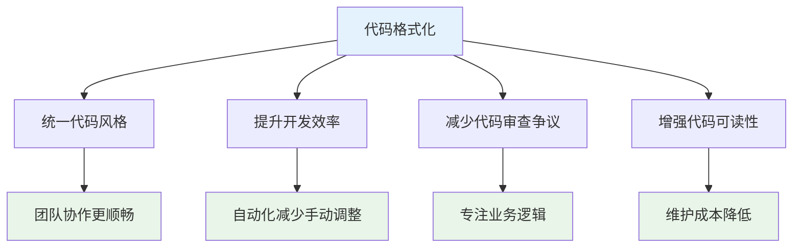
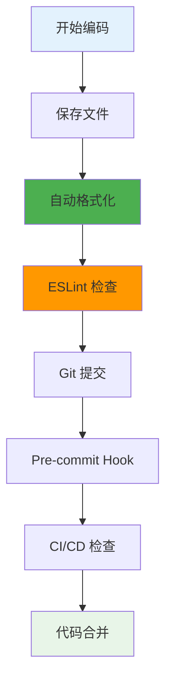

# 💅 Prettier 代码格式化工具完全指南

> 💡 **Prettier** 是一个代码格式化程序，支持多种语言，通过统一的代码风格提升团队开发效率和代码质量。

## 📖 目录导航

- [🎯 Prettier 简介](#🎯-prettier-简介)
- [📦 安装配置](#📦-安装配置)
- [⚙️ 配置详解](#⚙️-配置详解)
- [🔧 VSCode 集成](#🔧-vscode-集成)
- [🚀 使用方式](#🚀-使用方式)
- [🚫 忽略规则](#🚫-忽略规则)
- [🤝 团队协作](#🤝-团队协作)
- [🌟 最佳实践](#🌟-最佳实践)

---

## 🎯 Prettier 简介

### 💡 什么是 Prettier？

`Prettier` 的中文意思是"漂亮的、机灵的"，是一个代码格式化程序。涉及引号、分号、换行、缩进等。支持目前大部分语言处理，包括 JavaScript、Flow、TypeScript、CSS、SCSS、Less、JSX、Vue、GraphQL、JSON、Markdown。它通过解析代码并使用自己的规则来格式化代码。

### ✨ 核心特性

| 特性 | 描述 | 优势 | 应用场景 |
|------|------|------|----------|
| **🌐 多语言支持** | 支持 JavaScript、TypeScript、CSS、Vue 等 | 一站式格式化解决方案 | 全栈开发项目 |
| **🎨 统一风格** | 强制执行一致的代码风格 | 消除团队间的风格差异 | 团队协作开发 |
| **⚡ 自动化** | 保存时自动格式化 | 提升开发效率 | 日常编码 |
| **🔧 可配置** | 支持自定义格式化规则 | 满足不同项目需求 | 企业级项目 |

### 🌟 主要优势



---

## 📦 安装配置

### 🛠️ 项目安装

::: code-group

```bash [npm]
# 安装 Prettier 核心包
npm install --save-dev prettier

# 安装 ESLint 配置（解决冲突）
npm install --save-dev eslint-config-prettier eslint-plugin-prettier
```

```bash [yarn]
# 使用 Yarn 安装
yarn add --dev prettier
yarn add --dev eslint-config-prettier eslint-plugin-prettier
```

```bash [pnpm]
# 使用 pnpm 安装
pnpm add -D prettier
pnpm add -D eslint-config-prettier eslint-plugin-prettier
```

:::

### 🌐 全局安装

```bash
# 全局安装 Prettier
npm install -g prettier

# 验证安装
prettier --version
```

### 📁 项目结构

```
project/
├── .prettierrc.js        # Prettier 配置文件
├── .prettierignore       # 忽略文件配置
├── .eslintrc.js          # ESLint 配置
├── package.json
└── src/
    ├── components/
    └── utils/
```

---

## ⚙️ 配置详解

### 📝 配置文件创建

VSCode 读取单独配置文件的优先级会高于插件内配置。在项目根目录创建 `.prettierrc.js` 文件：

```javascript
module.exports = {
  // 🎯 基础格式化配置
  printWidth: 150,              // 指定自动换行的行长，默认值为80
  tabWidth: 2,                  // 指定每个缩进级别的空格数
  useTabs: false,               // 使用空格而不是制表符缩进
  
  // 🔤 语法风格配置
  semi: true,                   // 在语句末尾添加分号
  singleQuote: true,            // 使用单引号而不是双引号
  quoteProps: "as-needed",      // 对象属性引号："as-needed" | "consistent" | "preserve"
  jsxSingleQuote: false,        // 在JSX中使用单引号
  
  // 🎨 代码结构配置
  trailingComma: "es5",         // 尾随逗号："none" | "es5" | "all"
  bracketSpacing: true,         // 对象字面量的花括号间打印空格
  bracketSameLine: false,       // 将多行元素的>放在最后一行的末尾
  arrowParens: "always",        // 箭头函数参数括号："always" | "avoid"
  
  // 📄 范围和解析配置
  rangeStart: 0,                // 格式化范围开始
  rangeEnd: Infinity,           // 格式化范围结束
  requirePragma: false,         // 不需要写文件开头的 @prettier
  insertPragma: false,          // 不需要自动在文件开头插入 @prettier
  
  // 🔄 特殊格式配置
  proseWrap: "preserve",        // 折行标准："always" | "never" | "preserve"
  htmlWhitespaceSensitivity: "css", // HTML文件空格敏感度
  vueIndentScriptAndStyle: false,   // Vue文件脚本和样式标签不缩进
  endOfLine: "lf",              // 换行符："lf" | "crlf" | "cr" | "auto"
  
  // 🎯 语言特定配置
  embeddedLanguageFormatting: "auto", // 嵌入式语言格式化
  singleAttributePerLine: false,      // 每行一个属性
};
```

### 🔧 配置选项详解

#### 核心配置选项

| 选项 | 类型 | 默认值 | 描述 | 推荐值 |
|------|------|--------|------|--------|
| **printWidth** | number | 80 | 代码行宽度 | 150 |
| **tabWidth** | number | 2 | 缩进空格数 | 2 |
| **useTabs** | boolean | false | 使用制表符 | false |
| **semi** | boolean | true | 添加分号 | true |
| **singleQuote** | boolean | false | 使用单引号 | true |
| **trailingComma** | string | "es5" | 尾随逗号 | "es5" |

#### 高级配置选项

```javascript
// 针对不同文件类型的配置
module.exports = {
  // 全局配置
  semi: true,
  singleQuote: true,
  
  // 特定文件类型覆盖配置
  overrides: [
    {
      files: "*.json",
      options: {
        printWidth: 200,
        tabWidth: 2
      }
    },
    {
      files: "*.md",
      options: {
        proseWrap: "always",
        printWidth: 70
      }
    },
    {
      files: "*.vue",
      options: {
        vueIndentScriptAndStyle: true
      }
    }
  ]
};
```

### 📋 JSON 格式配置

也可以使用 `.prettierrc` 文件（JSON 格式）：

```json
{
  "printWidth": 150,
  "tabWidth": 2,
  "useTabs": false,
  "semi": true,
  "singleQuote": true,
  "quoteProps": "as-needed",
  "jsxSingleQuote": false,
  "trailingComma": "es5",
  "bracketSpacing": true,
  "bracketSameLine": false,
  "arrowParens": "always",
  "endOfLine": "lf",
  "overrides": [
    {
      "files": "*.json",
      "options": {
        "printWidth": 200
      }
    }
  ]
}
```

---

## 🔧 VSCode 集成

### 📥 插件安装

在 VSCode 中安装必要的插件：

1. **Prettier - Code formatter**: 代码格式化
2. **ESLint**: 代码质量检查
3. **Prettier ESLint**: 集成 ESLint 和 Prettier

### ⚙️ VSCode 设置配置

在 VSCode 设置中配置自动格式化：

```json
{
  // 🎯 基础编辑器设置
  "editor.formatOnSave": true,              // 保存时自动格式化
  "editor.formatOnPaste": true,             // 粘贴时自动格式化
  "editor.formatOnType": false,             // 输入时不自动格式化
  "editor.defaultFormatter": "esbenp.prettier-vscode",  // 默认格式化器
  
  // 🔧 代码操作设置
  "editor.codeActionsOnSave": {
    "source.fixAll.eslint": true,          // 保存时修复 ESLint 问题
    "source.organizeImports": true         // 自动整理导入
  },
  
  // 📝 特定语言设置
  "[javascript]": {
    "editor.defaultFormatter": "esbenp.prettier-vscode"
  },
  "[typescript]": {
    "editor.defaultFormatter": "esbenp.prettier-vscode"
  },
  "[vue]": {
    "editor.defaultFormatter": "esbenp.prettier-vscode"
  },
  "[json]": {
    "editor.defaultFormatter": "esbenp.prettier-vscode"
  },
  "[html]": {
    "editor.defaultFormatter": "esbenp.prettier-vscode"
  },
  "[css]": {
    "editor.defaultFormatter": "esbenp.prettier-vscode"
  },
  "[scss]": {
    "editor.defaultFormatter": "esbenp.prettier-vscode"
  },
  "[markdown]": {
    "editor.defaultFormatter": "esbenp.prettier-vscode"
  },
  
  // 🎨 Prettier 特定设置
  "prettier.requireConfig": true,           // 要求配置文件
  "prettier.useEditorConfig": false,        // 不使用 .editorconfig
  "prettier.resolveGlobalModules": true     // 解析全局模块
}
```

### 🚀 工作区设置

在项目根目录创建 `.vscode/settings.json`：

```json
{
  "editor.formatOnSave": true,
  "editor.codeActionsOnSave": {
    "source.fixAll.eslint": true
  },
  "editor.defaultFormatter": "esbenp.prettier-vscode",
  "prettier.configPath": ".prettierrc.js",
  "files.associations": {
    "*.vue": "vue"
  }
}
```

---

## 🚀 使用方式

### 1. 🖥️ 命令行格式化

::: code-group

```bash [基础用法]
# 格式化所有文件
npx prettier --write .

# 格式化指定文件
npx prettier --write src/main.js

# 格式化指定目录
npx prettier --write src/

# 格式化特定类型文件
npx prettier --write "src/**/*.{js,vue,json}"
```

```bash [检查模式]
# 检查格式化状态（不修改文件）
npx prettier --check .

# 列出需要格式化的文件
npx prettier --list-different .

# 格式化并输出到控制台
npx prettier src/main.js
```

```bash [高级用法]
# 指定配置文件
npx prettier --config .prettierrc.js --write .

# 指定忽略文件
npx prettier --ignore-path .prettierignore --write .

# 调试模式
npx prettier --debug-check src/main.js
```

:::

### 2. 📝 编辑器格式化

在 VSCode 中使用格式化功能：

- **右键格式化**: 右键 → "格式化文档"
- **快捷键**: `Shift + Alt + F` (Windows) / `Shift + Option + F` (Mac)
- **命令面板**: `Ctrl + Shift + P` → "Format Document"

### 3. ⚡ 自动格式化

通过 VSCode 插件设置保存时自动格式化代码：

::: tip 💡 推荐方式
建议使用**保存时自动格式化**，这样可以确保代码始终保持统一的格式，无需手动操作。
:::

```json
{
  "editor.formatOnSave": true,
  "editor.codeActionsOnSave": {
    "source.fixAll.eslint": true
  }
}
```

### 4. 🔧 Package.json 脚本

在 `package.json` 中添加格式化脚本：

```json
{
  "scripts": {
    "format": "prettier --write .",
    "format:check": "prettier --check .",
    "format:js": "prettier --write \"src/**/*.{js,ts}\"",
    "format:vue": "prettier --write \"src/**/*.vue\"",
    "format:style": "prettier --write \"src/**/*.{css,scss,less}\"",
    "lint:fix": "eslint . --fix && prettier --write ."
  }
}
```

---

## 🚫 忽略规则

### 📁 .prettierignore 文件

创建 `.prettierignore` 文件来指定不需要格式化的文件：

```gitignore
# 依赖文件
node_modules/
dist/
build/
*.min.js

# 配置文件
.env
.env.local
.env.production

# 文档文件
*.md
docs/

# 特定文件
public/
coverage/
*.log

# 临时文件
.tmp/
.cache/
```

### 💻 代码中忽略

#### 忽略整个文件

```javascript
// prettier-ignore-file

// 整个文件不会被格式化
const uglyCode = {a:1,b:2,c:3};
```

#### 忽略下一行

```javascript
// prettier-ignore
const matrix = [
  [1, 2, 3],
  [4, 5, 6]
];
```

#### 忽略代码块

```javascript
/* prettier-ignore-start */
const uglyMatrix = [
  [1,2,3],
  [4,5,6]
];
/* prettier-ignore-end */
```

#### HTML 中忽略

```html
<!-- prettier-ignore -->
<div   class="ugly-formatting"   >
  <p>This won't be formatted</p>
</div>
```

---

## 🤝 团队协作

### 📋 项目配置同步

#### 1. 配置文件共享

确保项目包含以下配置文件：

```
project/
├── .prettierrc.js         # Prettier 配置
├── .prettierignore        # 忽略文件
├── .eslintrc.js           # ESLint 配置
├── .vscode/
│   └── settings.json      # VSCode 工作区设置
└── package.json
```

#### 2. 推荐插件配置

创建 `.vscode/extensions.json`：

```json
{
  "recommendations": [
    "esbenp.prettier-vscode",
    "dbaeumer.vscode-eslint",
    "ms-vscode.vscode-typescript-next",
    "Vue.volar"
  ]
}
```

### 🔄 CI/CD 集成

#### GitHub Actions 配置

```yaml
name: Code Format Check

on: [push, pull_request]

jobs:
  prettier:
    runs-on: ubuntu-latest
    steps:
      - uses: actions/checkout@v3
      - uses: actions/setup-node@v3
        with:
          node-version: '18'
      - run: npm ci
      - run: npm run format:check
```

#### Pre-commit Hooks

使用 `husky` 和 `lint-staged`：

```bash
# 安装依赖
npm install --save-dev husky lint-staged

# 配置 package.json
{
  "husky": {
    "hooks": {
      "pre-commit": "lint-staged"
    }
  },
  "lint-staged": {
    "*.{js,vue,ts}": [
      "eslint --fix",
      "prettier --write"
    ],
    "*.{json,md}": [
      "prettier --write"
    ]
  }
}
```

---

## 🌟 最佳实践

### 📋 配置建议

1. **🎯 统一标准**: 团队统一使用相同的配置文件
2. **⚡ 自动化**: 设置保存时自动格式化
3. **🔧 集成 ESLint**: 结合 ESLint 使用，解决冲突
4. **📝 文档化**: 在项目文档中说明格式化规则

### 🔄 工作流程



### 💡 常见问题解决

#### 1. Prettier 与 ESLint 冲突

```bash
# 安装解决冲突的配置
npm install --save-dev eslint-config-prettier

# 在 .eslintrc.js 中添加
module.exports = {
  extends: [
    'eslint:recommended',
    'prettier' // 必须放在最后
  ]
};
```

#### 2. 格式化不生效

```json
// 检查 VSCode 设置
{
  "editor.formatOnSave": true,
  "editor.defaultFormatter": "esbenp.prettier-vscode",
  "prettier.requireConfig": true
}
```

#### 3. 某些文件不格式化

检查 `.prettierignore` 文件和 VSCode 文件关联：

```json
{
  "files.associations": {
    "*.vue": "vue",
    "*.jsx": "javascriptreact"
  }
}
```

---

::: tip 🎯 总结

Prettier 是现代前端开发中不可或缺的工具：

### 🚀 核心价值
- **🎨 统一风格**: 消除团队间的代码风格差异
- **⚡ 提升效率**: 自动格式化减少手动调整
- **🔧 易于集成**: 与主流编辑器和构建工具完美集成
- **📈 提高质量**: 一致的代码风格提升可维护性

### 💡 实施建议
1. **项目初期**: 建立统一的格式化规则
2. **团队培训**: 确保所有成员正确配置工具
3. **自动化**: 设置 CI/CD 检查和 Git hooks
4. **持续优化**: 根据团队反馈调整配置

掌握 Prettier 将让你的代码更加优雅，团队协作更加顺畅！🎉

:::

::: warning 📋 注意事项
- 配置文件优先级：项目配置 > 用户配置 > 默认配置
- 与 ESLint 结合使用时注意解决规则冲突
- 大型项目建议使用 `.prettierignore` 排除不需要格式化的文件
- 定期更新 Prettier 版本以获得最新功能
:::

---

> 🌟 **代码如诗，格式如画** - 让 Prettier 为你的代码增添优雅之美！
