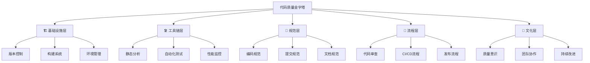
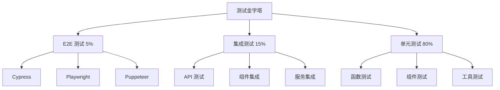

# 🏆 前端代码质量把控完全指南

> 代码质量是软件开发的生命线，通过系统化的质量把控体系，确保代码的可维护性、可扩展性和稳定性。

<details>
<summary>📋 目录导航</summary>

- [质量体系概览](#质量体系概览)
- [代码规范化](#代码规范化)
- [静态代码分析](#静态代码分析)
- [自动化测试策略](#自动化测试策略)
- [版本控制最佳实践](#版本控制最佳实践)
- [代码审查流程](#代码审查流程)
- [质量度量与监控](#质量度量与监控)
- [CI/CD集成](#ci-cd集成)
- [工具链配置](#工具链配置)
- [团队协作规范](#团队协作规范)

</details>

## 🎯 质量体系概览

### 核心质量维度

代码质量评估的七个关键维度：

| 维度 | 描述 | 目标指标 | 检测工具 |
|------|------|----------|----------|
| **🎨 代码风格** | 统一的编码风格和格式 | 0违规 | ESLint, Prettier |
| **📊 复杂度控制** | 控制代码复杂度避免过度嵌套 | 圈复杂度 < 10 | SonarQube, ESLint |
| **♻️ 重复率** | 减少重复代码提高复用性 | 重复率 < 5% | SonarQube, CPD |
| **🧪 测试覆盖率** | 确保充分的测试覆盖 | 覆盖率 > 80% | Jest, Vitest |
| **📝 文档完整性** | 代码注释和文档覆盖 | 注释率 > 20% | JSDoc, TypeDoc |
| **🔒 安全性** | 识别安全漏洞和风险 | 0高危漏洞 | Snyk, npm audit |
| **⚡ 性能** | 代码执行效率和资源消耗 | 核心函数 < 100ms | Lighthouse, Profiler |

### 质量金字塔模型



## 📏 代码规范化

### ESLint 配置最佳实践

#### 1. 基础配置文件

```javascript
// .eslintrc.js
module.exports = {
  env: {
    browser: true,
    es2021: true,
    node: true,
  },
  extends: [
    'eslint:recommended',
    '@typescript-eslint/recommended',
    'plugin:react/recommended',
    'plugin:react-hooks/recommended',
    'prettier', // 确保与 Prettier 兼容
  ],
  parser: '@typescript-eslint/parser',
  parserOptions: {
    ecmaFeatures: {
      jsx: true,
    },
    ecmaVersion: 12,
    sourceType: 'module',
    project: './tsconfig.json',
  },
  plugins: [
    'react',
    '@typescript-eslint',
    'import',
    'jsx-a11y',
    'security',
  ],
  rules: {
    // 代码质量规则
    'complexity': ['error', { max: 10 }],
    'max-depth': ['error', 4],
    'max-lines': ['error', 300],
    'max-lines-per-function': ['error', 50],
    'max-params': ['error', 3],
    
    // TypeScript 规则
    '@typescript-eslint/no-unused-vars': 'error',
    '@typescript-eslint/explicit-function-return-type': 'warn',
    '@typescript-eslint/no-explicit-any': 'error',
    
    // React 规则
    'react/prop-types': 'off',
    'react/react-in-jsx-scope': 'off',
    'react-hooks/exhaustive-deps': 'warn',
    
    // 导入规则
    'import/order': ['error', {
      'groups': ['builtin', 'external', 'internal', 'parent', 'sibling', 'index'],
      'newlines-between': 'always',
    }],
    
    // 安全规则
    'security/detect-object-injection': 'warn',
    'security/detect-non-literal-regexp': 'warn',
  },
  settings: {
    react: {
      version: 'detect',
    },
  },
  overrides: [
    {
      files: ['**/*.test.{js,jsx,ts,tsx}'],
      env: {
        jest: true,
      },
      rules: {
        'max-lines-per-function': 'off',
      },
    },
  ],
};
```

#### 2. Prettier 配置

```json
// .prettierrc
{
  "semi": true,
  "trailingComma": "es5",
  "singleQuote": true,
  "printWidth": 80,
  "tabWidth": 2,
  "useTabs": false,
  "bracketSpacing": true,
  "arrowParens": "avoid",
  "endOfLine": "lf",
  "bracketSameLine": false,
  "embeddedLanguageFormatting": "auto"
}
```

#### 3. 提交前检查配置

```json
// package.json
{
  "husky": {
    "hooks": {
      "pre-commit": "lint-staged",
      "commit-msg": "commitlint -E HUSKY_GIT_PARAMS"
    }
  },
  "lint-staged": {
    "*.{js,jsx,ts,tsx}": [
      "eslint --fix",
      "prettier --write",
      "git add"
    ],
    "*.{css,scss,less}": [
      "stylelint --fix",
      "prettier --write",
      "git add"
    ],
    "*.{json,md}": [
      "prettier --write",
      "git add"
    ]
  }
}
```

### StyleLint 样式规范

```javascript
// .stylelintrc.js
module.exports = {
  extends: [
    'stylelint-config-standard',
    'stylelint-config-prettier',
    'stylelint-config-recess-order',
  ],
  plugins: [
    'stylelint-order',
    'stylelint-declaration-block-no-ignored-properties',
  ],
  rules: {
    // 禁止低优先级的选择器覆盖高优先级的选择器
    'no-descending-specificity': null,
    // 禁止空样式块
    'block-no-empty': true,
    // 禁止重复的选择器
    'no-duplicate-selectors': true,
    // 要求或禁止在声明块的分号之前换行
    'declaration-block-trailing-semicolon': 'always',
    // 限制复合选择器的数量
    'selector-max-compound-selectors': 4,
    // 禁止未知的伪类选择器
    'selector-pseudo-class-no-unknown': true,
    // 属性排序
    'order/properties-order': [
      'position',
      'top',
      'right',
      'bottom',
      'left',
      'z-index',
      'display',
      'float',
      'width',
      'height',
      'margin',
      'padding',
      'border',
      'background',
      'color',
      'font',
      'text-align',
      'opacity',
      'transform',
      'transition',
    ],
  },
};
```

## 🔍 静态代码分析

### SonarQube 集成配置

#### 1. SonarQube 项目配置

```properties
# sonar-project.properties
sonar.projectKey=my-frontend-project
sonar.projectName=My Frontend Project
sonar.projectVersion=1.0.0

# 源码目录
sonar.sources=src
sonar.tests=src
sonar.test.inclusions=**/*.test.{js,jsx,ts,tsx}
sonar.test.exclusions=src/**/*.{js,jsx,ts,tsx}

# 排除文件
sonar.exclusions=**/node_modules/**,**/dist/**,**/build/**,**/*.min.js

# JavaScript/TypeScript 配置
sonar.javascript.lcov.reportPaths=coverage/lcov.info
sonar.typescript.lcov.reportPaths=coverage/lcov.info

# 质量门禁设置
sonar.qualitygate.wait=true
```

#### 2. Docker 部署 SonarQube

```yaml
# docker-compose.yml
version: '3.8'
services:
  sonarqube:
    image: sonarqube:9.9-community
    container_name: sonarqube
    environment:
      - SONAR_JDBC_URL=jdbc:postgresql://db:5432/sonar
      - SONAR_JDBC_USERNAME=sonar
      - SONAR_JDBC_PASSWORD=sonar
    ports:
      - "9000:9000"
    volumes:
      - sonarqube_data:/opt/sonarqube/data
      - sonarqube_logs:/opt/sonarqube/logs
      - sonarqube_extensions:/opt/sonarqube/extensions
    depends_on:
      - db

  db:
    image: postgres:13
    container_name: sonarqube-db
    environment:
      - POSTGRES_USER=sonar
      - POSTGRES_PASSWORD=sonar
      - POSTGRES_DB=sonar
    volumes:
      - postgresql_data:/var/lib/postgresql/data

volumes:
  sonarqube_data:
  sonarqube_logs:
  sonarqube_extensions:
  postgresql_data:
```

#### 3. SonarQube 配置

```javascript
// sonar-quality-gate.js
const sonarConfig = {
  // 可靠性指标
  reliability: {
    bugs: 0, // 零容忍 Bug
    reliability_rating: 'A', // 可靠性评级 A
  },
  
  // 安全性指标
  security: {
    vulnerabilities: 0, // 零容忍漏洞
    security_rating: 'A', // 安全评级 A
    security_hotspots_reviewed: 100, // 100% 安全热点审查
  },
  
  // 可维护性指标
  maintainability: {
    code_smells: 10, // 最多 10 个代码异味
    maintainability_rating: 'A', // 可维护性评级 A
    technical_debt_ratio: 5, // 技术债务比率 < 5%
  },
  
  // 覆盖率指标
  coverage: {
    coverage: 80, // 代码覆盖率 > 80%
    new_coverage: 80, // 新代码覆盖率 > 80%
  },
  
  // 重复率指标
  duplication: {
    duplicated_lines_density: 3, // 重复行密度 < 3%
    new_duplicated_lines_density: 3, // 新重复行密度 < 3%
  },
};
```

### TypeScript 严格模式配置

```json
// tsconfig.json
{
  "compilerOptions": {
    "strict": true,
    "noImplicitAny": true,
    "strictNullChecks": true,
    "strictFunctionTypes": true,
    "strictBindCallApply": true,
    "strictPropertyInitialization": true,
    "noImplicitReturns": true,
    "noImplicitThis": true,
    "noUnusedLocals": true,
    "noUnusedParameters": true,
    "exactOptionalPropertyTypes": true,
    "noImplicitOverride": true,
    "noPropertyAccessFromIndexSignature": true,
    "noUncheckedIndexedAccess": true
  },
  "include": ["src/**/*"],
  "exclude": ["node_modules", "dist", "build"]
}
```

## 🧪 自动化测试策略

### 测试金字塔实践



### Jest 配置最佳实践

```javascript
// jest.config.js
module.exports = {
  // 测试环境
  testEnvironment: 'jsdom',
  
  // 设置文件
  setupFilesAfterEnv: ['<rootDir>/src/setupTests.ts'],
  
  // 模块路径映射
  moduleNameMapping: {
    '^@/(.*)$': '<rootDir>/src/$1',
    '\\.(css|less|scss|sass)$': 'identity-obj-proxy',
  },
  
  // 覆盖率配置
  collectCoverage: true,
  collectCoverageFrom: [
    'src/**/*.{js,jsx,ts,tsx}',
    '!src/**/*.d.ts',
    '!src/index.tsx',
    '!src/serviceWorker.ts',
    '!src/**/*.stories.{js,jsx,ts,tsx}',
  ],
  coverageThreshold: {
    global: {
      branches: 80,
      functions: 80,
      lines: 80,
      statements: 80,
    },
  },
  
  // 测试匹配模式
  testMatch: [
    '<rootDir>/src/**/__tests__/**/*.{js,jsx,ts,tsx}',
    '<rootDir>/src/**/*.{spec,test}.{js,jsx,ts,tsx}',
  ],
  
  // 转换配置
  transform: {
    '^.+\\.(js|jsx|ts|tsx)$': 'babel-jest',
  },
  
  // 模拟配置
  moduleFileExtensions: ['js', 'jsx', 'ts', 'tsx', 'json', 'node'],
  
  // 忽略模式
  testPathIgnorePatterns: [
    '<rootDir>/node_modules/',
    '<rootDir>/build/',
  ],
  
  // 监听模式配置
  watchman: true,
  
  // 报告器配置
  reporters: [
    'default',
    ['jest-junit', {
      outputDirectory: './coverage',
      outputName: 'junit.xml',
    }],
  ],
};
```

### 组件测试示例

```typescript
// Button.test.tsx
import { render, screen, fireEvent } from '@testing-library/react';
import { Button } from './Button';

describe('Button Component', () => {
  // 基础渲染测试
  it('should render with correct text', () => {
    render(<Button>Click me</Button>);
    expect(screen.getByRole('button', { name: /click me/i })).toBeInTheDocument();
  });
  
  // 交互测试
  it('should call onClick when clicked', () => {
    const handleClick = jest.fn();
    render(<Button onClick={handleClick}>Click me</Button>);
    
    fireEvent.click(screen.getByRole('button'));
    expect(handleClick).toHaveBeenCalledTimes(1);
  });
  
  // 样式测试
  it('should apply variant styles correctly', () => {
    render(<Button variant="primary">Primary Button</Button>);
    const button = screen.getByRole('button');
    
    expect(button).toHaveClass('btn-primary');
  });
  
  // 禁用状态测试
  it('should be disabled when disabled prop is true', () => {
    render(<Button disabled>Disabled Button</Button>);
    const button = screen.getByRole('button');
    
    expect(button).toBeDisabled();
    expect(button).toHaveAttribute('aria-disabled', 'true');
  });
  
  // 可访问性测试
  it('should have correct accessibility attributes', () => {
    render(<Button aria-label="Close dialog">×</Button>);
    const button = screen.getByRole('button');
    
    expect(button).toHaveAttribute('aria-label', 'Close dialog');
  });
});
```

### E2E 测试配置 (Cypress)

```typescript
// cypress.config.ts
import { defineConfig } from 'cypress';

export default defineConfig({
  e2e: {
    baseUrl: 'http://localhost:3000',
    supportFile: 'cypress/support/e2e.ts',
    specPattern: 'cypress/e2e/**/*.cy.{js,jsx,ts,tsx}',
    viewportWidth: 1280,
    viewportHeight: 720,
    video: true,
    screenshotOnRunFailure: true,
    
    setupNodeEvents(on, config) {
      // 代码覆盖率插件
      require('@cypress/code-coverage/task')(on, config);
      
      // 环境变量处理
      config.env = {
        ...config.env,
        ...process.env,
      };
      
      return config;
    },
  },
  
  component: {
    devServer: {
      framework: 'react',
      bundler: 'vite',
    },
    setupNodeEvents(on, config) {
      require('@cypress/code-coverage/task')(on, config);
      return config;
    },
  },
});
```

## 📋 版本控制最佳实践

### Git 工作流规范

#### 1. 分支策略 (Git Flow)

```mermaid
gitgraph
    commit id: "Initial"
    branch develop
    checkout develop
    commit id: "Feature A"
    branch feature/user-auth
    checkout feature/user-auth
    commit id: "Add login"
    commit id: "Add logout"
    checkout develop
    merge feature/user-auth
    commit id: "Integration"
    branch release/v1.0
    checkout release/v1.0
    commit id: "Bug fixes"
    checkout main
    merge release/v1.0
    tag: "v1.0.0"
    checkout develop
    merge release/v1.0
```

#### 2. 提交信息规范

```bash
# 提交信息格式
<type>(<scope>): <subject>

<body>

<footer>
```

**提交类型说明：**

| 类型 | 描述 | 示例 |
|------|------|------|
| `feat` | 新功能 | `feat(auth): add user login functionality` |
| `fix` | Bug 修复 | `fix(api): resolve timeout issue` |
| `docs` | 文档更新 | `docs(readme): update installation guide` |
| `style` | 代码格式 | `style(button): fix indentation` |
| `refactor` | 重构 | `refactor(utils): extract common functions` |
| `perf` | 性能优化 | `perf(list): improve rendering performance` |
| `test` | 测试相关 | `test(auth): add unit tests for login` |
| `chore` | 构建/工具 | `chore(deps): upgrade dependencies` |

#### 3. Commitlint 配置

```javascript
// commitlint.config.js
module.exports = {
  extends: ['@commitlint/config-conventional'],
  rules: {
    'type-enum': [
      2,
      'always',
      [
        'feat',
        'fix',
        'docs',
        'style',
        'refactor',
        'perf',
        'test',
        'chore',
        'revert',
        'build',
        'ci',
      ],
    ],
    'type-case': [2, 'always', 'lower-case'],
    'type-empty': [2, 'never'],
    'scope-case': [2, 'always', 'lower-case'],
    'subject-case': [2, 'never', ['sentence-case', 'start-case', 'pascal-case', 'upper-case']],
    'subject-empty': [2, 'never'],
    'subject-full-stop': [2, 'never', '.'],
    'header-max-length': [2, 'always', 100],
    'body-leading-blank': [1, 'always'],
    'body-max-line-length': [2, 'always', 100],
    'footer-leading-blank': [1, 'always'],
    'footer-max-line-length': [2, 'always', 100],
  },
};
```

### Git Hooks 配置

```bash
#!/bin/sh
# .husky/pre-commit

. "$(dirname "$0")/_/husky.sh"

# 运行 lint-staged
npx lint-staged

# 运行类型检查
npm run type-check

# 运行测试
npm run test:ci

# 检查构建
npm run build
```

## 👥 代码审查流程

### Pull Request 模板

```markdown
<!-- .github/pull_request_template.md -->
## 📝 变更描述

简要描述此 PR 的变更内容和目的。

## 🔗 相关问题

- Closes #(issue number)
- Related to #(issue number)

## 🧪 测试

- [ ] 单元测试已通过
- [ ] 集成测试已通过
- [ ] E2E 测试已通过
- [ ] 手动测试已完成

## 📋 检查清单

### 代码质量
- [ ] 代码遵循项目编码规范
- [ ] 已添加必要的注释
- [ ] 没有遗留的 console.log 或调试代码
- [ ] 代码复杂度在可接受范围内

### 功能性
- [ ] 功能按预期工作
- [ ] 边界情况已处理
- [ ] 错误处理已实现
- [ ] 性能影响已评估

### 安全性
- [ ] 没有引入安全漏洞
- [ ] 用户输入已验证
- [ ] 敏感信息已保护

### 可访问性
- [ ] 符合 WCAG 2.1 AA 标准
- [ ] 键盘导航可用
- [ ] 屏幕阅读器友好

### 文档
- [ ] README 已更新（如需要）
- [ ] API 文档已更新（如需要）
- [ ] 变更日志已更新

## 📱 测试设备

- [ ] Chrome
- [ ] Firefox
- [ ] Safari
- [ ] Edge
- [ ] Mobile Safari
- [ ] Mobile Chrome

## 🖼️ 截图/GIF

如果有 UI 变更，请提供截图或 GIF。

## 💡 额外信息

任何审查者需要知道的额外信息。
```

### 代码审查指南

#### 审查重点清单

```markdown
## 🔍 代码审查重点

### 1. 架构和设计
- [ ] 代码是否符合现有架构
- [ ] 是否有过度设计或设计不足
- [ ] 组件/模块职责是否清晰
- [ ] 是否遵循 SOLID 原则

### 2. 代码质量
- [ ] 命名是否清晰有意义
- [ ] 函数是否足够简洁
- [ ] 是否有重复代码
- [ ] 错误处理是否充分

### 3. 性能考虑
- [ ] 是否有性能瓶颈
- [ ] 是否有不必要的重渲染
- [ ] 是否有内存泄漏风险
- [ ] 算法复杂度是否合理

### 4. 安全性
- [ ] 是否有 XSS 风险
- [ ] 是否有 CSRF 风险
- [ ] 用户输入是否已验证
- [ ] 敏感数据是否安全

### 5. 可维护性
- [ ] 代码是否易于理解
- [ ] 是否有充分的注释
- [ ] 是否易于测试
- [ ] 是否易于扩展
```

## 📊 质量度量与监控

### 关键指标监控

```javascript
// quality-metrics.js
export const qualityMetrics = {
  // 代码质量指标
  codeQuality: {
    // 圈复杂度
    cyclomaticComplexity: {
      threshold: 10,
      current: 8.5,
      trend: 'improving',
    },
    
    // 代码重复率
    duplicationRate: {
      threshold: 5,
      current: 3.2,
      trend: 'stable',
    },
    
    // 技术债务
    technicalDebt: {
      threshold: '4h',
      current: '2.5h',
      trend: 'improving',
    },
  },
  
  // 测试指标
  testing: {
    // 单元测试覆盖率
    unitTestCoverage: {
      threshold: 80,
      current: 85.3,
      trend: 'improving',
    },
    
    // 集成测试覆盖率
    integrationTestCoverage: {
      threshold: 70,
      current: 72.1,
      trend: 'stable',
    },
    
    // 测试成功率
    testSuccessRate: {
      threshold: 95,
      current: 97.8,
      trend: 'stable',
    },
  },
  
  // 安全指标
  security: {
    // 安全漏洞数量
    vulnerabilities: {
      high: 0,
      medium: 2,
      low: 5,
      trend: 'improving',
    },
    
    // 依赖漏洞
    dependencyVulnerabilities: {
      critical: 0,
      high: 0,
      moderate: 1,
      trend: 'stable',
    },
  },
  
  // 性能指标
  performance: {
    // 构建时间
    buildTime: {
      threshold: '5min',
      current: '3.2min',
      trend: 'stable',
    },
    
    // Bundle 大小
    bundleSize: {
      threshold: '2MB',
      current: '1.8MB',
      trend: 'improving',
    },
  },
};
```

### 质量仪表板配置

```yaml
# grafana-dashboard.yml
dashboard:
  title: "前端代码质量监控"
  panels:
    - title: "代码覆盖率趋势"
      type: "graph"
      targets:
        - expr: "coverage_percentage"
      thresholds:
        - value: 80
          color: "green"
        - value: 60
          color: "yellow"
        - value: 0
          color: "red"
    
    - title: "构建状态"
      type: "stat"
      targets:
        - expr: "build_success_rate"
      
    - title: "安全漏洞"
      type: "table"
      targets:
        - expr: "security_vulnerabilities"
      
    - title: "性能指标"
      type: "heatmap"
      targets:
        - expr: "performance_metrics"
```

## ⚙️ CI/CD 集成

### GitHub Actions 工作流

```yaml
# .github/workflows/quality-check.yml
name: 代码质量检查

on:
  push:
    branches: [main, develop]
  pull_request:
    branches: [main, develop]

jobs:
  quality-check:
    runs-on: ubuntu-latest
    
    steps:
      # 检出代码
      - name: Checkout code
        uses: actions/checkout@v3
        with:
          fetch-depth: 0
      
      # 设置 Node.js
      - name: Setup Node.js
        uses: actions/setup-node@v3
        with:
          node-version: '18'
          cache: 'npm'
      
      # 安装依赖
      - name: Install dependencies
        run: npm ci
      
      # 代码格式检查
      - name: Lint check
        run: npm run lint
      
      # 类型检查
      - name: Type check
        run: npm run type-check
      
      # 单元测试
      - name: Run unit tests
        run: npm run test:coverage
      
      # 上传覆盖率报告
      - name: Upload coverage
        uses: codecov/codecov-action@v3
        with:
          file: ./coverage/lcov.info
          flags: unittests
          name: codecov-umbrella
      
      # SonarQube 分析
      - name: SonarQube analysis
        uses: sonarqube-quality-gate-action@master
        env:
          GITHUB_TOKEN: ${{ secrets.GITHUB_TOKEN }}
          SONAR_TOKEN: ${{ secrets.SONAR_TOKEN }}
      
      # 安全扫描
      - name: Security audit
        run: npm audit --audit-level moderate
      
      # 构建检查
      - name: Build check
        run: npm run build
      
      # E2E 测试
      - name: E2E tests
        uses: cypress-io/github-action@v5
        with:
          start: npm start
          wait-on: 'http://localhost:3000'
          record: true
        env:
          CYPRESS_RECORD_KEY: ${{ secrets.CYPRESS_RECORD_KEY }}
          GITHUB_TOKEN: ${{ secrets.GITHUB_TOKEN }}
```

### 质量门禁配置

```javascript
// quality-gate.js
module.exports = {
  // 必须通过的检查
  requiredChecks: [
    'lint',
    'type-check',
    'unit-tests',
    'security-audit',
    'build',
  ],
  
  // 质量指标阈值
  thresholds: {
    coverage: {
      lines: 80,
      branches: 75,
      functions: 80,
      statements: 80,
    },
    
    sonarqube: {
      bugs: 0,
      vulnerabilities: 0,
      code_smells: 10,
      coverage: 80,
      duplicated_lines_density: 3,
    },
    
    performance: {
      build_time: 300, // 5分钟
      bundle_size: 2048, // 2MB
    },
  },
  
  // 通知配置
  notifications: {
    slack: {
      webhook: process.env.SLACK_WEBHOOK,
      channel: '#development',
    },
    
    email: {
      recipients: ['team-lead@company.com'],
    },
  },
};
```

## 🛠️ 工具链配置

### 包管理器配置

```json
// .npmrc
registry=https://registry.npmjs.org/
save-exact=true
package-lock=true
audit-level=moderate
fund=false

# 性能优化
fetch-retries=3
fetch-retry-factor=2
fetch-retry-mintimeout=10000
fetch-retry-maxtimeout=60000
```

### EditorConfig 配置

```ini
# .editorconfig
root = true

[*]
charset = utf-8
end_of_line = lf
indent_style = space
indent_size = 2
insert_final_newline = true
trim_trailing_whitespace = true

[*.{js,jsx,ts,tsx,json}]
indent_size = 2

[*.{md,yml,yaml}]
trim_trailing_whitespace = false

[*.py]
indent_size = 4

[Makefile]
indent_style = tab
```

### VSCode 工作空间配置

```json
// .vscode/settings.json
{
  "editor.formatOnSave": true,
  "editor.defaultFormatter": "esbenp.prettier-vscode",
  "editor.codeActionsOnSave": {
    "source.fixAll.eslint": true,
    "source.fixAll.stylelint": true,
    "source.organizeImports": true
  },
  
  "typescript.preferences.importModuleSpecifier": "relative",
  "typescript.suggest.autoImports": true,
  
  "files.exclude": {
    "**/node_modules": true,
    "**/dist": true,
    "**/build": true,
    "**/.git": true,
    "**/.DS_Store": true
  },
  
  "search.exclude": {
    "**/node_modules": true,
    "**/dist": true,
    "**/build": true,
    "**/coverage": true
  },
  
  "emmet.includeLanguages": {
    "javascript": "javascriptreact",
    "typescript": "typescriptreact"
  }
}
```

## 📚 最佳实践总结

### 质量保障清单

```markdown
## ✅ 代码质量保障清单

### 开发阶段
- [ ] 配置 ESLint 和 Prettier
- [ ] 设置 TypeScript 严格模式
- [ ] 编写单元测试
- [ ] 遵循命名规范
- [ ] 添加必要注释

### 提交阶段
- [ ] 通过所有 lint 检查
- [ ] 测试覆盖率达标
- [ ] 提交信息规范
- [ ] 代码审查通过
- [ ] 构建成功

### 发布阶段
- [ ] 所有测试通过
- [ ] 性能指标达标
- [ ] 安全扫描通过
- [ ] 文档已更新
- [ ] 变更日志完整

### 监控阶段
- [ ] 质量指标监控
- [ ] 性能监控
- [ ] 错误监控
- [ ] 用户体验监控
```

### 团队协作规范

| 角色 | 职责 | 工具 |
|------|------|------|
| **开发者** | 编写高质量代码，遵循规范 | ESLint, Prettier, Jest |
| **Code Reviewer** | 代码审查，质量把关 | GitHub PR, SonarQube |
| **QA Engineer** | 测试验证，质量保证 | Cypress, Playwright |
| **Tech Lead** | 架构设计，规范制定 | Architecture, Standards |
| **DevOps** | CI/CD 配置，监控设置 | GitHub Actions, Monitoring |

## 📖 参考资源

### 官方文档
- [ESLint 官方文档](https://eslint.org/docs/)
- [Prettier 官方文档](https://prettier.io/docs/)
- [Jest 官方文档](https://jestjs.io/docs/)
- [SonarQube 官方文档](https://docs.sonarqube.org/)
- [TypeScript 官方文档](https://www.typescriptlang.org/docs/)

### 最佳实践指南
- [Google JavaScript 风格指南](https://google.github.io/styleguide/jsguide.html)
- [Airbnb JavaScript 风格指南](https://github.com/airbnb/javascript)
- [Clean Code JavaScript](https://github.com/ryanmcdermott/clean-code-javascript)

### 工具和插件
- [Husky](https://typicode.github.io/husky/) - Git hooks 管理
- [lint-staged](https://github.com/okonet/lint-staged) - 暂存文件检查
- [Commitlint](https://commitlint.js.org/) - 提交信息检查
- [Codecov](https://codecov.io/) - 代码覆盖率服务

---

> 💡 **提示**：代码质量不是一蹴而就的，需要团队持续的努力和改进。通过建立完善的质量保障体系，我们可以确保代码的长期维护性和稳定性。
